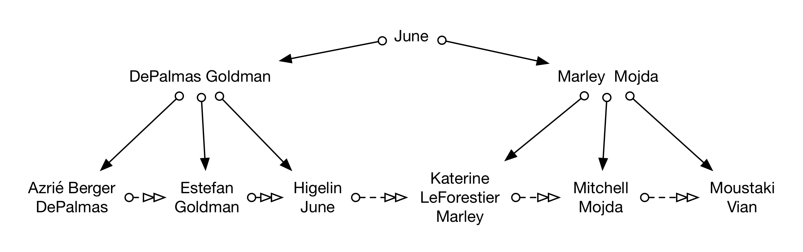
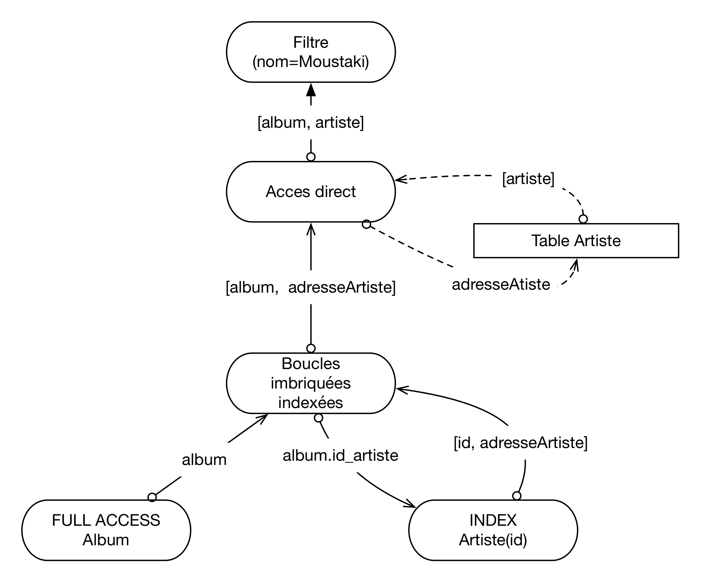

Examen blanc du 20 janvier 2020 (sans concurrence)
==================================================

Stockage et indexation
----------------------

On veut stocker un fichier *F* avec 120000 enregistrements d\'une taille
fixe de 100 octets par article.

Questions :

> -   De combien de blocs a-t-on besoin au minimum pour stocker tout le
>     fichier si la taille d\'un bloc est 8192 octets, sachant que
>     chaque bloc contient un entête de 150 octets et qu\'un
>     enregistrement ne peut pas chevaucher 2 blocs?
>
> > ::: {.ifconfig}
> > annales\_2020\_1 in (\'public\')
> >
> > ::: {.admonition}
> > Correction
> >
> > Un bloc contient 8 042 octets utiles. Donc 80 enregistrements par
> > bloc au maximum. On divise les 120 000 enregistrements par 80 et on
> > obtient 1 500 blocs
> > :::
> > :::
>
> -   On suppose maintenant que *F* est indexé par un index non dense
>     sur `A` et un index dense sur un autre champ `B`. On peut stocker
>     100 entrées dans un bloc d\'index et aucune place libre n\'est
>     laissée dans les blocs. Combien d\'entrées y a-t-il dans les
>     feuilles de l\'index non dense? dans les feuilles de l\'index
>     dense?
>
> > ::: {.ifconfig}
> > annales\_2020\_1 in (\'public\')
> >
> > ::: {.admonition}
> > Correction
> >
> > Le fichier *F* contient 1 500 blocs et et trié sur `A`. L\'index non
> > dense contient donc 1500 entrées, une par bloc et cet index occupe
> > 15 blocs. L\'index dense contient 120000 entrées, une par
> > enregistrement, et occupe 1200 blocs..
> > :::
> > :::
>
> -   Supposons que l\'index non dense a deux niveaux, racine comprise,
>     et que seule la racine est en mémoire. On se place dans le pire
>     des cas où il faut une lecture physique pour lire une feuille
>     d\'index et une autre pour lire un bloc du fichier.
>
>     On cherche les enregistrements pour lesquels la valeur de
>     l\'attribut `A` est comprise entre P1A3 et P3G5. On suppose qu\'il
>     y a moins de 100 enregistrements tels que `A` commençe par P.
>     Combien de lectures coûte la recherche par l\'index dans le pire
>     des cas?
>
> > ::: {.ifconfig}
> > annales\_2020\_1 in (\'public\')
> >
> > ::: {.admonition}
> > Correction
> >
> > La recherche utilise l\'index non dense sur `A`. Celui-ci tient sur
> > 15 blocs. La traversée de l\'index part de la racine et arrive
> > immédiatement à la feuille d\'index dont la première entrée est
> > inférieure ou égale à P1A3 et dont la dernière entrée est supérieure
> > ou égale à P1A3. On recherche dans cette feuille l\'entrée la plus
> > grande inférieure ou égale à P1A3. Cette entrée contient l\'adresse
> > du bloc du fichier qui contient l\'article de code P1A3. On accède à
> > ce bloc bloc. Les articles sont triés sur `A`. Soit tous les
> > articles de code compris entre P1A3 et P3G5 sont dans ce bloc soit
> > ils sont à cheval sur deux blocs adjacents (ils ne peuvent pas être
> > sur plus de 2 blocs adjacents). Dans ce dernier cas, une lecture du
> > bloc adjacent chaîné est nécessaire. Donc la recherche coûte 2 ou 3
> > accès bloc.
> > :::
> > :::
>
> -   Même question avec l\'index dense, pour une recherche sur
>     l\'attribut `B`.
>
> > ::: {.ifconfig}
> > annales\_2020\_1 in (\'public\')
> >
> > ::: {.admonition}
> > Correction
> >
> > La recherche utilise l\'index non dense sur `B`. La différence
> > essentielle est que le parcours séquentiel s\'effectue *au niveau
> > des feuilles de l\'index*. Il n\'est plus possible de le faire sur
> > le fichier car ce dernier n\'est plus trié.
> >
> > Pour chaque entrée trouvée dans une feuille, il faut effectuer une
> > lecture de bloc dans le fichier de données. Au pire, il faut lire
> > autant de blocs que d\'enregistrements, soit 100 lectures qui
> > viennent s\'ajouter aux deux blocs lus dans l\'index. Le coût
> > prédominant est donc dans ce cas la multiplication des accès
> > aléatoires au fichier de données, ce qui montre une nouvelle fois
> > qu\'une recherche par intervalle avec un index peut s\'avérer
> > contre-performante.
> > :::
> > :::

Index et optimisation
---------------------

Soit les tables relationnelles suivantes (les attributs qui forment une
clé sont en gras):

> -   Produits (**code**, marque, desig, descr). NB: code : identifiant
>     du produit, marque : marque du produit, desig : désignation du
>     produit, descr : description.
> -   PrixFour (**code, nom**, prix). NB: code : code du produit, nom :
>     nom du fournisseur.
> -   NoteMag (**code, titre**, note). NB: code : code du produit, titre
>     : titre du magazine, note : note entre 1 et 10 du produit dans le
>     magazine)

Voici une instance de la table NoteMag.

>   -----------------------------------------------------------------------
>   Code                    Titre                   Note
>   ----------------------- ----------------------- -----------------------
>   \'A345\'                \'HIFI\'                8
>
>   \'P123\'                \'Audio Expert\'        6
>
>   \'X254\'                \'HIFI\'                7
>
>   \'K783\'                \'Son & Audio\'         3
>
>   \'P345\'                \'HIFI\'                6
>
>   \'P512\'                \'Audio Expert\'        8
>
>   \'L830\'                \'Audio Expert\'        8
>
>   \'M240\'                \'\'HIFI\'\'            6
>   -----------------------------------------------------------------------

La table occupe plusieurs blocs dont chacun peut contenir au maximum 3
n-uplets.

> -   Construire un arbre B+ sur l\'attribut `code`, avec 4 entrées par
>     bloc au maximum.
>
> -   Est-il utile d\'indexer l\'attribut `titre`? Pourquoi?
>
> -   Soit la requête suivante :
>
>     > ``` {.sql}
>     > select *
>     > from NoteMag
>     > where code between 'A000' and 'X000';
>     > ```
>
>     Pour évaluer cette requête, on suppose que le tampon de lecture ne
>     peut contenir qu\'un seul bloc et l\' index tient en mémoire. Dans
>     ce cas, est-ce qu\'il est préférable d\'utiliser l\'index ou de
>     parcourir la table séquentiellement ? Pourquoi ?
>
>     ::: {.ifconfig}
>     annales\_2020\_1 in (\'public\')
>
>     ::: {.admonition}
>     Correction
>
>     Une lecture séquentielle est préférable : la sélectivité de
>     l\'index est très basse, et comme il s\'agit d\'un index dense, on
>     risque de lire la même bloc plusieurs fois.
>     :::
>     :::

On donne ci-dessous une requête SQL et le plan d\'exécution fourni par
Oracle :

``` {.sql}
select desig, marque, prix
from Produits, PrixFour, NoteMag
where Produits.code=PrixFour.code
and Produits.code=NoteMag.code
and note > 8;
```

Plan d\'exécution :

``` {.text}
0 SELECT STATEMENT
   1 MERGE JOIN
      2 SORT JOIN
         3 NESTED LOOPS
            4 TABLE ACCESS FULL NOTEMAG
            5 TABLE ACCESS BY INDEX ROWID PRODUITS
               6 INDEX UNIQUE SCAN A34561
      7 SORT JOIN
         8 TABLE ACCESS FULL PRIXFOUR
```

Questions:

> -   Existe-t-il un index ? sur quel(s) attribut(s) de quel(s) table(s)
>     ?
>
>     ::: {.ifconfig}
>     annales\_2020\_1 in (\'public\')
>
>     ::: {.admonition}
>     Correction
>
>     Il existe un index sur l\'attribut code de la table Produits.
>     :::
>     :::
>
> -   Algorithme de jointure : Expliquer en détail le plan d\'exécution
>     (accès aux tables, sélections, jointure, projections)
>
> -   Ajout d\'index : On crée un index sur l\'attribut `note` de la
>     table `NoteMag`. Expliquez les améliorations en terme de plan
>     d\'exécution apportées par la création de cet index.
>
> ::: {.ifconfig}
> annales\_2020\_1 in (\'public\')
>
> ::: {.admonition}
> Correction
>
> Après création d\'index le plan est :
>
> ``` {.text}
> Plan d'execution
> ----------------
> 0 SELECT STATEMENT
>   1 NESTED LOOPS
>     2 NESTED LOOPS
>       3 TABLE ACCESS FULL PRIXFOUR
>       4 TABLE ACCESS BY INDEX ROWID PRODUITS
>         5 INDEX UNIQUE SCAN PRODUITS_CODE
>     6 TABLE ACCESS BY INDEX ROWID NOTEMAG
>       7 INDEX RANGE SCAN NOTE_MAG
> ```
> :::
> :::

Examen blanc juin 2020
======================

On prend pour exemple une base de données qui sert à la gestion d\'un
site web de diffusion de la musique en *streaming*:

> -   Abonné (id, nom, prénom, typeAbonnement, dateDébut)
> -   Artiste (id, nom, prénom, nationalité)
> -   Album (id, nom, idArtiste, annéeSortie)
> -   Chanson (id, nom, idAlbum)
> -   Ecoute (idAbonné, idChanson, date, téléchargé)

L\'abonnement est sans engagement: seulement la date de début est
nécessaire pour un abonnement en cours. Le type d\'un abonnement peut
être: \'free\' (financé par la publicité), \'normal\' et \'premium\'
(donne le droit de télécharger la musique en local pour une écoute hors
connexion). L\'attribut \'téléchargé\' vaut vrai ou faux. Un abonné peut
avoir écouté une chanson plusieurs fois (à des dates différentes).

Le SGBD crée un index sur les clés primaires, mais pas sur les clés
étrangères.

Questions sur le schéma (3 points)
----------------------------------

> -   Pour la table Ecoute, identifiez les clés primaires et étrangères.
>
> ::: {.ifconfig}
> annales\_2020\_2 in (\'public\')
>
> ::: {.admonition}
> Correction
>
> -   Clé primaire: (idAbonné, idChanson, date)
> -   Clés étrangères: idAbonné, idChanson
> :::
> :::
>
> -   Donnez la commande SQL pour créer la table Ecoute.
>
>     ::: {.ifconfig}
>     annales\_2020\_2 in (\'public\')
>
>     ::: {.admonition}
>     Correction
>
>     ``` {.sql}
>     create table Ecoute(
>         idAbonné integer,
>         idChanson integer,
>         date DATE,
>         téléchargé BOOLEAN,
>         PRIMARY KEY (idAbonné, idChanson, date)
>         FOREIGN KEY (idAbonné) REFERENCES Abonné(id),
>         FOREIGN KEY (idChanson) REFERENCES Chanson(id))
>     ```
>     :::
>     :::
>
> -   Une recherche par index est-elle possible si on interroge la table
>     Ecoute sur l\'id d\'une chanson (justifier)?
>
> -   Une recherche par index est-elle possible si on interroge la table
>     Ecoute sur l\'id d\'un abonné (justifier)?

Stockage et indexation (4 points)
---------------------------------

On insère successivement les enregistrements suivants dans la table
Artiste, selon cet ordre :

>   -----------------------------------------------------------------------
>   Id       Nom                  Prénom               Nationalité
>   -------- -------------------- -------------------- --------------------
>   1        Moustaki             Georges              française
>
>   2        Modja                Inna                 malienne
>
>   3        LeForestier          Maxime               française
>
>   4        Vian                 Boris                française
>
>   5        DePalmas             Gérald               française
>
>   6        June                 Valérie              américaine
>
>   7        Higelin              Jacques              française
>
>   8        Berger               Michel               française
>
>   9        Goldman              Jean-Jacques         française
>
>   10       Mitchell             Eddy                 française
>
>   11       Katerine             Philippe             française
>
>   12       Estefan              Gloria               cubaine
>
>   13       Marley               Bob                  jamaicaine
>
>   14       Azrié                Abed                 française
>   -----------------------------------------------------------------------

On met en place un index sur l\'attribut `nom` de cette table.

> -   Construire l\'arbre B d\'ordre 2 (4 entrées max par bloc)
>     correspondant à cet ensemble d\'enregistrements, en respectant
>     l\'ordre d\'insertion. Donner les étapes de construction
>     intermédiaires importantes (celles qui produisent un changement de
>     la structure de l\'arbre).
>
> -   On considère que cet arbre B est stocké à raison d\'un nœud par
>     bloc sur disque. On recherche les noms des artistes dont
>     l\'initiale du nom se trouve entre \'B\' et \'I\' (inclus).
>     Combien de blocs disque doivent être chargées au minimum pour
>     répondre à cette requête en utilisant l\'arbre B+ ? Justifier.
>
>     ::: {.ifconfig}
>     annales\_2020\_2 in (\'public\')
>
>     ::: {.admonition}
>     Correction
>
>     ::: {#arbreb-blanc-juin20}
>     {.align-center
>     width="90.0%"}
>     :::
>     :::
>
>     Deux graphes simples
>
>     > Il s\'agit ici d\'une requête par intervalle, facilement
>     > réalisable avec un arbre B. On commence par faire une recherche
>     > du premier enregistrement dont l\'initiale du nom est égale ou
>     > immédiatement supérieure à \'B\'. On a trouvé le premier
>     > enregistrement répondant à la requête (en parcourant ici 3
>     > feuilles de l\'arbre B), il suffit d\'exploiter le chaînage des
>     > feuilles pour trouver les autres enregistrements (en parcourant
>     > ici encore 2 feuilles de l\'arbre B). On charge donc 5 blocs
>     > d\'index. Il faut ensuite récupérer les données pointées par
>     > l\'index sur disque. Au mieux, toutes les données sont stockées
>     > dans une même bloc (peu probable mais possible\...). Donc on
>     > charge au minimum 6 blocs.
>     :::

Optimisation (7 points)
-----------------------

Soit la requête suivante:

``` {.sql}
select Album.nom
from Artiste, Album
where Artiste.id=Album.idArtiste
and Artiste.nom='Moustaki'
```

Questions:

> -   Donnez le plan d\'exécution sous la forme de votre choix, en
>     supposant que les seuls index sont ceux sur les clés primaires
> -   Qu\'est-ce qui change si on crée l\'index sur le nom des artistes?

Soit maintenant le plan d\'exécution suivant:

``` {.text}
0 SELECT STATEMENT
    1*   MERGE JOIN
    2      SORT JOIN
    3*        NESTED LOOPS
    4*          TABLE ACCESS FULL           Ecoute
    5           TABLE ACCESS BY ROWID       Chanson
    6              INDEX RANGE SCAN         IDX-Chanson_ID
    7      SORT JOIN
    8         TABLE ACCESS FULL             Album

    1 - access(Chanson.id_album=Album.id)
    3 - access(Ecoute.id_chanson=Chanson.id)
    4 - access(date=29/05/2013)
```

Questions:

> -   Donnez la requête correspondante
>
> -   Expliquez ce plan, en indiquant notamment quels index existent, et
>     lesquels n\'existent pas
>
>     ::: {.ifconfig}
>     annales\_2020\_2 in (\'public\')
>
>     ::: {.admonition}
>     Correction
>
>     ::: {#pex-blanc-juin20}
>     {.align-center width="90.0%"}
>     :::
>
>     L\'index sur Ecoute(idAbonne) ne sert à rien dans cette requête.
>     Les deux index suivants peuvent être utilisés pour la jointure
>     entre Chanson et Ecoute (donc boucles imbriquées avec index) mais
>     pas tous les deux en même temps, il faut choisir l\'un des deux
>     (les deux options sont acceptées ici). Ensuite tri-fusion ou
>     boucles-imbriquées acceptés pour la seconde jointure (dépend de la
>     taille des tables). Ci-dessous, un tri-fusion pour la seconde
>     jointure.
>
>     ``` {.sql}
>     select idAbonne, Album.nom
>     from Ecoute, Chanson, Album
>     where Ecoute.id_chanson = Chanson.id
>     and Chanson.id_album = Album.id
>     and date='29/05/2013';
>     ```
>     :::
>     :::
>
> -   Quels index pouvez-vous ajouter pour optimiser cette requête, et
>     quel est le plan d\'exécution correspondant?
>
>     ::: {.ifconfig}
>     annales\_2020\_2 in (\'public\')
>
>     ::: {.admonition}
>     Correction
>
>     L\'index sur Album(id) est utilisé pour la seconde jointure qui
>     devient donc une jointure par boucles imbriquées avec index.
>     L\'index sur Ecoute(date) n\'est pas utilisé pour la jointure
>     entre Ecoute et Chanson mais pour effectuer une sélection des
>     enregistrements sur la table directrice Ecoute dans la première
>     jointure.
>
>     ``` {.text}
>     0 SELECT STATEMENT
>     1*    NESTED LOOPS
>     2*        NESTED LOOPS
>     3            TABLE ACCESS BY ROWID       Ecoute
>     4*             INDEX RANGE SCAN          IDX-Ecoute_DATE
>     5            TABLE ACCESS BY ROWID       Chanson
>     6              INDEX RANGE SCAN          IDX-Chanson_IDChanson
>     7         TABLE ACCESS BY ROWID          Album
>     8              INDEX RANGE SCAN          IDX_Album_ID
>     ```
>     :::
>     :::

Concurrence (6 points)
----------------------

Soit l\'exécution concurrente suivante :

$$H = r_2[x] r_3[x] w_1[y] r_3[y] w_3[y] r_1[z] w_2[y] c_1 w_3[z] w_2[z] c_3 c_2$$

Questions

> -   Donner la liste des conflits de H
>
> -   Donner le graphe de sérialisation de H. Que pouvez-vous déduire de
>     ce graphe ?
>
> -   Donner l\'exécution finale obtenue par application de
>     l\'algorithme de verrouillage à deux phases. Donner le détail du
>     déroulement de l\'algorithme.
>
> -   Que se passerait-il si on ne posait que des verrous exclusifs?
>
>     ::: {.ifconfig}
>     annales\_2020\_2 in (\'public\')
>
>     ::: {.admonition}
>     Correction
>
>     Réponses:
>
>     > -   Sur x : aucun conflit
>     > -   Sur y : $w_1[y] r_3[y]$, $w_1[y] w_3[y]$, $r_3[y] w_2[y]$,
>     >     $w_1[y] w_2[y]$ et $w_3[y] w_2[y]$
>     > -   Sur z : $r_1[z] w_2[z]$, $r_1[z] w_3[z]$,$w_3[z] w_2[z]$
>
>     $T_1 \rightarrow T_3, T_3 \rightarrow T_2, T_1 \rightarrow T_2$.
>     Il n\'y a pas de cycle, dont H est *sérialisable*.
>
>     Exécution finale:
>
>     $$H' =  r_2[x] r_3[x] w_1[y] r_1[z] c_1 r_3[y] w_3[y] w_3[z] c_3 w_2[y] w_2[z] c_2$$
>     :::
>     :::
