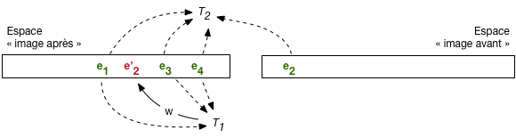
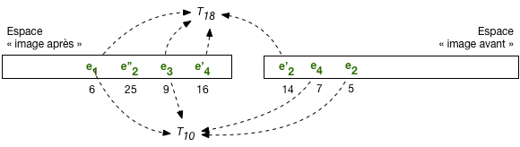
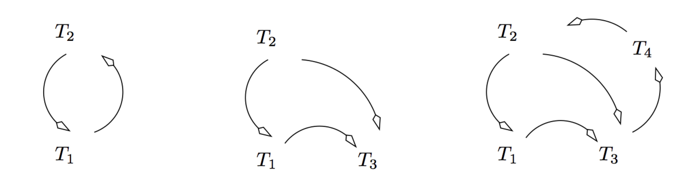
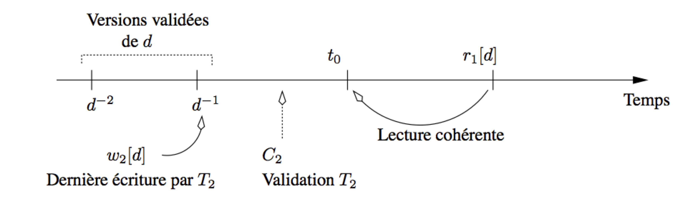
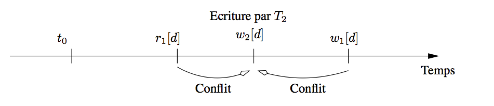

.. |nbsp| unicode:: 0xA0  
   :trim:  

.. _chap-conc:

#######################
Contrôle de concurrence
#######################

Le contrôle de concurrence est l'ensemble des méthodes mises en œuvre  
par un serveur de bases de données pour assurer le bon comportement
des transactions, et notamment leur *isolation*. Les autres propriétés 
désignées par l'acronyme ACID (soit la durabilité et l'atomicité) sont garanties par des techniques de
reprise sur panne que nous étudierons ultérieurement. 

Les SGBD utilisent essentiellement deux types d'approche pour gérer l'isolation. 
La première s'appuie sur un mécanisme de versionnement des mises à jour successives 
d'un nuplet. On parle de contrôle multiversion ou "d'isolation par cliché" (*snapshot isolation*
en anglais).  C'est une méthode satisfaisante jusqu'au niveau d'isolation
*repeatable read* car elle impose peu de blocages et assure une bonne fluidité. En revanche
elle ne suffit pas à garantir une isolation totale, de type *serializable* (sauf à recourir
à des algorithmes sophistiqués qui ne semblent pas être encore adoptés dans les systèmes). 

La seconde approche a recours au verrouillage, en lecture et en écriture, et garantit la
sérialisabilité des exécutions concurrentes, grâce à un algorithme connu et utilisé depuis très longtemps,
le *verrouillage à deux phases* (*two-phases locking*). Le verrouillage 
impacte négativement la fluidité des exécutions, certaines transactions devant être
mises en attente. Il peut parfois même entraîner un rejet de certaines transactions. C'est 
le prix à payer pour éviter toute anomalie transactionnelle.

*******************************
S1: isolation par versionnement
*******************************

.. admonition::  Supports complémentaires:

    * `Diapositives: isolation par versionnement <http://sys.bdpedia.fr/files/slconc-isolmultiversions.pdf>`_
    * `Vidéo sur l'isolation par versionnement <https://mediaserver.lecnam.net/permalink/v1263e27154a0dzu5zi1/>`_ 

Nous avons déjà évoqué à plusieurs reprises le fait qu'un SGBD gère, à certains moments,
plusieurs versions d'un  même nuplet. C'est clairement le cas pendant le déroulement d'une transaction,
pour garantir la possibilité d'effectuer des *commit/rollback*. Le versionnement est utilisé de manière plus générale
pour garantir l'isolation, au moins jusqu'au niveau *repeatable read*. C'est ce qui est détaillé dans cette session.

.. important:: Dans le contexte d'une base relationnelle, 
   le mot "donnée" dans ce qui suit désigne toujours un nuplet dans une table.

Versionnement et lectures "propres"
===================================

Comme vous avez dû le constater pendant la mise en pratique, par exemple avec notre interface en ligne,
il existe toujours deux choix possibles pour une transaction :math:`T` en
cours |nbsp| : effectuer un ``commit`` pour valider définitivement
les opérations effectuées, ou un ``rollback`` pour les annuler.
Pour que ces choix soient toujours disponibles, le SGBD
doit maintenir, pendant l'exécution de *T*,
deux versions des données mises à jour |nbsp| :

.. admonition:: Définition: image avant et image après

   Le système maintient, pour tout nuplet en cours de modification par une transaction, deux
   versions de ce nuplet:
   
      -  une version  *après* la mise à jour, que nous appellerons *l'image après*  de ce nuplet;
      -  une version  *avant* la mise à jour, que nous appellerons *l'image avant* de ce nuplet.

Ces deux images correspondent à deux versions successives du même nuplet,  stockées dans deux espaces de stockage
séparés (nous étudierons ces espaces de stockage dans le chapitre consacré à la reprise sur panne).
Le versionnement est donc d'abord une conséquence de la nécessité de pouvoir effectuer
des *commit* ou des *rollback*. Il s'avère également
très utile pour gérer *l'isolation* des transactions, grâce à l'algorithme suivant.

.. admonition:: Algorithme: lectures propres et cohérentes

   Soit deux transactions :math:`T` et :math:`T'`. Leur isolation,
   basée sur ces deux images, s'effectue
   de la manière suivante.

    - Chaque fois que *T* effectue la mise à jour d'un nuplet,
      la version courante est d'abord copiée dans l'image avant,
      puis remplacée par la  valeur de l'image après fournie par *T*. 
    - Quand *T* effectue la lecture de nuplets qu'elle vient
      de modifier, le système doit lire dans l'image après 
      pour assurer une vision cohérente de la base, reflétant
      les opérations effectuées par *T*. 
    - En revanche, quand c'est  une autre transaction *T'* qui demande
      la lecture d'un nuplet en cours de modification par  *T*, il faut lire dans l'image avant pour éviter
      les effets de lectures sales.

Cet algorithme est illustré par la :numref:`read-committed`. L'espace "après" et "avant" sont
distingués (attention, il s'agit d'une représentation simplifiée d'espaces de stockage dont
l'organisation est assez complexe: voir chapitre :ref:`chap-rp`). Dans l'espace "après" on trouve
les versions les plus récentes des nuplets de la base: ceux qui on fait l'objet d'un
*commit* sont en vert, ceux qui sont en cours de modification sont en rouge.

L'image avant contient la version précédente de chaque nuplet en cours de modification. 
En l'occurrence, :math:`e'_2` est en rouge dans l'image après car il représente
une version du nuplet :math:`e_2` en cours de modification
par :math:`T_1`. La version précédente est en vert dans l'image avant.

.. _read-committed:

   
   Lectures et écritures avec image après et image avant
   
Pour les lectures: :math:`T_1` lira  :math:`e'_2` qu'elle est en train de modifier,
dans l'image après,
pour des raisons de *cohérence*, alors que  :math:`T_2` (ou n'importe quelle autre
transaction) lira la version :math:`e_2` dans l'image avant pour éviter une lecture sale.

   
.. note:: On peut se poser la question du nombre de paires image après/avant nécessaires. Que se passe-t-il 
   par exemple si :math:`T_2` demande la mise à jour d'un nuplet déjà en cours de modification par :math:`T_1` |nbsp| ? 
   Si cette mise à jour était autorisée, il faudrait créer une troisième version du nuplet, l'image avant de :math:`T_2`
   étant l'image après de :math:`T_1` (tout le monde suit?). La multiplication des versions rendrait 
   la gestion des ``commit`` et ``rollback``
   extrêmement complexe, voire impossible: comment agir dans ce cas pour effectuer un *rollback* de la
   transaction :math:`T_1`? Il faudrait supprimer l'image après de :math:`T_1`, et donc l'image avant de :math:`T_2`,
   Il n'est pas nécessaire d'aller plus loin pour réaliser que ce casse-tête est insoluble.
   En pratique les systèmes n'autorisent pas les écritures sales, s'appuyant pour contrôler
   cette règle sur des mécanismes de verrouillage exclusif qui
   seront présentés dans ce qui suit. 

Lectures répétables
===================

Le mécanisme décrit ci-dessus est suffisant pour assurer un niveau d'isolation de type
*read committed*. En effet, toute transaction autre que celle effectuant la modification
d'un nuplet  doit lire l'image avant, qui est nécessairement
une version ayant fait l'objet d'un *commit* (pour les raisons exposées dans la note qui
précède).  En revanche, ce même mécanisme ne suffit pas pour le niveau 
*repeatable read*, comme le montre la :numref:`unrepeatable-read`.

.. _unrepeatable-read:

   
   Lecture non répétable après validation par :math:`T_1`

Cette figure montre la situation après que :math:`T_1` a validé. La version
:math:`e'_2` fait maintenant partie des nuplets ayant fait l'objet d'un *commit*
et  :math:`T_2` lit cette version, qui est donc différente de celle à laquelle elle pouvait accéder
avant le *commit* de :math:`T_1`.
La lecture est "non répétable", ce qui constitue un défaut d'isolation 
puisque  :math:`T_2` constate, en cours d'exécution, l'effet des mises à jour d'une transaction concurrente.

Les *lectures non répétables*  sont dues au fait qu'une transaction
:math:`T_2` lit un nuplet *e* qui a été   modifié par une transaction :math:`T_1`  *après* le début
de :math:`T_2`. Or, quand :math:`T_1` modifie *e*, il existe
avant la validation deux versions de *e* |nbsp| : l'image avant
et l'image après. Il suffirait que :math:`T_2` continue à lire  l'image avant, même après que
:math:`T_1` a validé, pour que le
problème soit résolu. En d'autres termes, ces images avant peuvent être vues, au-delà de leur rôle dans le
mécanisme des *commit/rollback*, comme un "cliché" de la base
pris à un moment donné, et toute transaction ne lit que dans le
cliché *valide* au moment où elle a débuté.

Un peu de réflexion suffit pour se convaincre qu'il n'est pas suffisant
de conserver une seule version de l'image  avant, mais qu'il faut conserver toutes celles
qui existaient au moment où la transaction la plus ancienne a débuté.
De nombreux SGBD (dont ORACLE, PostgreSQL, MySQL/InnoDB) proposent 
un mécanisme de *lecture cohérente* basé sur ce système
de versionnement qui s'appuie sur l'algorithme suivant |nbsp| :

.. admonition:: Algorithme: lectures répétables

   -  chaque transaction :math:`T_i` se voit attribuer, quand elle débute,
      une estampille temporelle :math:`\tau_i` |nbsp| ;
      chaque valeur d'estampille est unique
      et les valeurs sont croissantes |nbsp| : on garantit
      ainsi un ordre total entre les transactions.

   -  chaque version *validée* d'un nuplet *e* est de même
      estampillée par le moment :math:`\tau_e` de sa validation |nbsp| ;

   -  quand :math:`T_i` doit lire un nuplet *e*, le système regarde
      dans l'image après. Si *e* a été modifié par :math:`T_i`
      ou si son estampille est inférieure à :math:`\tau_i`,
      le nuplet peut être lu puisqu'il a été validé
      avant le début de :math:`T_i`, sinon le système recherche
      dans l'image avant la version de *e*
      validée et  immédiatement antérieure à :math:`\tau_i`.  

La seule extension nécessaire par rapport à l'algorithme
précédent est  la non-destruction
des images avant, même quand la transaction qui
a modifié le nuplet valide par ``commit``. L'image
avant contient alors toutes les versions successives
d'un nuplet, marquées par leur estampille temporelle. Seule
la plus récente de ces versions correspond à une mise
à jour en cours. Les autres ne servent qu'à assurer
la cohérence des lectures.

La  :numref:`repeatable-read` illustre le mécanisme de lecture
cohérente et répétable. Les nuplets de l'image après sont associés à leur estampille
temporelle: 6 pour :math:`e_1`, 25 pour :math:`e''_2`, etc.  On trouve dans l'image avant
les versions antérieures de ces nuplets: :math:`e'_2` avec pour estampille 14, :math:`e_4`
avec pour estampille 7, :math:`e_2`, estampille 5.

.. _repeatable-read:

   
   Lectures répétables avec image avant
   
La transaction :math:`T_{18}` a débuté à l'instant 18. Elle lit, dans l'image après,
les nuplets dont l'estampille est inférieure à 18: :math:`e_1`, :math:`e_3`, :math:`e'_4`. 
En revanche elle doit lire dans l'image avant la version de :math:`e_2` dont l'estampille est inférieure
à 18, soit :math:`e'_2`.

La transaction :math:`T_{10}` a débuté à l'instant 10. Le même mécanisme s'applique. On constate que 
:math:`T_{10}` doit remonter jusqu'à la version de :math:`e_{2}` d'estampille 5 pour effectuer
une lecture cohérente.

L'image avant contient l'historique
de toutes les versions successives
d'un enregistrement, marquées par leur estampille temporelle. Seule
la plus récente de ces versions correspond à une mise
à jour en cours. Les autres ne servent qu'à assurer
la cohérence des lectures.  L'image avant peut donc être vue comme un conteneur des "clichés" de la base
pris au fil des mises à jour successives. Toute transaction ne lit que dans le
cliché "valide" au moment où elle a débuté.

Certaines de ces versions n'ont plus aucune chance
d'être utilisées |nbsp| : ce sont celles pour lesquelles
il existe une version plus récente et antérieure à tous les débuts de
transaction  en cours. Cette propriété
permet au SGBD d'effectuer un nettoyage
(*garbage collection*) des versions devenues inutiles.

On peut imaginer la difficulté (et donc le coût) pour le système de cette garantie de lecture répétable. Il faut,
pour une transaction donnée effectuant une lecture, remonter la chaîne des versions successives de chaque nuplet
jusqu'à trouver la version faisant partie de l'état de la base au moment où la transaction a débuté. Le
niveau *read committed* apparaît beaucoup plus simple à garantir, et donc probablement plus efficace. 
L'isolation a un prix, qui résulte de structures de données et d'algorithmes (relativement) sophistiqués.

Quiz
====
             

  -   Quelle affirmation sur l'image avant et l'image après est exacte?
         
       .. eqt:: iavantapres

         A) :eqt:`I` L'image après ne contient que des nuplets validés par un *commit*
         #) :eqt:`C` L'image avant ne contient que des nuplets validés par un *commit*
         #) :eqt:`I` Toutes les lectures se font dans l'image avant
         #) :eqt:`I` Toutes les lectures se font dans l'image après
            
  -    Dans quel mode a-t-on besoin de conserver plus d'une version dans l'image avant?

      .. eqt:: iavantapres2

         A) :eqt:`C` En ``repeatable read`` 
         #) :eqt:`I` En ``read committed`` 
         #) :eqt:`I` En ``serializable`` 

  -    Jusqu'à quand doit-on garder une version :math:`e_i` estampillée à l'instant :math:`i`

      .. eqt:: estampilee

         A) :eqt:`I` Pour toujours
         #) :eqt:`I` Tant que la transaction qui a écrit :math:`e_i` est active
         #) :eqt:`C` Tant qu'il existe une transaction qui a débuté avant  :math:`i`
         #) :eqt:`I` Tant qu'il existe une transaction qui a déjà lu :math:`e_i`

**********************
S2: la sérialisabilité
**********************

.. admonition::  Supports complémentaires:

   * `Diapositives: la sérialisabilité <http://sys.bdpedia.fr/files/slserialisabilite.pdf>`_
   * `Vidéo sur la sérialisabilité <https://mediaserver.lecnam.net/permalink/v1263e271538f2ilau7r/>`_ 

Nous en arrivons maintenant à l'isolation complète des transactions, garantie par le
niveau *serializable*. La sérialisabilité est le critère utime de correction pour l'exécution
concurrente de transactions. Voici sa définition:

.. admonition:: Définition de la sérialisabilité

   Soit *H* une exécution concurrente de *n* transactions :math:`T_1, \cdots T_n`. Cette exécution 
   est *sérialisable* si et seulement si, quel que soit l'état initial de la base, 
   il existe un ordonnancement *H'* de :math:`T_1, \cdots T_n` tel que
   le résultat de l'exécution de *H* est  équivalent à celui
   de l'exécution *en série* des transactions de *H'*.
   
En d'autres termes: si *H*, constitué d'une imbrication des opérations de :math:`T_1, \cdots T_n`,
est sérialisable, alors le résultat aurait pu être obtenu par une exécution *en série* des transactions,
pour au moins un ordonnancement.
Au cours d'une exécution *en série*, chaque transaction est seule à accéder à la base au moment 
où elle se déroule, et l'isolation est, par définition, totale.

Relisez bien cette définition jusqu'à l'assimiler et en comprendre les détails.  
Le but du contrôle de concurrence
va consister à n'autoriser que les exécutions concurrentes sérialisables, en retardant si nécessaire l'exécution
de certaines des transactions. 

Notez que la définition ci-dessus est de nature *déclarative*: elle nous
donne le sens de la notion de sérialisabilité, mais ne nous fournit aucun moyen pratique de vérifier 
qu'une exécution est sérialisable. On ne peut pas en effet se permettre de vérifier, à chaque étape d'une exécution
concurrente, s'il existe un ordonnancement donnant un résultat équivalent. Il nous faut donc des conditions
plus facile à mettre en œuvre: elles reposent sur la notion de *conflit* et sur le *graphe de sérialisabilité*.

Conflits et graphe de sérialisation
===================================

La notion de base pour tester la sérialisabilité est celle de *conflits* entre deux
opérations

.. admonition:: **Définition**: conflit entre opérations d'une exécution concurrente. 
 
   Deux opérations  :math:`p_i[x]` et :math:`q_j[y]`, provenant de deux transactions
   distinctes :math:`T_i` et :math:`T_j` (:math:`i \not= j`), sont 
   *en conflit* si et seulement si elles portent sur le même 
   nuplet (:math:`x=y`), et *p* ou (non exclusif) *q* est une écriture.

On étend facilement cette définition aux exécutions concurrentes |nbsp| :
deux transactions dans une exécution sont en *conflit* si
elles accèdent au même nuplet et si un de ces accès au moins
est une écriture.

.. admonition:: **Exemple**. 

   Reprenons une nouvelle fois l'exemple des mises à jour perdues. 
   
   .. math::

       r_1(s)  r_1(c_1) r_2(s)  r_2(c_2)  w_2(s)  w_2(c_2) w_1(s) w_1(c_1)
   

   L'exécution correspond
   à deux transactions :math:`T_1` et :math:`T_2`, accédant 
   aux données *s*, :math:`c_1` et :math:`c_2`. Les conflits sont
   les suivants |nbsp| :

    -  :math:`r_1(s)` et :math:`w_2(s)` sont en conflit |nbsp| ;
    -  :math:`r_2(s)` et :math:`w_1(s)` sont en conflit.
    -  :math:`w_2(s)` et :math:`w_1(s)` sont en conflit.

   Noter que :math:`r_1(s)` et :math:`r_2(s)` *ne sont  pas* en conflit,
   puisque ce sont deux lectures. Il n'y a pas de conflit sur
   :math:`c_1` et :math:`c_2`.

Les conflits permettent de définir une relation entre les
transactions d'une exécution concurrente. 

.. admonition:: **Définition**. 

   Soit *H* une exécution concurrente d'un ensemble de transactions :math:`T = \{T_1, T_2, \cdots, T_n\}`.
   Alors il existe une relation :math:`\lhd` sur cet ensemble, définie par |nbsp| :
  
   .. math:: 
   
      T_i \lhd T_j \Leftrightarrow \exists p \in T_i, q \in T_j, p\ \rm{est\ en\ conflit\ avec} \ q\ et\ p <_H q 
      
   où :math:`p <_H q` indique que *p* apparaît avant *q* dans *H*.

Dans l'exemple qui précèdent, on a donc :math:`T_1 \lhd T_2`,
ainsi que :math:`T_2 \lhd T_1`. 

Une transaction :math:`T_i` peut
ne pas être en relation (directe) avec une transaction :math:`T_j`. 

Condition de sérialisabilité
============================

La condition sur la sérialisabilité
s'exprime sur le graphe de la relation :math:`(T, \lhd)`,
dit
*graphe de sérialisation* |nbsp| : 

.. admonition:: **Théorème de sérialisabilité**. 

   Soit *H* une exécution concurrente d'un ensemble de transactions
   :math:`\cal T`. Si le graphe de :math:`({\cal T}, \lhd)` est acyclique,
   alors *H* est sérialisable. 

La  :numref:`graphe_serial` montre quelques exemples
de graphes de sérialisation. Le premier 
correspond aux exemples données ci-dessus |nbsp| : il
est clairement cyclique. Le second n'est pas
cyclique et correspond donc à une exécution sérialisable. Le
troisième  est cyclique.

.. _graphe_serial:

   
   Exemples de graphes de sérialisation
   
Un algorithme de contrôle de concurrence a donc pour
objectif d'éviter la formation d'un cycle dans le graphe
de sérialisation. C'est une condition pratique qu'il est envisageable de vérifier
pendant le déroulement d'une exécution. Il existe en fait deux grandes familles
de contrôle de concurrence:

  - les algorithmes dits "optimistes" surveillent les conflits en intervenant au minimum sur
    le déroulement des transactions, et rejettent une transaction
    quand un cycle apparaît; 
  - les algorithmes dits "pessimistes" effectuent des verrouillages et blocages pour tenter de
    prévenir l'apparition de cycle dans le graphe de sérialisation.
    
    
Les sessions qui suivent présentent deux algorithmes très répandus: le contrôle multiversions,
optimiste, dont la version de base (que nous présentons) ne garantit pas
totalement la sérialisabilité, et le verrouillage à deux phases, plutôt de nature pessimiste,
le plus utilisé quand la sérialisabilité stricte est requise.

.. note:: (Parenthèse pour ceux qui veulent tout savoir). Dans l'idéal, la condition sur 
   le graphe des conflits caractériserait *exactement*
   les exécutions sérialisables et ontrouverait un "si et seulement si"
   dans l'énoncé du théorème.. Ce n'est pas tout à fait le cas. Tester qu'une exécution
   a un graphe des conflits cyclique (appelons ces exécutions *conflit sérialisables*)
   est une condition *suffisante* mais pas *nécessaire*. Certaines exécutions (très rares) peuvent être 
   sérialisables avec un graphe de conflits cyclique. En d’autres termes, un système qui fonctionne 
   avec le graphe des conflits rejette (un peu) trop de transactions.
   
   L'alternative serait d'effectuer un ensemble de vérifications complexes, dont je préfère
   ne pas vous donner la liste.
   Les exécutions qui satisfont ces vérifications sont appelées *vue sérialisables* dans les
   manuels traitant de manière approfondie de la concurrence. La vue-sérialisabilité
   est une condition nécessaire *et* suffisante, et  caractérise exactement la sérialisabilité.
   
   Tester la vue-sérialisabilité est très complexe, beaucoup plus complexe
   que le test sur le graphe des conflits. Les systèmes appliquent donc la seconde
   et tout le monde est content, les scientifiques et les praticiens. Fin de la parenthèse.
   
Quiz
====
             

  - Supposons une table *T(id, valeur)*, et la procédure suivante qui
    copie la valeur d'une ligne vers la valeur d'une autre:
    
    .. code-block:: sql

       /* Une procédure de copie */

       create or replace procedure Copie (id1 INT, id2 INT) AS

        -- Déclaration des variables
        val INT;  

        BEGIN
          -- On recherche la valeur de id1
          SELECT * INTO val FROM T WHERE id = id1

          -- On copie dans la ligne id2
          UPDATE T SET valeur = val WHERE id = id2
          
          -- Validation
          commit; 
       END;
      /

    On prend deux transactions *Copie(A, B)* et *Copie(B,A)*, l'une copiant de la
    ligne *A* vers la ligne *B* et l'autre effectuant la copie inverse. Initialement, la
    valeur de *A* est *a* et la valeur de *B* est *b*. Qu'est-ce qui
    caractérise une exécution sérialisable de ces deux transactions?
       
    .. eqt:: defSerial1

       A) :eqt:`I` *A* et *B* valent *a*
       #) :eqt:`I` *A* et *B* valent *b*
       #) :eqt:`C` *A* et *B* ont la même valeur
       #) :eqt:`I` *A* vaut *b* et  *B* vaut  *a*

  -  Voici une exécution concurrente de deux transactions de réservation.
         
          .. math:: 
  
               r_1(s)  r_1(c_1) w_1(s) r_2(s) r_2(c_2) w_2(s) w_1(c_1) w_2(c_2)

      Quelles sont les opérations en conflit?

      .. eqt:: conflitTrans1

         A) :eqt:`I` :math:`r_1(s)` et :math:`r_2(s)`
         #) :eqt:`C` :math:`r_1(s)` et :math:`w_2(s)`
         #) :eqt:`C`:math:`w_1(s)` et :math:`w_2(s)`
         #) :eqt:`I`:math:`r_2(c_2)` et :math:`w_2(c_2)`

  -   Voici une exécution concurrente de *Copie(A, B)* et *Copie(B,A)*
         
         .. math:: 
  
             r_1(v_1)  r_2(v_2) w_1(v_2) w_2(v_1)

      Est-elle sérialisable, d'après les conflits et le graphe? 
      
      .. eqt:: serial2

         A) :eqt:`I` Oui
         #) :eqt:`C` Non
            

.. _sec-multiversions:

******************************************
S3: Contrôle de concurrence multi-versions
******************************************

.. admonition::  Supports complémentaires:

    * `Diapositives: contrôle de concurrence multiversions <http://sys.bdpedia.fr/files/slccmultiversions.pdf>`_
    * `Vidéo sur le contrôle de concurrence multiversions <https://mediaserver.lecnam.net/permalink/v1263dc99deb557xunjm/>`_ 

Le contrôle de concurrence multiversions (*isolation snapshot*) 
permet une gestion relativement simple de l'isolation, au prix d'un verrouillage
minimal. Même s'il ne garantit pas une sérialisabilité totale, c'est une solution
adoptée par de nombreux systèmes transactionnels (par seulement des SGBD d'ailleurs).
La méthode s'appuie essentiellement sur un versionnement des données (voir ci-dessus), 
et sur des vérifications de cohérence entre les versions
lues et celles corrigéees par une même transaction. 

L'algorithme tire parti du fait que les lectures s'appuient
toujours sur une version cohérente (le "cliché") de la base.  
Tout se passe comme si les lectures effectuées par une transaction :math:`T(t_{0})`
débutant à l'instant :math:`t_0` lisaient la base, dès le début de la
transaction, donc dans l'état  :math:`t_0`.
Cette remarque réduit considérablement les cas possibles
de conflits et surtout de cycles entre conflits.

Les possibilités de conflit
===========================

Prenons
une lecture :math:`r_1[d]` effectuée par la transaction :math:`T_1(t_0)`.
Cette lecture accède à la version *validée*
la plus récente de *d* qui précède :math:`t_0`, par définition de l'état
de la base à :math:`t_0`. Deux cas de conflits sont envisageables |nbsp| :

  -  :math:`r_1[d]` est en conflit avec une écriture :math:`w_2[d]`
     qui a eu lieu *avant*   :math:`t_0` |nbsp| ;
  -  :math:`r_1[d]` est en conflit avec une écriture :math:`w_2[d]`
     qui a eu lieu *après* :math:`t_0`.
  
Dans le premier cas, :math:`T_2`   a forcément effectué son ``commit`` avant :math:`t_0`,
puisque :math:`T_1` lit l'état de la base à :math:`t_0` |nbsp| :
tous les conflits de :math:`T_1` avec :math:`T_2` sont dans le même sens (de fait,
:math:`T_2` et :math:`T_1` s'exécutent en série), et
il n'y a pas de risque de cycle (:numref:`cc-multiversions1`).

.. _cc-multiversions1:

   
   Contrôle de concurrence multi-versions |nbsp| : conflit  avec les écritures précédentes

Le second cas est celui qui peut poser problème. Notez tout d'abord 
qu'une nouvelle lecture de *d* par :math:`T_1` n'introduit pas de cycle puisque
toute lecture s'effectue à :math:`t_0`. En revanche, si :math:`T_1` cherche
à écrire *d* après l'écriture :math:`w_2[d]`, alors un conflit
cyclique apparaît (:numref:`cc-multiversions2`). 

.. _cc-multiversions2:

   
   Contrôle de concurrence multi-versions |nbsp| : conflit  avec une écriture d'une autre transaction.
   
Le contrôle de concurrence peut alors se limiter 
à vérifier, au moment
de l'écriture d'un nuplet *d* par une transaction *T*, qu'aucune
transaction *T'* n'a modifié *d* entre le début de *T* et l'instant
présent.  Si on autorisait la modification de *d* par *T*, 
un cycle apparaîtrait dans le graphe de sérialisation.  En d'autres termes, *une
mise à jour n'est possible que si la partie de la base à modifier n'a
pas changé depuis que *T* a commencé à s'exécuter*.

L'algorithme
============

Rappelons que pour chaque transaction :math:`T_i` on
connaît son estampille temporelle de début d'exécution :math:`\tau_i`; et pour
chaque version d'un nuplet *e* son estampille de validation :math:`\tau_e`.
Le contrôle de concurrence multi-versions s'appuie sur la capacité pour une transaction de 
*verrouiller* une version, auquel cas aucune autre transaction ne peut y accéder 
jusqu'à ce que les verrous soient levés par le *commit* ou le *rollback* de la transaction
verrouillante. 

.. admonition:: Algorithme de contrôle de concurrence multiversions

    -  toute lecture :math:`r_i[e]` lit la plus récente
       version de *e* telle que :math:`\tau_e \leq \tau_i`; aucun contrôle ou verrouillage n'est effectué;
    -  en cas d'écriture :math:`w_i[e]`, 
        - si :math:`\tau_e \leq \tau_i` et aucun verrou n'est posé sur *e* |nbsp| : 
          :math:`T_i` pose un verrou exclusif sur *e*, et effectue la mise à jour |nbsp| ;
        - si :math:`\tau_e \leq \tau_i` et un verrou est posé sur *e* |nbsp| : 
          :math:`T_i` est mise en attente |nbsp| ; 
    -     si :math:`\tau_e > \tau_i`, :math:`T_i` est rejetée.
    -  au moment du ``commit`` d'une transaction :math:`T_i`,  tous les enregistrements modifiés par 
       :math:`T_i` obtiennent 
       une nouvelle version avec pour estampille l'instant du ``commit``.

Avec cette technique, on peut ne pas poser de verrou au moment des opérations de lecture,
ce qui est souvent présenté comme un argument fort par rapport au verrouillage à deux phases
qui sera étudié plus loin. En revanche les verrous 
sont toujours indispensables pour les écritures, afin d'éviter lectures ou écritures sales.

Voici un déroulé de cette technique, toujours
sur notre exemple d'une exécution concurrente
du programme de réservation avec l'ordre suivant |nbsp| :

.. math::

   r_1(s)  r_1(c_1) r_2(s)  r_2(c_2)  w_2(s)  w_2(c_2) C_2 w_1(s) w_1(c_1) C_1

On suppose que :math:`\tau_1 = 100`,  :math:`\tau_2 = 120`. 
On va considérer également qu'une opération est effectuée toutes les 10
unités de temps, même si seul l'ordre compte, et pas le délai
entre deux opérations. Le déroulement
de l'exécution est donc le suivant |nbsp| :

    -  :math:`T_1` lit *s*, sans verrouiller |nbsp| ;
    -  :math:`T_1` lit :math:`c_1`, sans verrouiller |nbsp| ;
    -  :math:`T_2` lit *s*, sans verrouiller |nbsp| ;
    -  :math:`T_2` :math:`c_2`, sans verrouiller |nbsp| ;
    -  :math:`T_2` veut modifier *s* |nbsp| : l'estampille de *s*
       est inférieure à  :math:`\tau_2 = 120`, ce qui signifie
       que *s* n'a pas été modifié par une autre transaction depuis que
       :math:`T_2` a commencé à s'exécuter; on 
       pose un verrou  sur *s* et on effectue
       la modification |nbsp| : 
    -  :math:`T_2` modifie :math:`c_2`, avec pose d'un verrou  |nbsp| ;
    -  :math:`T_2` valide et relâche les verrous |nbsp| ;
       deux nouvelles versions de 
       *s* et :math:`c_2` sont  créées avec l'estampille *150* |nbsp| ;
    -  :math:`T_1` veut à son tour modifier *s*, mais
       cette fois le contrôleur détecte qu'il existe
       une version de *s* avec :math:`\tau_s > \tau_1`, donc que *s*
       a été modifié après le début de :math:`T_1`. 
       Le contrôleur doit donc rejeter :math:`T_1` sous peine d'autoriser un cycle
       et donc d'obtenir une exécution non sérialisable.

On obtient le
rejet de l'une des deux transactions avec un contrôle *à postériori*, d'où l'expression
"approche optimiste" exprimant  l'idée que
la  technique choisit de laisser faire
et d'intervenir seulement quand les conflits cycliques interviennent réellement.

Limites de l'algorithme
=======================

L'algorithme de contrôle multiversions est réputé efficace, plus efficace que le
traditionnel verrouillage à deux phases. La comparaison est cependant biaisée car 
le contrôle multiversions  ne garantit pas la sérialisabilité dans tous les cas, comme le montre
l'exemple très simple qui suit. On reprend la procédure de copie d'une ligne à l'autre dans
la table *T*, et l'exécution concurrente de deux transactions issues de cette procédure.
         
.. math:: 
  
     r_1(v_1)  r_2(v_2) w_1(v_2) w_2(v_1)

Vous devriez déjà être convaincu que cette exécution n'est pas sérialisable. Si on la soumet
à l'algorithme de contrôle de concurrence multi-version, un rejet de l'une des transactions
devrait dont survenir. Or, il est facile de vérifier que

  - La valeur :math:`v_1` est lue, pas de contrôle ni de verrouillage.
  - La valeur :math:`v_2` est lue, pas de contrôle ni de verrouillage.
  - La valeur :math:`v_2` est modifiée sans obstacle, car aucune 
    mise à jour de :math:`v_2` n'a eu lieu depuis le début de l'exécution.
  - Même chose pour :math:`v_1`.
  
Donc, tout se déroule sans obstacle, et la non-sérialisabilité n'est pas détectée. À la fin de l'exécution,
les valeurs de *A* et *B* diffèrent alors qu'elles devraient être égales. Cet algorithme n'est pas d'une correction
absolue, même s'il détecte la plupart des situations non-sérialiables, y compris notre exemple prototypique
des mises à jour perdues.

Des travaux de recherche ont proposé des améliorations garantissant la sérialisabilité stricte, mais
elles ne semblent pas encore intégrées aux systèmes qui s'appuient sur la solution éprouvée du verrouillage 
à deux phases, présenté ci-dessous.

*********************************
S4: le verrouillage à deux phases
*********************************

.. admonition::  Supports complémentaires:

   * `Diapositives: verrouillage à deux phases <http://sys.bdpedia.fr/files/sl2pl.pdf>`_
   * `Vidéo sur le verrouillage à deux phases <https://mediaserver.lecnam.net/permalink/v1263dc98fc44cwb33xc/>`_ 

L'algorithme de verrouillage à deux phases (que nous simplifierons en 2PL pour *2 phases locking*)
est le plus ancien, et toujours le plus utilisé des 
méthodes de contrôle de concurrence assurant la sérialisabilité stricte. Il a la réputation
d'induire beaucoup de blocages, voire d'interblocages, ainsi que des rejets de transactions. Comme nous
l'avons indiqué à de très nombreuses reprises, aucune solution n'est idéale et il faut faire un choix
entre le risque d'anomalies ponctuelles et imprévisibles, et des blocages et rejets tout aussi ponctuels
et imprévisibles mais assurant la correction des exécutions concurrentes.

L'algorithme lui-même est relativement simple. Il s'appuie sur des méthodes de verrouillage
qui sont présentées en premier lieu.

Verrouillage
============

Le 2PL est basé sur le
*verrouillage* des nuplets lus ou mis à jour. L'idée
est simple |nbsp| : chaque transaction désirant lire
ou écrire un nuplet doit auparavant obtenir un verrou
sur ce nuplet.  Une fois obtenu (sous certaines conditions
explicitées ci-dessous), le verrou reste détenu
par la transaction qui l'a posé, jusqu'à
ce que cette transaction décide de relâcher le verrou.

Le 2PL gère deux types de verrous |nbsp| :

  -  les *verrous partagés*  autorisent la pose d'autres verrous partagés sur le même nuplet.
     
  -  les *verrous exclusifs* interdisent
     la pose de tout autre verrou, exclusif ou partagé,
     et donc de toute lecture ou écriture par une autre
     transaction.

On ne peut poser un verrou partagé que s'il n'y a que des verrous partagés sur le nuplet.
On ne peut poser un verrou exclusif que s'il n'y a aucun autre verrou, qu'il soit exclusif ou partagé.
Les verrous sont posés par chaque transaction, et ne sont libérés qu'au moment du ``commit`` ou
``rollback``.

Dans ce qui suit les  verrous en lecture  seront notés *rl* (comme *read lock*), 
et les verrous en écritures seront notés *wl* (comme
*write lock*). Donc :math:`rl_i[x]` indique par exemple que la
transaction *i* a posé un verrou en lecture sur la resource *x*.
On notera de même *ru* et *wu* le relâchement des verrous (*read unlock* et 
*write unlock*).

Il ne peut y avoir qu'un seul verrou exclusif sur un nuplet. 
Son obtention par une transaction *T*
suppose donc qu'il n'y ait aucun verrou déjà posé
par une autre transaction *T'*. 
En revanche il peut y avoir plusieurs verrous partagés |nbsp| :
l'obtention d'un verrou partagé est possible sur
un nuplet tant que ce nuplet n'est pas verrouillé exclusivement
par une autre transaction. Enfin, si une transaction
est la seule à détenir un verrou partagé sur un nuplet,
elle peut "promouvoir" ce verrou en un verrou exclusif.

Si une transaction ne parvient pas à obtenir un verrou,
elle est mise en attente, *ce qui signifie que la transaction
s'arrête complètement jusqu'à ce que le verrou soit obtenu*. Rappelons
qu'une transaction est une séquence d'opérations, et qu'il n'est
évidemment pas question de changer l'ordre, ce qui reviendrait
à modifier la sémantique du programme. Quand une opération
ne peut pas s'exécuter car le verrou correspondant ne peut pas être posé,
elle est mise en attente ainsi
que toutes celles qui la suivent pour la même transaction.
 
Les verrous sont posés de manière automatique par le SGBD en fonction
des opérations effectuées par les transactions/utilisateurs.  
Il est également possible de demander explicitement le verrouillage
de certaines ressources (nuplet ou même table) (cf. chapitre
d'introduction à la concurrence). 

Tous les SGBD proposent un verrouillage au niveau du nuplet, et privilégient
les verrous partagés tant que cela ne remet pas en cause
la correction des exécutions concurrentes. Un verrouillage
au niveau du nuplet est considéré comme moins pénalisant pour
la fluidité, puisqu'il laisse libres d'autres transactions
d'accéder à tous les autres nuplets non verrouillés. Il
existe cependant des cas où cette méthode est inappropriée. Si
par exemple un programme parcourt une table avec un curseur
pour modifier chaque nuplet, et valide à la fin, on va poser
un verrou sur chaque nuplet alors qu'on aurait obtenu un résultat
équivalent avec un seul verrou au niveau de la table.

.. note::  Certains SGBD pratiquent également *l'escalade des verrous* |nbsp| : quand plus
           d'une certaine fraction des nuplets d'une table est verrouillée,
           le SGBD passe automatiquement à un verrouillage au niveau de la table.
           Sinon on peut envisager, en tant que programmeur, 
           la pose  explicite d'un verrou
           exclusif sur la table à modifier au début du programme. Ces méthodes
           ne sont pas abordées ici: à vous de voir, une fois les connaissances fondamentales
           acquises, comment gérer au mieux votre application avec les outils proposés
           par votre SGBD.

Contrôle par verrouillage à deux phases
=======================================

Le verrouillage à deux phases est le protocole le plus ancien
pour assurer des exécutions concurrentes correctes. 
Le respect du protocole est assuré par un module dit *ordonnanceur* 
qui reçoit les opérations émises par les transactions
et les traite selon l'algorithme suivant |nbsp| :

  - L'ordonnanceur reçoit :math:`p_i[x]` et consulte le verrou déjà posé sur *x*, :math:`ql_j[x]`, 
    s'il existe.
    
      #. si :math:`pl_i[x]` est en conflit avec :math:`ql_j[x]`, :math:`p_i[x]` est retardée et la transaction :math:`T_i`  est mise en attente.
      #. sinon, :math:`T_i` obtient le verrou :math:`pl_i[x]` et  l'opération :math:`p_i[x]` est exécutée.	
      
  - les verrous ne sont relâchés qu'au moment    du ``commit`` ou du ``rollback``.

Le terme "verrouillage à deux phases" s'explique par le processus
détaillé ci-dessus |nbsp| : il y a d'abord *accumulation* de verrous
pour une transaction *T*, puis *libération* des verrous
à la fin de la transaction. 
Les transactions obtenues par application de cet algorithme
sont sérialisables. Il est assez facile de voir
que les lectures ou écritures sales sont interdites, puisque
toutes deux reviennent à tenter de lire ou d'écrire un nuplet
déjà écrit par une autre, et donc verrouillé exclusivement
par l'algorithme. 

Le protocole garantit que, en présence de deux transactions en conflit :math:`T_1` et
:math:`T_2`, la dernière arrivée sera mise en attente de la première ressource
conflictuelle et sera bloquée jusqu'à ce que la première commence à relâcher
ses verrous (règle 1).  À ce moment là il n'y a plus de conflit possible
puisque :math:`T_1` ne demandera plus de verrou.

Quelques exemples
=================

Prenons pour commencer l'exemple
des deux transactions suivantes |nbsp| :

    -  :math:`T_1: r_1[x]  w_1[y]  C_1` 
    -  :math:`T_2: w_2[x]  w_2[y] C_2`

et l'exécution concurrente |nbsp| : 

.. math::

    r_1[x] w_2[x] w_2[y] C_2 w_1[y] C_1

Maintenant   supposons que l'exécution avec pose et relâchement de verrous
ne respecte pas les deux phases du 2PL, et se passe de la manière suivante |nbsp| :

    -  :math:`T_1` pose un verrou partagé sur *x*, lit *x* puis relâche le verrou |nbsp| ;
    -  :math:`T_2` pose un verrou exclusif sur *x*, et modifie *x* |nbsp| ;
    -  :math:`T_2` pose un verrou exclusif sur *y*, et modifie *y* |nbsp| ;
    -  :math:`T_2` valide puis relâche les verrous sur *x* et *y* |nbsp| ;
    -  :math:`T_1` pose un verrou exclusif sur *y*, modifie *y*, relâche le verrou et valide.

On a violé la règle 3 |nbsp| : :math:`T_1` a relâché le verrou sur *x* puis en a 
repris un sur *y*. Une "fenêtre" s'est ouverte qui a permis a :math:`T_2`
de poser des verrous sur *x* et *y*. Conséquence |nbsp| : 
l'exécution n'est plus sérialisable car :math:`T_2` a écrit sur :math:`T_1` pour *x*,
et :math:`T_1` a écrit sur :math:`T_2` pour *y*. Le graphe de sérialisation
est cyclique.

Reprenons le même exemple, avec un verrouillage à deux phases |nbsp| :

    -  :math:`T_1` pose un verrou partagé sur *x*, lit *x* mais ne relâche pas le verrou |nbsp| ;
    -  :math:`T_2` tente de poser un verrou exclusif sur *x* |nbsp| : impossible puisque :math:`T_1` détient un verrou partagé,
       donc :math:`T_2` *est mise en attente* |nbsp| ;
    -  :math:`T_1` pose un verrou exclusif sur *y*, modifie *y*,
       et valide |nbsp| ; tous les verrous détenus par :math:`T_1` 
       sont relâchés |nbsp| ;
    -  :math:`T_2` est libérée |nbsp| : elle pose un verrou exclusif sur *x*, et 
       le modifie |nbsp| ;
    -  :math:`T_2` pose un verrou exclusif sur *y*, et modifie *y* |nbsp| ;
    -  :math:`T_2` valide, ce qui relâche les verrous sur *x* et *y*.

On obtient donc, après réordonnancement,  l'exécution suivante, qui est
évidemment sérialisable |nbsp| :

.. math::

    r_1[x] w_1[y] w_2[x] w_2[y]

En général, le verrouillage permet une certaine imbrication 
des opérations tout en garantissant sérialisabilité et recouvrabilité. 
Notons cependant qu'il est un peu trop strict
dans certains cas |nbsp| : voici l'exemple d'une exécution sérialisable
impossible à obtenir avec un verrouillage à deux phases.

.. math::

    r_1[x] w_2[x] C_2 w_3[y] C_3 r_1[y] w_1[z] C_1

Un des inconvénients du verrouillage à deux phases est d'autoriser
des *interblocages* |nbsp| : deux transactions concurrentes 
demandent chacune un verrou sur une ressource
détenue par l'autre. Reprenons notre exemple de base |nbsp| :
deux exécutions concurrentes de la procédure
*Réservation*, désignées par :math:`T_1`
et :math:`T_2`, consistant 
à réserver des places pour le même spectacle, 
mais pour deux clients distincts :math:`c_1`  et :math:`c_2`. L'ordre
des opérations reçues par le serveur est le suivant |nbsp| :

.. math::

    r_1(s)  r_1(c_1) r_2(s)  r_2(c_2)  w_2(s)  w_2(c_2) C_2 w_1(s) w_1(c_1) C_1

On effectue des lectures pour :math:`T_1` puis :math:`T_2`, ensuite
les écritures pour :math:`T_2` puis :math:`T_1`. Cette exécution
n'est pas sérialisable, et le verrouillage à deux phases
doit empêcher qu'elle se déroule dans cet ordre. Malheureusement
il ne peut le faire qu'en rejettant une des deux transactions.
Suivons l'algorithme pas à pas |nbsp| :

    -  :math:`T_1` pose un verrou partagé sur *s* et lit *s* |nbsp| ;
    -  :math:`T_1` pose un verrou partagé sur :math:`c_1` et lit :math:`c_1` |nbsp| ;
    -  :math:`T_2` pose un verrou partagé sur *s*,
       *ce qui est autorisé car* :math:`T_1` *n'a elle-même qu'un verrou
       partagé* et lit *s* |nbsp| ;
    -  :math:`T_2` pose un verrou partagé sur :math:`c_2` et lit :math:`c_2` |nbsp| ;
    -  :math:`T_2` veut poser un verrou exclusif sur *s* |nbsp| :
       impossible à cause du verrou partagé de :math:`T_1` |nbsp| :
       donc :math:`T_2` est mise en attente |nbsp| ;
    -  :math:`T_1` veut à son tour poser un verrou exclusif sur *s* |nbsp| :
       impossible à cause du verrou partagé de :math:`T_2` |nbsp| :
       donc :math:`T_1` est à son tour mise en attente.

:math:`T_1` et :math:`T_2` sont en attente l'une de l'autre |nbsp| : il y a
*interblocage* (*deadlock* en anglais).
Cette situation ne peut pas être évitée et doit donc être
gérée par le SGBD |nbsp| : en général ce dernier maintient un
*graphe d'attente des transactions* et teste l'existence
de cycles dans ce graphe. Si c'est le cas, c'est qu'il y a interblocage
et une des transactions doit être annulée autoritairement, 
ce qui est à la fois déconcertant pour
un utilisateur non averti, et désagréable puisqu'il
faut resoumettre la transaction annulée. Cela reste bien
entendu encore préférable à un algorithme qui autoriserait
un résultat incorrect.

Notons que le problème vient d'un accès aux mêmes ressources, mais
dans un ordre différent |nbsp| : il est donc bon, au moment où l'on
écrit des programmes, d'essayer de normaliser l'ordre d'accès
aux données.

Dès que 2 transactions lisent la même donnée avec pour
objectif d'effectuer une mise à jour ultérieurement,
il y a potentiellement interblocage. D'où
l'intérêt de pouvoir demander dès la lecture
un verrouillage exclusif (écriture). C'est la
commande ``select .... for update`` que l'on trouve
dans certains SGBD. Cette méthode reste cependant peu sûre et ne dispense
pas de se mettre en mode sérialisable pour garantir la correction des exécutions concurrentes.

Quiz
====

  - Une transaction :math:`T_1` a lu un nuplet :math:`x` et posé un verrou partagé. Quelles affirmations
    sont vraies?

    .. eqt:: verrou1

         A) :eqt:`C` si aucun autre verrou n'est posé, :math:`T_1` peut poser un verrou exclusif sur :math:`x`
         #) :eqt:`C`  :math:`T_2` peut poser un verrou partagé sur :math:`x`
         #) :eqt:`I` :math:`T_2` peut poser un verrou exclusif sur :math:`x`

  - On reprend la procédure de copie et l'exécution concurrente de deux transactions.

         .. math:: 
  
             r_1(v_1)  r_2(v_2) w_1(v_2) w_2(v_1)

    A votre avis, en appliquant un 2PL:
    
    .. eqt:: verrou2

         A) :eqt:`I` :math:`T_1` s'exécutera avant :math:`T_2`
         #) :eqt:`I`  :math:`T_2` s'exécutera avant :math:`T_1`
         #) :eqt:`C` un interblocage surviendra?

  - On exécute en concurrence deux transactions de réservation, par le même client mais 
    pour deux spectacles différents:
  
    .. math::

        r_1(s_1)  r_1(c) r_2(s_2)  r_2(c)  w_2(s_2)  w_2(c) C_2 w_1(s_1) w_1(c) C_1
    
    Quelle opération à votre avis entraînera le premier blocage d'une transaction ?
    
    .. eqt:: verrou2

         A) :eqt:`I` sur :math:`r_2(c)`
         #) :eqt:`I`  :math:`w_2(s_2)`
         #) :eqt:`C` :math:`w_2(c)` 

*********
Exercices
*********

.. _ex-grapheserial:
.. admonition:: Exercice `ex-grapheserial`_: Graphe de sérialisabilité et équivalence 
                    des exécutions

    Identifiez les conflits et construisez les graphes de sérialisabilité pour les exécutions
    concurrentes suivantes. Indiquez les exécutions sérialisables et
    vérifiez s'il y a des exécutions équivalentes.

    -  :math:`H_{1}:w_{2}[x]\:w_{3}[z]\:w_{2}[y]\:c_{2}\:r_{1}[x]\:w_{1}[z]\:c_{1}\:r_{3}[y]\:c_{3}`
    - :math:`H_{2}:r_{1}[x]\:w_{2}[y]\:r_{3}[y]\:w_{3}[z]\:c_{3}\:w_{1}[z]\:c_{1}\:w_{2}[x]\:c_{2}`
    - :math:`H_{3}:w_{3}[z]\:w_{1}[z]\:w_{2}[y]\:w_{2}[x]\:c_{2}\:r_{3}[y]\:c_{3}\:r_{1}[x]\:c_{1}`

  .. ifconfig:: conc in ('public')

      .. admonition:: Correction

          - Voici les conflits de :math:`H_1`: sur *x*: :math:`w_{2}[x]\:r_{1}[x]`;
            sur *y*: :math:`w_{2}[y]\:r_{3}[y]`;
            sur *z*: :math:`w_{3}[z]\:w_{1}[z]`

            On a donc les arêtes :math:`T_2 \to T_1`, :math:`T_2 \to T_3`,
            et :math:`T_3 \to T_1`. Pas de cycle donc cette exécution
            est sérialisable.
            
          - Les conflits de :math:`H_2`: sur *x*,  :math:`r_{1}[x]\:w_{2}[x]`; 
            sur *y*: :math:`w_{2}[y]\:r_{3}[y]`;  sur *z*: :math:`w_{3}[z]\:w_{1}[z]`
            
            On a donc les arêtes :math:`T_1 \to T_2`, :math:`T_2 \to T_3`,
            :math:`T_3 \to T_1`. Cycle évident, donc exécution non sérialisable.
            
          - Les conflits de :math:`H_3`: sur *x*: :math:`w_{2}[x]\:r_{1}[x]`;
            sur *y*: :math:`w_{2}[y]\:r_{3}[y]`;
            sur $z$: :math:`w_{3}[z]\:w_{1}[z]`
  
            On a donc les arêtes :math:`T_2 \to T_1`, :math:`T_2 \to T_3`,
            :math:`T_3 \to T_1`.Pas de cycle donc cette exécution
            est sérialisable.

        **Conclusion**:  :math:`H_1` et :math:`H_3` sont sérialisables. Mais
        elles ne sont pas équivalentes. Pour avoir équivalence, deux conditions 
        sont nécessaires: (i) avoir les mêmes transactions et 
        les mêmes opérations, et  (ii) avoir le même ordre des 
        opérations conflictuelles.
        
        Ici la seconde condition est remplie, mais pas la première!  En effet,
        si on extrait la transaction :math:`T_{1}`, on remarque que
        pour :math:`H_1`  on a :math:`T_{1} = r_{1}[x] w_{1}[z] c_{1}`, 
        tandis que pour :math:`H_3`, :math:`T_{1} =  w_{1}[z] r_{1}[x] c_{1}`. 

.. _ex-multiversions1:
.. admonition:: Exercice `ex-multiversions1`_: application du contrôle multiversion 
   à l'anomalie des lectures non répétables

    On reprend l'exemple d'une imbrication de la procédure de réservation et de la procédure de contrôle
    (voir chapitre précédent).
    
    .. math:: 

        r_1(c_1) r_1(c_2)  Res(c_2, s, 2)  \ldots r_1(c_n) r_1(s)
    
    Appliquer le contrôle multi-versions. Que constate-t-on ?

   .. ifconfig:: conc in ('public')

      .. admonition:: Correction

          :math:`T_1` lit d'abord :math:`c_1` et :math:`c_2`. La réservation
          s'exécute: un conflit apparaît entre :math:`r_1(c_2)` et :math:`w_2(c_2)`.
          Ensuite :math:`T_1` finit ses lectures: le conflit potentiel
          serait entre :math:`w_2(s)` et :math:`r_1(s)` mais comme
          les  lectures de :math:`T_1` on lieu sur l'état de la base
          au début de la transaction, le conflit est
          dans le sens :math:`r_1(s) \to w_2(s)` l'exécution est sérialisable.
          Le résultat de la procédure de contrôle, en multiversion, est
          correct puisque toutes les lectures s'effectuent sur un état cohérent.

.. _ex-multiversions2:
.. admonition:: Exercice `ex-multiversions2`_: les limites du contrôle de concurrence multi-versions

    Supposons qu'un hôpital gère la liste de ses médecins dans une table (simplifiée) *Docteur(nom, garde)*, 
    chaque médecin pouvant ou non
    être de garde. On doit s'assurer qu'il y a toujours au moins deux médecins de garde.
    La procédure suivante doit permettre de placer un médecin au repos en vérifiant cette contrainte.
    
    .. code-block:: sql

       /* Une procédure de gestion des gardes */

       create or replace procedure HorsGarde (nomDocteur VARCHAR) AS

        -- Déclaration des variables
        val nb_gardes;  

        BEGIN
          -- On calcule le nombre de médecin de garde
          SELECT count(*) INTO nb_gardes FROM Docteur WHERE nom = nomDocteur;

          IF (nb_gardes > 2) THEN
             UPDATE Docteur SET garde = false WHERE nom = nomDocteur;
             COMMIT;
          ENDIF
       END;
      /

    En principe, cette procécure semble très correcte (et elle l'est). Supposons
    que nous ayons trois médecins, Philippe, Alice, et Michel, désignés par *p*, *a* et *m*,
    tous les trois de garde.
    Voici une exécution concurrente de deux transactions :math:`T_1` = *HorsGarde('Philippe')*
    et :math:`T_2` = *HorsGarde('Michel')*.
         
    .. math:: 
  
          r_1(p)  r_1(a) r_1(m) r_2(p)  r_2(a) r_2(m) w_1(p) w_2(m)

    Questions:

      - Quel est avec cette exécution le nombre de médecins de garde
        constatés par :math:`T_1` et :math:`T_2`

        .. eqt:: garde1

             A) :eqt:`I` 3 pour :math:`T_1`, 2 pour :math:`T_2`
             #) :eqt:`C` 3 pour :math:`T_1`, 3 pour :math:`T_2`
             #) :eqt:`I` 2 pour :math:`T_1`, 3 pour :math:`T_2`

      - Quel est le nombre de médecins de garde à la fin?

        .. eqt:: garde2

             A) :eqt:`I` 2 
             #) :eqt:`C` 1 
             #) :eqt:`I` 0 

      - Conclusion? Vous pouvez vérifier la sérialisabilité (conflits, graphes) et appliquer
        le contrôle de concurrence multi-versions pour vérifier s'il détecte et prévient les anomalies
        de cette exécution.

   .. ifconfig:: conc in ('public')

      .. admonition:: Correction

          - Les deux procédures lisent la base avant toute modification, et en
            concluent toutes les deux que nos trois médecins sont de garde. Ce qui est vrai.
          - Chaque procédure met "hors garde" son médecin respectif (soit Philippe
            et Michel) en pensant chacune qu'il en restera 2 (=3-1) à la fin. Mais
            après les ``commit``, seule Alice est de garde.
          - On trouve évidemment des conflits de :math:`T_1` vers :math:`T_2`
            et réciproquement, ce qui confirme que l'exécution n'est pas sérialisable.
            Le contrôle de concurrence MV vérifie, au moment de la mise à jour,
            que le médecin concerné n'a pas été modifié depuis le début
            de la transaction. C'est le cas, donc aucun blocage n'est effectué,
            et le résultat est incorrect. Ce ne serait pas le cas avec le verrouillage
            à deux phases qui bloquerait sur l'écriture d'un médecin qui a été
            *lu* par une autre transaction.

.. _ex-debitcredit:
.. admonition:: Exercice `ex-debitcredit`_: le cas des débits/crédits

    Les trois programmes suivants peuvent s'exécuter dans un système
    de gestion bancaire. ``Débit()`` diminue le solde d'un compte *c*
    avec un montant donné *m*. Pour simplifier, tout débit
    est permis (on accepte des découverts). ``Crédit()`` augmente le
    solde d'un compte *c* avec un montant donné *m*. Enfin
    ``Transfert()`` transfère un montant *m* à partir d'un compte
    source *s* vers un compte destination *d*.  L'exécution de
    chaque programme démarre par un ``Start`` et se termine par un
    ``Commit`` (non montrés ci-dessous).

    .. code-block:: text

        Débit (c:Compte;   |  Crédit (c:Compte;   |  Transfert (s,d:Compte;
               m:Montant)  |          m:Montant)  |             m:Montant)
        begin              |  begin               |  begin
          t := Read(c);    |    t := Read(c);     |    Débit(s,m);
          Write(c,t-m);    |    Write(c,t+m);     |    Crédit(d,m);
        end                |  end                 |  end
        
    Le système exécute en même temps les trois opérations suivantes:

        #. un transfert de montant 100 du compte A vers le compte B
        #. un crédit de 200 pour le compte A
        #. un débit de 50 pour le compte B

      - Écrire les transactions :math:`T_1`, :math:`T_2` et :math:`T_3`
        qui  correspondent à ces opérations. Montrer que l'histoire *H*
        suivante:
        
        .. math::
  
            r_{1}[A] r_{3}[B] w_{1}[A] r_{2}[A] w_{3}[B] r_{1}[B] c_{3} w_{2}[A] c_{2} w_{1}[B] c_{1} 
            
        est une exécution  concurrente de :math:`T_1`, :math:`T_2` et :math:`T_3`.
      - Mettre en évidence les conflits dans *H*  et construire le
        graphe de sérialisation de cette exécution. *H* est-elle
        sérialisable?
      - Quelle est l'exécution *H'*  obtenue à partir de *H*
        par verrouillage à deux phases? 
      - Si au début le compte A avait un solde de 100 et B de 50, quel
        sera le solde des deux comptes après la reprise si une panne
        intervient après l'exécution de:math:`w_{1}[B]`?

  .. ifconfig:: conc in ('public')

      .. admonition:: Correction

          - ``Débit`` et  ``Crédit``  sont constitués chacun d'une
            lecture, suivie d'une écriture. Dans ce cas, les transactions
            :math:`T_1`, :math:`T_2` et :math:`T_3` seront:

            - :math:`T_{1}: r_{1}[A] w_{1}[A] r_{1}[B] w_{1}[B] c_{1}`
            - :math:`T_{2}: r_{2}[A] w_{2}[A] c_{2}`
            - :math:`T_{3}: r_{3}[B] w_{3}[B] c_{3}`
            
            *H* contient toutes les opérations de :math:`T_1`, :math:`T_2` et :math:`T_3`
            et respecte l'ordre des opérations dans chaque transaction. Donc *H* 
            est bien une exécution concurrente de :math:`T_1`, :math:`T_2` et :math:`T_3`.
 
           - Les conflits sur A: :math:`r_{1}[A]\to w_{2}[A]`;
             :math:`w_{1}[A] \to r_{2}[A]`; :math:`w_{1}[A] \to w_{2}[A]`.
           - Les conflits sur B: :math:`r_{3}[B] \to w_{1}[B]`; 
             :math:`w_{3}[B] \to r_{1}[B]`; :math:`w_{3}[B] \to w_{1}[B]`.
            
            Le graphe de sérialisation  a pour arêtes 
            :math:`T_{3}\rightarrow T_{1}\rightarrow T_{2}`.
            *H* est sérialisable, car le graphe ne contient pas de cycle.
            
          - Voici le déroulé du verrouillage à deux phases. 

             - :math:`r_{1}[A]`, :math:`r_{3}[B]` reçoivent les verrous de lecture et s'exécutent
             - :math:`w_{1}[A]` obtient le verrou d'écriture sur A (déjà obtenu en  lecture  par :math:`T_1`) et s'exécute
             - :math:`r_{2}[A]` bloquée en attente de verrou sur A, donc :math:`T_2` bloquée
             - :math:`w_{3}[B]` obtient le verrou d'écriture sur B (déjà obtenu en  lecture  par :math:`T_2`) et s'exécute
             - :math:`r_{1}[B]` bloquée en attente de verrou sur B donc :math:`T_1`  bloquée
             - :math:`c_{3}`  s'exécute et relâche les verrous sur B donc  :math:`r_{1}[B]`
               débloquée, obtient le verrou et s'exécute (:math:`T_1` débloquée)
             - :math:`w_{2}[A]` et :math:`c_{2}` bloquées car :math:`T_2` bloquée
             - :math:`w_{1}[B]` obtient le verrou et s'exécute
             - :math:`c_{1}` s'exécute et relâche les verrous sur A, donc
               :math:`r_{2}[A]` , :math:`w_{2}[A]` et :math:`c_{2}` s'exécutent.
               
            Le résultat est 
            
            .. math::
            
                H' =  r_{1}[A] r_{3}[B] w_{1}[A]w_{3}[B] c_{3} r_{1}[B] w_{1}[B] c_{1} r_{2}[A] w_{2}[A] c_{2}
            
            Si une panne intervient après l'exécution de :math:`w_{1}[B]`, 
            seule la transaction :math:`T_{3}` (le débit de 50 sur B) 
            est validée à ce moment.  Donc le compte A aura un solde de 100 
            et B de 0.

.. _ex-2pl1:
.. admonition:: Exercice `ex-2pl1`_: verrouillage à deux phases

    Le programme suivant s'exécute dans un système de gestion de commandes pour
    les produits d'une entreprise. Il permet de commander une quantité donnée
    d'un produit qui se trouve en stock. Les paramètres du programme représentent
    respectivement la référence de la commande (*c*), la référence du produit (*p*)
    et la quantité commandée (*q*).

    .. code-block:: bash
    
        function Commander 
          $c: référence de la commande
          $p: référence du produit
          $q: quantité commandée

          Lecture prix produit $p
          Lecture du stock $s$ du produit $p
          if ($q > $s) then 
            rollback
          else
             Mise à jour stock de $p
            Enregistrement dans $c du total de facturation
            commit
          fi

    Notez que le prix et la quantité de produit en 
    stock sont gardés dans des enregistrements différents.

      - Lesquelles parmi les transactions suivantes peuvent être    
        obtenues par l'exécution du programme ci-dessus? Justifiez votre réponse.

          - :math:`T_1: r[x] r[y] R`
          - :math:`T_2: r[x] R`
          - :math:`T_3: r[x] w[y] w[z] C`
          - :math:`T_4: r[x] r[y] w[y] w[z] C`
        
      - Dans le système s'exécutent en même temps trois
        transactions: deux commandes d'un même produit et le changement du prix
        de ce même produit. Montrez que l'histoire *H* ci-dessous est une exécution
        concurrente de ces trois transactions et expliquez la signification des
        enregistrements qui y interviennent.
    
        .. math:: 
        
            r_1[x] r_1[y] w_2[x] w_1[y] c_2 r_3[x] r_3[y] w_1[z] c_1 w_3[y] w_3[u] c_3

      - Vérifiez si *H* est sérialisable en identifiant 
        les conflits et en construisant le graphe de sérialisation.
      - Quelle est l'exécution obtenue par verrouillage à
        deux phases à partir de *H*? Quel prix sera appliqué pour la seconde 
        commande, le même que pour la première ou le prix modifié?

  .. ifconfig:: conc in ('public')

      .. admonition:: Correction

          - :math:`T_1`: oui, on a fait les deux lectures et décidés
            d'effectuer un ``rollback`` car le stock est insuffisant.
            :math:`T_2`: non, le programme ne fait pas de ``rollback`` après une
            seule lecture.
            Mêmes arguments pour :math:`T_3` (non) et :math:`T_4` (oui). 
            
          - Il faut commencer par isoler les transactions.
             
             -  :math:`T_1 = r_1[x] r_1[y] w_1[y]w_1[z] c_1`
             -  :math:`T_2 =  w_2[x] ] c_2`
             -  :math:`T_3 =  r_3[x] r_3[y]  w_3[y] w_3[u] c_3`
             
            Donc :math:`T_1` et :math:`T_3` sont bien des commandes
            et :math:`T_2` une mise à jour.
          - Trouvons les conflits.Sur *x*: :math:`r_1(y) \to w_2(x)`
            et :math:`w_2(x) \to r_3(x)`; sur *y*, :math:`w_1(y) \to r_3(y)`
            et  :math:`r_1(y) \to w_3(y)`; sur *u* et *z* (les commandes), aucun
            conflit.
            
            Il n'y pas  de cycle, donc l'exécution est sérialisable.
            
          - On exécute :math:`r_1(x)r_1(y)`. La transaction :math:`T_2` 
            (qui modifie le prix du produit) est alors mise en attente
            car elle ne peut pas obtenir de verrou exclusif. 
            
            On exécute
            ensuite :math:`w_1(x)`, :math:`r_3(x)` qui ajoute un nouveau
            verrou partagé surb *x*, :math:`r_3(x)` et :math:`w_1(z)`:
            :math:`T_1` valide mais :math:`T_2` reste en attente sur :math:`T_3`.
            La transaction :math:`T_3` finit donc de s'exécuter, avant
            de débloquer :math:`T_2`. En résumé, on effectue en séquence
            :math:`T_1 T_3 T_2`. Le prix du produit pour les deux commandes
            est le prix initial.

.. _ex-medecindegarde: 
.. admonition:: Exercice `ex-medecindegarde`_: les médecins de garde et le contrôle de concurrence

   On reprend les transactions de gestion de docteurs et de leurs gardes (voir section :ref:`sec-multiversions`). 
   On a l'exécution concurrente suivante des deux transactions cherchant à lever la garde de Philippe et de Michel.
   
   .. math:: 
  
          r_1(p)  r_1(a) r_1(m) r_2(p)  r_2(a) r_2(m) w_1(p) w_2(m)
   
   Questions:
   
     - Trouver les conflits
     - En déduire (argumenter) que cette exécution concurrente n'est pas sérialisable
     - Appliquer l'algorithme de contrôle multiversions
     - Appliquer l'algorithme 2PL.

  .. ifconfig:: conc in ('public')

      .. admonition:: Correction

          - Les conflits: sur *p* entre :math:`r_2(p)` et :math:`w_1(p)`;
            sur *m* entre :math:`r_1(m)` et :math:`w_2(m)`.
            
          - On a donc les arêtes :math:`T_1\to T_2`   et :math:`T_2 \to T_1`.
            Le cycle est évident et l'exécution n'est pas sérialisable.
          - Appliquons le  contrôle multiversions. Au moment
            de :math:`w_1(p)`, on vérifie que *p* n'a pas été modifié
            depuis le début de la transaction: pas de problème. Même
            contrôle sur :math:`w_2(m)`, et même conclusion. Cette
            exécution est donc acceptée par le contrôle multiversions
            alors qu'elle n'est pas sérialisable.
          - Appliquons le verrouillage à deux phases. Les six
            premières lectures entraînent la pose de verrous partagés.
            Ensuite:
            
              - Au moment de :math:`w_1(p)`, :math:`T_1` est mise
                en attente sur le verrou partagé détenu par :math:`T_2`.
              - Au moment de :math:`w_2(m)`, :math:`T_2` est mise
                en attente sur le verrou partagé détenu par :math:`T_1`.
                
            Les deux transactions s'attendent l'une l'autre: interblocage,
            le système va rejeter une des deux. 
            
            Conclusion: le verrouillage à deux phases est le seul complètement
            correct, le seul à empêcher *toutes* les exécutions non sérialisables.
            
**********
Références
**********

Le sujet du contrôle de concurrence est complexe et a donné lieu à de très nombreux travaux. C'est, au final,
une des très grandes réussites des systèmes relationnels. Si vous voulez aller plus loin:

  - le livre de Jim Gray, *Transaction Processing: Concepts and Techniques*, paru en 1992, est *la* référence
  - Cet excellent résumé est facilement accessible: https://wiki.postgresql.org/wiki/Serializable
  - Le contrôle multi-versions amélioré pour atteindre le niveau sérialisable est ici:
    http://www.cs.nyu.edu/courses/fall09/G22.2434-001/p729-cahill.pdf. Quelques exemples du chapitre
    sont repris de cet article.
    