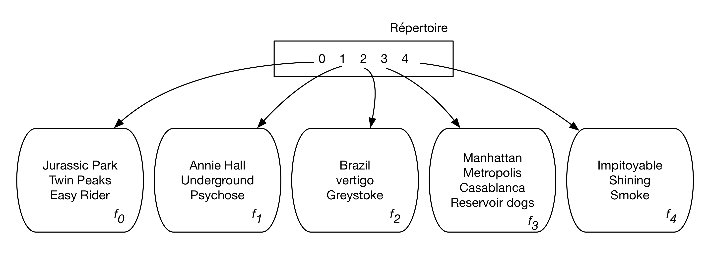
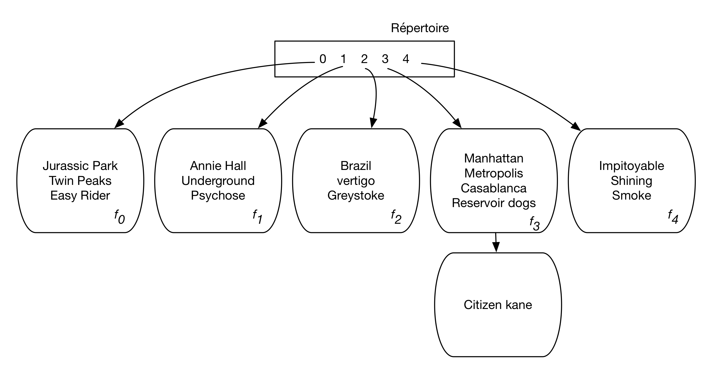
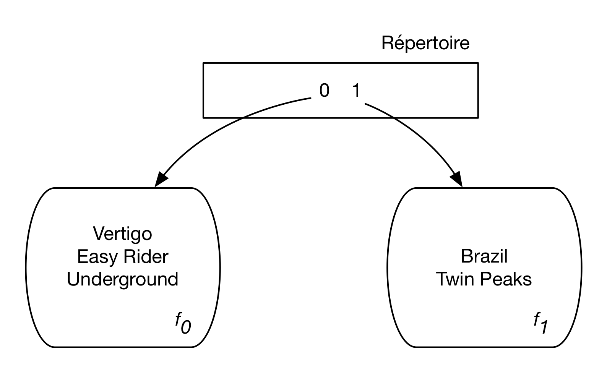
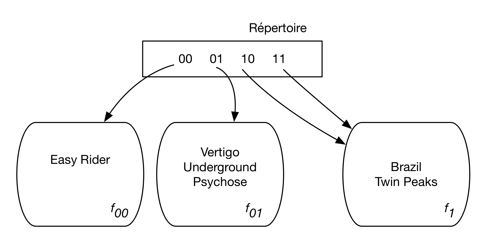
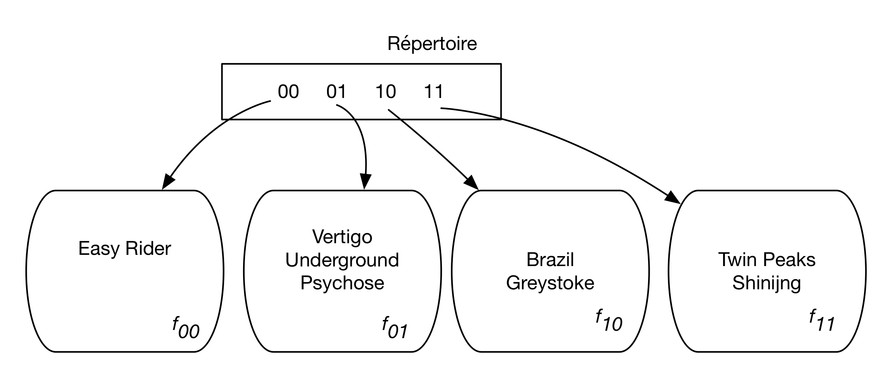
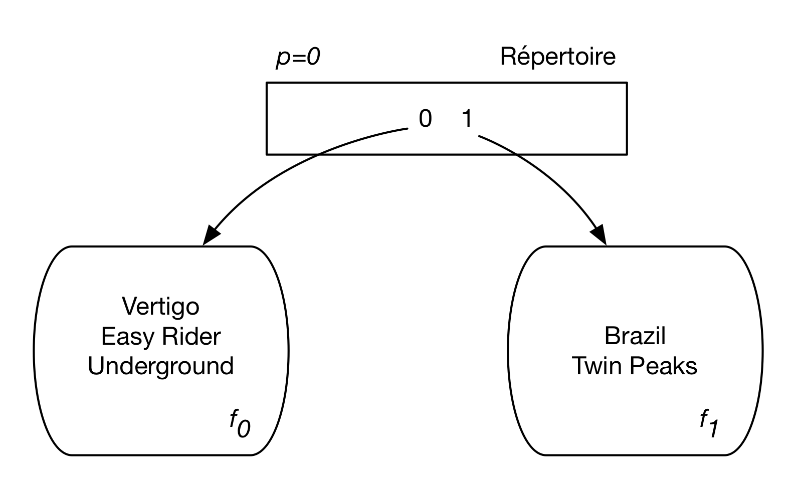
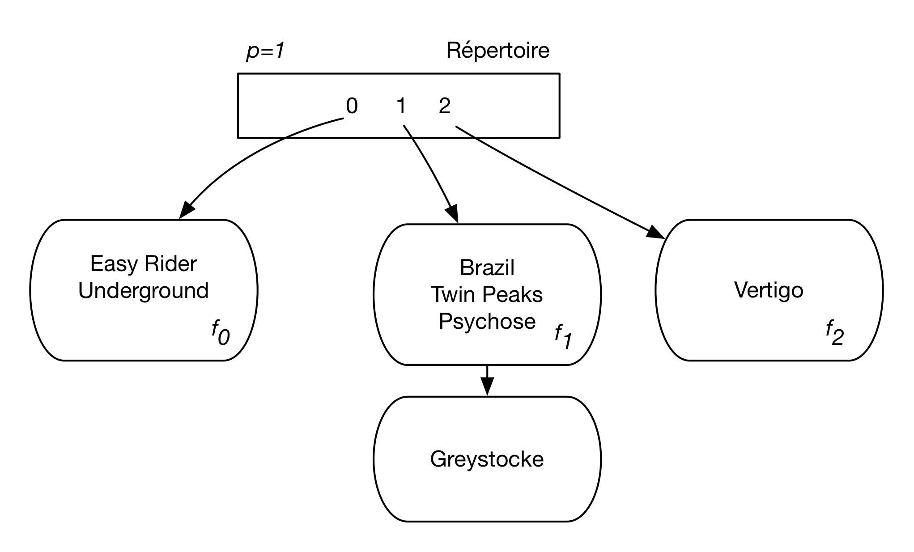
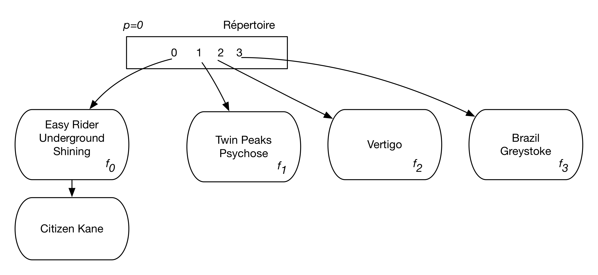

.. |nbsp| unicode:: 0xA0  
   :trim:  

.. _chap-hachage:

##############################
Structures d'index: le hachage
##############################

Les tables de hachage sont des structures très couramment utilisées
en mémoire centrale pour organiser des ensembles et fournir
un accès performant à ses éléments. Le hachage est également utilisé 
par les SGBD pour organiser de grandes collections de données sur mémoire
persistante. Une technique intermédiaire, le *hachage hybride*, consiste
à créer une seule structure de hachage dont les données sont partiellement
en mémoire RAM et partiellement sur le disque. Le hachage hybride est
notamment utilisé pour des algorithmes de jointures sophistiqués 
sur lesquels nous reviendrons.

Dans ce chapitre nous étudions les structures de hachage utilisées pour indexer
de grandes collections de données. La plus simple, le *hachage statique* ne fonctionne
correctement que pour des collections de tailles fixes, ce qui exclut des tables
évolutives (le cas le plus courant). Le *hachage dynamique*, qui s'adapte à la taille
de la collection indexée, est présenté en section 2. Il repose sur un répertoire
(*directory*) dont la taille peut croître au point de devenir un problème.
Enfin la troisième section introduit
le *hachage linéaire*, une structure qui apporte toute l'efficacité du hachage tout en maintenant
une taille de répertoire réduite.

***********************
S1: le hachage statique
***********************

.. admonition::  Supports complémentaires:

   * `Diapositives du hachage statique:  <http://sys.bdpedia.fr/files/slhachage.pdf>`_
   * `Vidéo d'introduction au hachage <https://mediaserver.lecnam.net/permalink/v1263e2715e5e8g3jpn3/>`_ 
    

Nous commençons
par rappeler les principes du hachage avant d'étudier
les spécificités apportées par le stockage en mémoire secondaire.

Principes de base
=================

L'idée de base du hachage est d'organiser un ensemble
d'éléments d'après une clé, et d'utiliser une fonction 
(dite *de hachage*) qui, pour chaque valeur de clé :math:`c`,
donne l'adresse :math:`f(c)` d'un espace de stockage
où l'élément doit être placé. En mémoire principale
cet espace de stockage est en général une liste chaînée,
et en mémoire secondaire séquence de blocs sur le disque
que nous appellerons *fragment* (*bucket* en anglais).

Prenons l'exemple de notre ensemble de films, et
organisons-le avec une table de hachage sur le titre.
Pour simplifier, on va supposer que chaque fragment
contient un seul bloc avec une capacité d'au plus quatre 
films. L'ensemble des 16 films occupe donc
au moins 4 blocs. Pour garder un peu de souplesse dans la répartition
qui n'est pas toujours uniforme, 
on va affecter 5 fragments à la collection de films, et
on numérote ces fragments de 0 à 4.

Chaque fragment a une adresse, celle de son premier bloc. Il nous
faut donc une structure qui associe le numéro du fragment à son
adresse. Cette struture est le *répertoire* de la table de hachage.
Le répertoire est un simple tableau à deux dimensions, avec les numéros
dans une colonne et les adresses dans une autre. Le répertoire
d'une structure de hachage est en principe très petit et doit tenir en mémoire RAM.

Maintenant il faut définir la règle qui permet
d'affecter un film à l'un des fragments. Cette règle prend
la forme d'une fonction qui, appliquée à un titre, va 
donner en sortie un numéro de fragment. Cette fonction
doit satisfaire les deux critères suivants:

  - le résultat de la fonction, pour n'importe quelle chaîne de caractères, doit être
    une adresse de fragment, soit pour notre exemple un entier compris entre 0 et 4;
  - la distribution des résultats de la fonction doit être uniforme sur l'intervalle :math:`[0, 4]`;
    en d'autres termes les probabilités d'obtenir chacun des 5 chiffres pour une chaîne de caractères quelconque
    doivent être égales.
    
Si le premier critère est relativement facile à satisfaire, le second
soulève quelques problèmes car l'ensemble des chaînes de caractères
auxquelles on applique une fonction de hachage possède souvent des
propriétés statistiques spécifiques.  Dans notre exemple, l'ensemble
des titres de film commencera souvent par "Le" ou "La" ce
qui risque de perturber la bonne distribution du résultat si on ne
tient pas compte de ce facteur. On sait définir des fonctions de hachage uniforme,
à base d'un savant triturage de la représentation binaire de clés pour éliminer toute
régularité. On va supposer ce point acquis: nos fonctions de hachage sont uniformes.

Nous allons utiliser un principe simple pour notre exemple,
en considérant la première lettre du titre, et en lui affectant
son rang dans l'alphabet. Donc *a* vaudra 1, *b* vaudra *2*,
*i* vaudra 9, etc. Ensuite, pour se ramener à une valeur entre
0 et 4, on prendra simplement le reste de la division
du rang de la lettre par 5 ("modulo 5").
En résumé la fonction :math:`h` est définie par:

.. math::

      h(titre) = rang(titre[0])\, mod\, 5

La :numref:`hachage` montre la table de hachage obtenue 
avec cette fonction. Tous les films commençant par
*a*, *f*, *k*, *p*, *u* et *z* sont affectés au bloc 1 ce
qui donne, pour notre ensemble de films, *Annie Hall*,
*Psychose* et *Underground*. les
lettres *b*, *g*, *l*, *q* et *v* sont affectées au bloc 2
et ainsi de suite. Notez que la lettre *e* a pour rang 5
et se trouve donc affectée au bloc 0.

.. _hachage:       

            
   Exemple d'une table de hachage

La :numref:`hachage` présente, outre les cinq fragments :math:`f_0, \cdots, f_4`  stockant 
des films, le répertoire à cinq *entrées* permettant d'associer une valeur
entre 0 et 4 à l'adresse d'un fragment sur le disque. Ce répertoire
fournit une indirection entre l'identification
*logique* du bloc et son emplacement physique,
selon un mécanisme déjà rencontré dans la partie du
chapitre :ref:`chap-stock` consacrée aux techniques
d'adressage de blocs. Comme déjà indiqué,
on peut raisonnablement supposer que sa taille est faible et qu'il peut
donc résider en mémoire principale, même pour de très grandes structures
de hachage avec des milliers de fragments.

On est assuré avec cette fonction d'obtenir toujours un chiffre
entre 0 et 4, mais en revanche la distribution risque de
ne pas être uniforme: si, comme on peut s'y attendre,
beaucoup de titres commencent par la lettre *l*,
le bloc 2 risque d'être surchargé. et l'espace initialement prévu
s'avèrera insuffisant. 

Dans le pire des cas, une fonction de hachage mal conçue affecte tous
les enregistrements à la même adresse, et la structure dégénère vers
un simple fichier séquentiel (cas d'une fonction renvoyant toujours à par exemple).
Il faudrait utiliser un calcul beaucoup
moins sensible à ce genre de biais; prendre
par exemple les 4 ou 8 premiers
caractères de la chaînes, traiter ces caractères commes
des entiers dont on effectue la somme, définir
la fonction sur le résultat de cette somme.

Recherche dans une table de hachage
===================================

La structure de hachage permet les recherches par titre. Reprenons notre exemple favori:

.. code-block:: sql

     select *
     from Film
     where titre = 'Impitoyable'
     
Pour évaluer cette requête, il suffit d'appliquer la fonction de
hachage à la première lettre du titre, *i*, qui a pour rang 9. Le
reste de la division de 9 par 5 est 4, et on peut donc charger le fragment
4 et y trouver le film *Impitoyable*. On a donc pu effectuer cette
recherche en lisant un seul bloc, ce qui est optimal. Cet exemple
résume les deux avantages principaux d'une table de hachage:

  - La structure n'occupe aucun espace disque additionnel aux données elles-mêmes, contrairement
    à l'arbre-B;
  - elle permet d'effectuer les recherches par clé par accès
    direct (calculé) au fragment susceptible de contenir les enregistrements.

Sauf exception (ici la recherche par la première lettre du titre), la
recherche par préfixe n'est plus possible.
La hachage ne permet pas non plus d'optimiser les recherches par intervalle,
puisque l'organisation des enregistrements ne s'appuie pas sur l'ordre
des clés.  La requête suivante par exemple ne peut être résolule que par le parcours de tous les
blocs de la structure, même si trois films seulement sont
concernés. 

.. code-block:: sql

    select *
    from  Film
    where titre betseen 'Annie Hall' and 'Easy Rider'
    
Cette incapacité à effectuer efficacement des recherches
par intervalle doit mener à préférer l'arbre-B dans tous les
cas où ce type de recherche est envisgeable.  
Si la clé est par exemple une date, il est probable que des
recherches seront effectuées sur un intervalle de temps, et
l'utilisation du hachage peut s'avérer un mauvais choix. Mais dans le
cas, fréquent, où on utilise une clé séquentielle pour identifier
les enregistrements pas un numéro  indépendant de leurs
attributs, le hachage est tout à fait approprié car une recherche par
intervalle ne présente alors pas de sens et tous les accès se feront
par la clé.

Mises à jour
============

Si le hachage peut offrir des performances sans équivalent 
pour les recherches par clé, il est -- du moins
dans la version simple que nous présentons pour l'instant --
mal adapté aux mises à jour. Prenons tout d'abord le cas
des insertions: comme on a évalué au départ la taille
de la table pour déterminer le nombre de blocs nécessaire,
cet espace initial risque de ne plus être suffisant quand
des insertions conduisent à dépasser la taille 
estimée initialement. La seule solution est alors de chaîner de
nouveaux fragments.

Cette situation est illustrée dans la figure :numref:`hachage2`.
On a inséré un nouveau film, *Citizen Kane*. La valeur donnée
par la fonction de hachage est 3, rang de la lettre 'c'
dans l'alphabet, mais le bloc 3 est déjà plein. 

.. _hachage2:       

            
   Table de hachage avec page de débordement

Il est impératif pourtant de stocker le film dans l'espace
associé à la valeur 3 car c'est là que les recherches iront s'effectuer.
On doit alors chaîner un nouveau fragment au fragment 3 et y stocker
le nouveau film.  À une entrée dans le répertoire, correspondant
à l'adresse logique 3, sont associés maintenant deux fragments physiques,
avec une dégradation potentielle des performances puisqu'il faudra,
lors d'une recherche, suivre le chaînage et inspecter tous les
enregistrements pour lesquels la fonction de hachage donne la valeur
3.

Il est très important de noter qu'il est impossible, avec les principes
exposés ci-dessus, de modifier la structure de hachage en ajoutant des fragments et
en modifiant le répertoire. Cela impliquerait en effet la modification de la 
fonction de hachage elle-même. On aurait donc une différence entre
la fonction utilisée pour le stockage et celle utilisée pour la recherche.

Supposez que l'on ajoute un fragment, la fontion de hachage devient :math:`modulo(rang, 6)`. La
recherche du film 'Impitoyable' avec cette fonction nous dirigerait vers le fragment 3
et on ne trouverait pas le film.
Toute modification de la fonction de hachage rend la
structure obsolète, et il faut la reconstruire entièrement.

Autrement dit, ce type de hachage n'est pas
*dynamique* et ne permet pas, d'une part d'évoluer parallèlement à
la croissance ou décroissance des données, d'autre part de s'adapter
aux déviations statistiques par rapport à la normale. Il faudrait reconstruire
périodiquement la structure en fonction de son évolution. C'est un défaut majeur
par rapport à la réorganisation dynamique de l'arbre B.

En résumé, les avantages et inconvénients du hachage
statique, comparé
à l'arbre-B, sont les suivantes:

  - **Avantages**,: (1) recherche par accès direct, en temps constant; (2) n'occupe pas d'espace disque.
  - **Inconvénients**: (1) pas de recherche par intervalle;           (2) pas de dynamicité.

Il n'est pas inutile de rappeler qu'en pratique la
hauteur d'un arbre B est de l'ordre de 2 ou 3 niveaux, ce
qui relativise l'avantage du hachage. Une recherche avec le hachage
demande une lecture, et 2 ou 3 avec l'arbre B, ce qui n'est 
pas vraiment significatif, surtout quand l'arbre B réside en mémoire RAM. 
Cette considération explique que l'arbre B, plus
généraliste et presque aussi efficace, soit employé
par défaut pour l'indexation dans tous les SGBD relationnels.

Enfin signalons que le hachage est une structure *plaçante*,
et qu'on ne peut donc créer qu'une seule table de hachage
pour un ensemble de données, les autres index étant
obligatoirement des arbres B.

Il existe  des techniques plus avancées
de hachage dit *dynamique* 
qui permettent d'obtenir une structure plus évolutive.
La caractéristique comune de ces méthodes est d'adapter
le nombre d'entrées dans la table de hachage
de manière à ce que le nombre de blocs corresponde
approximativement à la taille nécessaire pour stocker
l'ensemble des enregistrements. On doit se retrouver alors
dans une situation où il n'y a qu'un bloc par entrée
en moyenne, ce qui garantit qu'on peut toujours
accéder aux enregistrements avec une seule lecture.

Quiz
====

 * À quoi sert le *répertoire* de la structure de hachage?
 
   .. eqt:: hach1-1

         A) :eqt:`I` À stocker les enregistrements d'après leur clé *c*
         #) :eqt:`C` À stocker l'adresse des fragments d'après la valeur de  :math:`h(c)`
         #) :eqt:`I` À stocker l'adresse des enregistrements d'après la valeur de  :math:`h(c)`

 * Pourquoi la fonction de hachage doit-elle être uniforme?
 
   .. eqt:: hach1-2

         A) :eqt:`C` Parce que les enregistrements doivent être répartis uniformément
            dans les fragments.
         #) :eqt:`I` Parce que chaque fragment doit contenir au moins un enregistrement
         #) :eqt:`I` Parce que deux appels successifs à la fonction doivent toujours donner
            le même résultat.

 * Ma clé primaire est un idenfifiant séquentiel. Que peut-on dire du stockage
   de deux enregistrements dont les clés sont consécutives?
 
   .. eqt:: hach1-3

         A) :eqt:`I`  Ils sont dans le même fragment, ou au pire dans deux fragments adjacents.
         #) :eqt:`I` Ils sont forcément dans deux fragments distincts
         #) :eqt:`C` Les emplacements des enregistrements sont complètement indépendants.

 * Quel est, dans le pire des cas, le coût d'une recherche par clé dans une structure de hachage statique?

   .. eqt:: hach1-4

         A) :eqt:`I`  Dans tous les cas une lecture séquentielle suffit.
         #) :eqt:`C` Dans le pire des cas tous les fragments sont chaînés et 
            le coût est identique au parcours du fichier
         #) :eqt:`I` Au pire il faut deux lectures séquentielles, une pour le
            fragment principal, l'autre pour le fragment chaîné.

**********************
S2: Hachage extensible
**********************

.. admonition::  Supports complémentaires:

   * `Diapositives du hachage extensible:  <http://sys.bdpedia.fr/files/slhachageext.pdf>`_
   * `Vidéo sur le hachage extensible <https://mediaserver.lecnam.net/permalink/v1263e2715ecdnjn7ag1/>`_

Nous présentons tout d'abord le hachage extensible sur
un exemple avant d'en donner une description plus générale.
Dans un premier temps, la structure est tout à fait identique
à celle que nous avons vue précédemment, à ceci près que
le nombre d'entrées dans le répertoire est variable,
et toujours égal à une puissance de 2. 

Maintenant nous supposons donnée une fonction de hachage
:math:`h(c)` qui s'applique à une valeur de clé *c* 
et dont le résultat est toujours un entier sur 4 octets,
soit 32 bits. Cette fonction est immuable.
Le tableau suivant donne les valeurs  obtenues par application de 
cette fonction aux titres de nos films.

.. csv-table:: 
       :header: "Titre", :math:`h(titre)`
       :widths: 10, 10
             
        Vertigo , 01110010
        Brazil, 1010010
        Twin Peaks, 11001011
        Underground, 01001001
        Easy Rider, 00100110
        Psychose, 01110011
        Greystoke, 10111001
        Shining, 11010011

Comme il n'y a que deux entrées, nous nous
intéressons seulement au premier de ces 32 bits, qui peut valoir
0 ou 1. La figure :numref:`hashext2` montre l'insertion
des cinq premiers films de notre liste, et leur
affectation à l'un des deux blocs. Le film
*Vertigo* par exemple a pour valeur de hachage 01110010
qui commence par 0, et se trouve donc affecté à
la première entrée.

.. _hashext2:       

            
   Hachage extensible avec 2 entrées

Supposons, pour la clarté de l'exposé, que l'on ne puisse placer que 3
enregistrements dans un fragment. Alors l'insertion de *Psychose*, avec
pour valeur de hachage 01110011, entraine le débordement du fragment 
associé à l'entrée 0.

On va alors doubler la taille du répertoire pour la faire passer à 
quatre entrées, avec pour valeurs respectives 00, 01, 10, 11,
soit les :math:`2^2` combinaisons possibles de 0 et de 1 sur deux bits.
Ce doublement de taille du répertoire entraine la réorganisation 
suivante (:numref:`hashext3`):

.. _hashext3:       

           
   Doublement du répertoire dans le hachage extensible

En détail:

  - les films de l'ancien fragment 0 sont répartis 
    sur les fragments 00 et 01 en fonction de la valeur
    de leurs deux premiers bits: *Easy Rider* 
    dont la valeur de hachage commence par 00 est placé
    dans le premier fragment, tandis que *Vertigo*,
    *Underground* et *Psychose*, dont les valeurs de hachage commencent par 01,
    sont placées dans le second fragment.
          
  - les films de l'ancien fragment 1 n'ont pas de raison d'être
    répartis  puisqu'il n'y a pas
    eu de débordement pour cette valeur\,: *on
    va donc associer le même fragment aux deux entrées 10 et 11*.

Maintenant on insère *Greystoke* (valeur 10111001)
et *Shining* (valeur) 11010011. Tous deux commencent 
par 10 et doivent donc être placés dans le troisième
fragment qui déborde alors. Ici il n'est cependant pas nécessaire
de doubler le répertoire puisqu'on est dans une situation
où plusieurs entrées de ce répertoire pointent
sur le même fragment.

On va donc allouer un nouveau fragment à la structure, et
l'associer à l'entrée 11, l'ancien fragment restant associé
à la seule entrée 10. Les films sont répartis dans les deux fragments, *Brazil*
et *Greystoke* avec l'entrée 10, 
*Twin Peaks* et *Shining* avec l'entrée 11
(:numref:`hashext4`).

.. _hashext4:       

           
   Jeu de pointeurs pour éviter de doubler le répertoire

En résumé, il n'y a que deux cas

  - **Cas 1**: on insère dans un fragment plein, mais plusieurs
    entrées pointent dessus. On alloue alors
    un nouveau fragment, et on répartit les adresses du répertoire pour référencer
    les deux fragments.
  - **Cas 2**:  on insère dans un fragment plein, associé à une seule entrée. 
    On double à nouveau le nombre d'entrées

La technique est simple et résout en partir le principal
défaut du hachage, l'absence de dynamicité. L'inconvénient potentiel est que 
le répertoire tend à croître de manière exponentielle, ce qui peut soulever un problème
à terme. Le hachage extensible reste par ailleurs
une structure plaçante qui doit être complétée par l'arbre B pour
des index secondaires.

Quiz
====

 * Qu'est-ce qui caractérise le hachage extensible?
 
   .. eqt:: hach2-1

         A) :eqt:`I` Les fragments sont de taille variable
         #) :eqt:`C` Le répertoire est de taille variable
         #) :eqt:`I` La fonction  de hachage change régulièrement
         #) :eqt:`I` On ajoute des fonctions quand la collection grandit

 * Quelle est la taille maximale du répertoire
 
   .. eqt:: hach2-3

         A) :eqt:`I` :math:`2^4`
         #) :eqt:`I` :math:`2 \times 4`
         #) :eqt:`C` :math:`2^{32}`
         #) :eqt:`I` :math:`2 \times 32`

 * Combien ajoute-t-on de fragments quand l'un deux déborde
 
   .. eqt:: hach2-3

         A) :eqt:`C`  un seul
         #) :eqt:`I`  Deux
         #) :eqt:`I` :math:`p` où *p* est le nombre d'entrée courant dans le répertoire.
         #) :eqt:`I` Autant que d'enregistrements en trop

 * Combien d'entrées du répertoire peuvent référencer le même fragment?
 
   .. eqt:: hach2-4

         A) :eqt:`I`  une seule
         #) :eqt:`I`  Deux
         #) :eqt:`C` Autant que nécessaire

********************
S3: hachage linéaire
********************

.. admonition::  Supports complémentaires:

   * `Diapositives du hachage linéaire:  <http://sys.bdpedia.fr/files/slhachagelin.pdf>`_
   * `Vidéo de présentation <https://mediaserver.lecnam.net/permalink/v1263e2715f35sf4x509/>`_

Le but du hachage linéaire est de maintenir une structure de hachage efficace
quand le jeu de données est très dynamique, et en particulier quand il croît
très rapidement. Cette maintenance implique une extension progressive du répertoire
de hachage et de la fonction de hachage, ainsi que l'ajout de nouveaux fragments. 
L'apport du hachage linéaire est d'incrémenter
à la fois le répertoire et les fragments *proportionnellement* aux besoins
de stockage, et d'éviter le doublement systématique du répertoire.

Le point de départ du hachage linéaire est identique à celui 
du hachage extensible. Nous supposons donnée une fonction de hachage
:math:`h(c)` qui s'applique à une valeur de clé *c* 
et dont le résultat est toujours un entier sur 4 octets,
soit 32 bits. Le tableau suivant donne les valeurs  
que nous allons utiliser pour illustrer 
le hachage linéaire sur quelques-uns de nos films.

.. csv-table:: 
       :header: "Titre", :math:`h(titre)`
       :widths: 10, 10
             
        Vertigo, 14 
        Brazil, 43
        Twin Peaks, 25
        Underground, 20
        Easy Rider, 8
        Psychose, 33
        Greystoke, 17
        Shining, 16
        Citizen Kane, 44

La structure est celle d'une table de hachage classique, avec un
répertoire dont chaque entrée référence un fragment. Nous prenons
comme point de départ la situation de la :numref:`hachageLineaire1`
qui ressemble en tous points à celle du hachage extensible, à
une (petite) exception près: 
un paramètre spécial, *l'indice de partitionnement* est ajouté à la structure. 
Appelons-le *p*. Sa valeur initiale est 0.

.. _hachageLineaire1:       

           
   Structure initiale pour le hachage linéaire. 
   
La fonction de hachage utilisée pour la structure de la  :numref:`hachageLineaire1`
est :math:`h(c) \, mod\ 2`, que nous noterons :math:`h_1`. Plus généralement,
on va considérer la suite de  fonctions :math:`h_0, h_1, h_2, \cdots`
définie par

.. math:: 

       h_i (c)  = h(c)\, mod\, 2^i
       
En français: le résultat de :math:`h_i(c)` est le reste de la division de :math:`c`
par :math:`2^i`.

Quand un fragment :math:`f_i` déborde, les actions suivantes sont
effectuées.

  - Un bloc de débordement est chaîné à :math:`f_i`  pour stocker le nouvel enregistrement.
  - Le fragment :math:`f_p`  est éclaté en (:math:`f_p`, :math:`f'_p`), 
    son contenu réparti dans les deux nouveaux
    fragments (:math:`f_p`, :math:`f'_p`), et *p* est incrémenté de 1.

Regardons ce qui se passe après insertion de Psychose, puis de Easy Rider.
Tous les deux ont des valeurs impaires pour :math:`h(c)` et sont donc
placés dans le fragment :math:`f_1`  qui déborde. Parallèlement
à ce débordement, le fragment :math:`f_0` est éclaté et son contenu réparti 
entre :math:`f_0`  et un nouveau
fragment :math:`f_2`,
comme le montre la :numref:`hachageLineaire1`. 

.. _hachageLineaire2:       

           
   Après débordement de :math:`f_1` et éclatement de :math:`f_0`

En éclatant le fragment :math:`f_0`, on a utilisé comme fonction
de répartition le successeur de :math:`h_1`, :math:`h_2`, et pris donc
en compte le reste de la division par :math:`2^2=4`. *Underground*
et *Easy Rider*, dont les valeurs respectives de :math:`h(c)` 
sont 24 et 8, restent donc dans :math:`f_0`, tandis
que Vertigo (valeur 14, avec pour reste de la division 2) est déplacé dans :math:`f_2`.

À ce stade, on constate donc que *deux fonctions de hachage cohabitent*:
:math:`h_1` et :math:`h_2`. Comment savoir laquelle utiliser? Le critère
est simplement déterminé par le paramètre *p*. Le
hachage linéaire repose toujours sur une paire de
fonctions :math:`(h_n, h_{n+1})`.
Initiallement, cette paire est :math:`(h_0, h_1)`, 
et comme *p=0*,  :math:`h_0` s'applique 
à tous les fragments. Au fur et à mesure
de l'évolution de la structure suite à des éclatements, *p*
est incrémenté et :math:`h_0` s'applique seulement aux fragments
dont l'indice est supérieur ou égal à *p*, et :math:`h_1`
à tous les autres.

Continuons notre exemple en insérant successivement Shining (valeur 16)
puis Citizen Kane  (valeur 48). Tous deux vont dans :math:`f_0` qui déborde.
Il faut donc éclater le fragment désigné par la valeur courante de *p*,
:math:`f_1`, et incrémenter *p*. On se retrouve dans la situation
de la :numref:`hachageLineaire3`.

.. _hachageLineaire3:       

           
   Après débordement de :math:`f_0` et éclatement de :math:`f_1`

Que constate-t-on? La structure a un nouveau bloc de débordement, mais celui
de :math:`f_1` a disparu. Pourquoi? Parce qu'en incrémentant *p*, la fonction
:math:`h_1` s'applique maintenant à :math:`f_1`, ce qui conduit à répartir 
les enregistrements initialement présents soit dans :math:`f_1` (si le modulo
4 de la clé est 1) ou le nouveau fragment :math:`f_3`  (si le modulo 4 et 3).

Résumons. Dans la structure de hachage linéaire, quand un fragment déborde,
un nouveau fragment est chaîné. On se retrouve dans la situation
du hachage statique, le chaînage introduisant une indirection
pénalisante pour les recherches. Si on s'en tenait là il n'y aurait
aucun progrès. Mais le hachage linéaire va plus loin en incrémentant
également le nombre de valeurs de hachage et effectuant un éclatement
de l'un des fragments de la structure, *mais pas forcément de celui qui vient
de déborder*. En fait, le débordement d'un fragment
agit comme une sorte de signal que la structure doit évoluer et s'agrandir,
et on le fait mais dans un ordre déterminé à l'avance. *C'est ce découplage entre la constatation d'un débordement
d'un côté, et l'éclatement d'un fragment de l'autre*, qui constitue l'idée
- brillante - fondant l'organisation du hachage linéaire. 

On accepte donc d'avoir des blocs de débordement, mais uniquement
de manière temporaire, car, à terme, le fragment qui a débordé et consiste en
plusieurs blocs chaînés sera éclaté à son tour, et le chaînage disparaitra.
On peut interpréter le principe comme étant celui d'une désynchronisation entre
la croissance des données et le nécessaire éclatement des fragments. 

On peut noter également qu'après cet éclatement, :math:`h_0` n'est plus utilisé.
La paire de fonction requises pour la structure devient  :math:`(h_1, h_2)`
et *p* est réinitialisé à 0: on va recommencer une séquence
d'éclatement des fragments, en partant de 0, dans l'ordre.
Toutes les puissances de 2, on "décale" d'un niveau la paire de fonction
de hachage, et on dispose de toutes les informations nécessaires pour gérer les
insertions et les recherches. Le petit code suivant est à la base de l'identification
du fragment contenant un enregistrement de clé *c*, la
paire courante de fonctions étant :math:`(h_n, h_{n+1})`.

.. code-block:: bash 

   $a := h_n(h(c));  
   if ($a < $p)  $a := h_{n+1}(h(c))

En clair: on applique d'abord :math:`h_n`, en supposant que le fragment
concerné n'a pas encore éclaté. On obtient une valeur de hachage *a*. Si *a*
est inférieure à *p*, c'est :math:` h_{n+1}` qu'il faut utiliser.

Quiz
====

 * Quelle affirmation est vraie pour le hachage linéaire?
 
   .. eqt:: hach3-1

         A) :eqt:`I` Il n'y a jamais besoin de chaîner des fragments en cas de débordement
         #) :eqt:`I` C'est toujours le même fragment qui éclate
         #) :eqt:`C` L'éclatement des fragments suit un ordre indépendant des insertions

 * Comment sait-on quelle fonction de hachage s'applique à une clé?
 
   .. eqt:: hach3-2

         A) :eqt:`C` C'est déterminé en fonction de *p*
         #) :eqt:`I` Le milieu du répertoire constitue la frontière
         #) :eqt:`I` C'est déterminé par la valeur de la clé

 * Pourquoi accepte-t-on de faire des chaînages dans le hachage linéaire?
 
   .. eqt:: hach3-3

         A) :eqt:`I`  Parce qu'ils sont inévitables
         #) :eqt:`C` Parce qu'ils sont temporaires et vont disparaître à l'occasion
            d'un futur éclatement
         #) :eqt:`I` Parce qu'ils n'entraînent pas de problème de performance dans
            le cas du hachage linéaire.

*********
Exercices
*********

.. _ex-hach1:
.. admonition:: Exercice `ex-hach1`_: construction d'un hachage statique

    Reprenons une  liste de 12 départements, à lire de gauche à droite 
    et de bas en haut.
    
    .. code-block:: text

            3  Allier; 36 Indre; 18 Cher; 75 Paris
            39 Jura; 9  Ariège; 81 Tarn; 11 Aude
            12 Aveyron; 25 Doubs; 73 Savoie; 55 Meuse; 
            
    La clé étant le numéro de département et on suppose qu'un bloc contient 5 enregistrements.
    
      - Proposez une fonction de hachage et le nombre d'entrées du répertoire,
        puis construisez une structure de hachage statique 
        en prenant les enregistrements dans l'ordre indiqué.

  .. ifconfig:: hachage in ('public')

      .. admonition:: Correction
      
         Il y a 12 départements, donc à priori on peut se contenter de 3 pages
         et il reste un peu de place. Pour la fonction de hachage,
         on prend simplement :math:`c\mod 3` où *c* est le code du département. 

        La table de hachage est donnée par la  :numref:`hachEx1`. On constate un fort
        déséquilibre et une page de débordement, dues à la répartition
        non uniforme des numéros de département dans notre échantillon.
        
        .. _hachEx1:       
        .. figure:: ../figures/hachEx1.png
           :width: 60%
           :align: center
           
           Le hachage statique, montrant une répartition non uniforme des enregistrements

.. _ex-hach2:
.. admonition:: Exercice `ex-hach2`_: avec hachage extensible

    Même exercice, mais avec une structure basée sur le hachage extensible. La fonction
    de hachage est la suivante:  :math:`h(nom) = i_1 i_2 \cdots i_4` 
    avec :math:`i_j = 1` si la lettre :math:`nom[i_j]` est en position impaire
    dans l'alphabet, et 0 sinon. Donc :math:`f(Aude)=1101`. Voici la
    liste des valeurs de hachage, en ne prenant que les 4 premiers bits.

    .. code-block:: text
    
        Allier  1001    Indre   1000    Cher    1010    Paris   0101
        Jura    0101    Ariège  1011    Tarn    0100    Aude    1101
        Aveyron 1011    Doubs   0110    Savoie  1101    Meuse   1111

    - On suppose toujours 5 enregistrements par bloc. Choisissez
      le nombre de bits initial de la structure de hachage en fonction
      du nombre de départements à indexer, et donnez la structure obtenue.
        
    -  Prenez les départements suivants, dans l'ordre indiqué 
       (de gauche à droite, puis de haut en bas) et donnez les évolutions
       de la structure de hachage extensible.

       .. code-block:: text
    
            Cantal  1100    Marne   1100    Loire   0110    Landes  0100
            Calvados 1110   Gard    1110    Vaucluse 0111   Ardèche 0011

  .. ifconfig:: hachage in ('public')

      .. admonition:: Correction
      
         Il y a 12 enregistrements, il faut au moins 3 blocs donc
         on va prendre en compte les deux premiers bits, avec quatre
         valeurs possibles et 4 blocs. 
      
         La structure est donnée dans la :numref:`hachExo2`. Notre fonction
         n'est toujours pas uniforme et aucun département n'est placé
         dans :math:`f_0` (cela viendrait sûrement).
      
         .. _hachExo2:       
         .. figure:: ../figures/hachExo2.png
            :width: 80%
            :align: center
            
            Situation initiale du hachage extensible, en prenant 2 bits pour 12 départements

         Continuons les insertions comme indiqué dans l'énoncé. Le Cantal
         et la Marne vont tous les deux dans le fragment :math:`f_{11}`,
         la Loire et les Landes dans le bloc :math:`f_{01}` qui déborde alors.
          
         Il faut éclater :math:`f_{01}` en :math:`f_{010}` et :math:`f_{011}`. 
         Il n'est réféerencé que par une seule
         entrée dans le répertoire, il faut donc doubler la taille
         de ce dernier. Tous les autres fragments sont alors référencés
         par 2 entrées (:numref:`hachExo2-2`).
          
         .. _hachExo2-2:       
         .. figure:: ../figures/hachExo2-2.png
            :width: 80%
            :align: center
            
            Après éclatement de :math:`f_{01}`

         Insérons maintenant le Calvados. Cette fois c'est :math:`f_{110}`
         qui est plein et doit être éclaté entre :math:`f_{110}`
         et :math:`f_{111}`. Comme :math:`f_{110}` était référencé
         par deux entrées, il est inutile de doubler le répertoire.
         la :numref:`hachExo2-3` montre la structure finale.
         
         .. _hachExo2-3:       
         .. figure:: ../figures/hachExo2-3.png
            :width: 100%
            :align: center
            
            Situation finale

.. _ex-hach3:
.. admonition:: Exercice `ex-hach3`_: un peu de hachage linéaire

    Expliquez l'évolution du hachage linéaiere en
    partant de la :numref:`hachageLineaire3` et en insérant deux films,
    Metropolis donc le code de hachage est 49, et Manhattan donc
    le code est 5.

  .. ifconfig:: hachage in ('public')

      .. admonition:: Correction
      
         Les deux films vont dans le fragment :math:`f_{1}` qui déborde. On
         crée donc un bloc de débordement. Comme *p=0*,
         c'est :math:`f_{0}` qui éclate, donnant naissance à :math:`f_{4}`.
         Les enregistrements initialement présents dans :math:`f_{0}`
         sont répartis et le chaînage disparaît. La valeur
         de *p* devient 1 (=numref:`hachExo3`).
         
         .. _hachExo3:       
         .. figure:: ../figures/hachExo3.png
            :width: 100%
            :align: center
            
            Le hachage linéaire après insertion de Metropolis et Manhattan
            
        Donc
         
           - le prochain fragment à éclater sera :math:`f_{1}`, et le chaînage
             disparaîtra à cette occasion
           - :math:`h_3`, qui applique un modulo 8,  s'applique aux recherches
             dans les fragments avant :math:`f_{1}`
           - :math:`h_2` s'applique aux autres recherches.

        
             