.. _chap-opalgo:
   
######################### 
Opérateurs et algorithmes
#########################

Une des tâches essentielles d'un SGBD est d'exécuter les requêtes SQL
soumises par une application afin de fournir le résultat avec le
meilleur temps d'exécution possible. La combinaison d'un langage
de haut niveau, et donc en principe facile d'utilisation, et d'un
moteur d'exécution puissant, apte à traiter efficacement des requêtes
extrêmement complexes, est l'un des principaux atouts des SGBD (relationnels).

Ce chapitre présente les composants de base d'un moteur d'évaluation
de requêtes: le modèle d'exécution, les
opérateurs algébriques, et les principaux algorithmes de jointure. Ce sont les briques 
à partir desquels 
un système construit dynamiquement le programme d'exécution d'une requête, également
appelé *plan d'exécution*. Dans l'ensemble du chapitre, nous donnons
une spécification détaillée d'un catalogue d'opérateurs qui permettent
d'évaluer toutes les requêtes SQL conjonctives (c'est-à-dire sans négation).

La manière dont le plan d'exécution est construit à la volée quand
une requête est soumise fait l'objet du chapitre suivant.

**************************************
S1: Modèle d'exécution: les itérateurs
**************************************

.. admonition::  Supports complémentaires:

    * `Diapositives: les itérateurs <http://sys.bdpedia.fr/files/sliter.pdf>`_
    * `Vidéo de présentation du modèle d'exécution <https://mediaserver.lecnam.net/permalink/v125f35a422c9s35js6h/>`_    
  
L'exécution d'une requête s'effectue par combinaison d'opérateurs qui assurent
chacun une tâche spécialisée. De même qu'une
requête quelconque peut être représentée par une *expression* de l'algèbre relationnelle,
construite à partir de cinq opérations de base,  un *plan d'exécution* consiste 
à combiner les opérateurs appropriés, tirés d'une petite bibliothèque de composants
logiciels qui constitue la "boîte à outils" du moteur d'exécution.

Ces composants ont une forme générique qui se retrouve dans tous les systèmes. D'une manière générale,
ils se présentent comme des "boîtes noires" qui consomment des 
flux de données en entrées et produisent
un autre flux de données en sortie. De plus, ces boîtes peuvent s'interconnecter,
l'entrée de l'une étant la sortie de l'autre. Enfin,
l'ensemble est conçu pour minimiser
les resources matérielles nécessaires, et en particulier la mémoire RAM. Nous commençons
par étudier en détail ce dernier aspect.

Matérialisation et pipelinage
=============================

Imaginons qu'il faille effectuer deux opérations :math:`o` 
et :math:`o'`  (par
exemple un parcours d'index suivi d'un accès au fichier) pour évaluer une
requête.  Une manière naive de procéder est d'exécuter d'abord l'opération :math:`o`,
de stocker le résultat intermédiaire en mémoire *cache* s'il y a de la place, ou sur
disque sinon, et d'utiliser le *cache* ou le fichier intermédiaire
comme source de données pour :math:`o'`. 

Pour notre exemple, le parcours d'index (l'opération
:math:`o`) rechercherait toutes les adresses des
enregistrements satisfaisant le critère de recherche, et les placerait dans
une structure temporaire. Puis l'opération :math:`o'`  irait lire ces adresses pour
accéder au fichier de données et fournir finalement les nuplets à l'application
(:numref:`iter-materialisation`). 

.. _iter-materialisation:
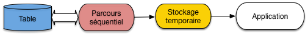
   
   Exécution d'une requête avec matérialisation
   
Sur un serveur recevant beaucoup de requêtes, 
la mémoire centrale deviendra rapidement indisponible ou 
trop petite pour accueillir les résultats intermédiaires qui devront donc
être écrits sur disque. Cette solution de *matérialisation* des
résultats intermédiaires est alors très pénalisante car
les écritures/lectures sur disque répétées entre chaque opération coûtent
d'autant plus cher en temps que la séquence d'opérations est longue. 

Un autre inconvénient sévère est qu'il faut attendre qu'une
première opération soit exécutée dans son intégralité avant
d'effectuer la seconde.
 
L'alternative appelée *pipelinage*  consiste à ne pas
écrire les enregistrements  produits par  :math:`o`  
sur disque mais à les utiliser immédiatement comme entrée de
:math:`o'`. Les deux opérateurs,   :math:`o`   
et  :math:`o'`,  sont donc connectés, la sortie du premier
tenant lieu d'entrée au second. Dans ce scénario,
:math:`o`  tient le rôle du producteur,  :math:`o'`  
celui du consommateur.
Chaque fois que :math:`o`  produit une adresse d'enregistrement,
:math:`o'`  la reçoit et va lire l'enregistrement dans le fichier
(:numref:`iter-pipeline`).

.. _iter-pipeline:
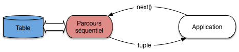
   
   Exécution d'une requête avec pipelinage
   
On n'attend donc pas que :math:`o`  soit terminée et
que l'ensemble des enregistrements  résultat de :math:`o`  ait
été produit pour lancer :math:`o'`. 
On peut ainsi combiner l'exécution de plusieurs opérations,
cette combinaison constituant justement le *plan
d'exécution* final.

Cette méthode a deux
avantages très importants:

      * il n'est pas nécessaire de stocker
        un résultat intermédiaire, puisque ce résultat est consommé
        au fur et à mesure de sa production;
      * l'utilisateur reçoit les premiers nuplets du
        résultat alors même que ce résultat n'est 
        pas calculé complètement.

Si l'application qui reçoit et traite le 
résultat de la requête passe un peu de temps sur 
chaque nuplet produit, l'exécution de la requête 
peut même ne plus constituer 
un facteur pénalisant. Si, par exemple, 
l'application qui demande l'exécution met 0,1 seconde pour traiter chaque nuplet
alors que le plan d'exécution peut fournir
20 nuplets par secondes, c'est la première qui constitue
le point de contention, et le coût de l'exécution
disparaît dans celui du traitement. Il en irait
tout autrement s'il fallait d'abord calculer 
*tout* le résultat avant de lui appliquer le
traitement: dans ce cas les temps passés dans chaque
phase *s'additionneraient*.

Cette remarque explique une dernière particularité:
*un plan d'exécution se déroule en fonction de la 
demande et pas de l'offre*. C'est toujours le consommateur,
:math:`o'`  dans notre exemple, qui "tire" un enregistrement 
de son producteur :math:`o`, quand il en a besoin, 
et pas :math:`o`  qui "pousse" un enregistrement 
vers :math:`o'`  dès qu'il est produit. La justification
est simplement que le consommateur, :math:`o'` ,
pourrait se retrouver débordé par l'afflux d'information
sans avoir assez de temps pour les traiter, ni assez de mémoire
pour les stocker.

L'application qui exécute une requête est elle-même le consommateur
ultime et décide du moment où les données doivent lui être communiquées. Elle
agit en fait comme une sorte d'aspirateur branché sur des tuyaux de données
qui vont prendre leurs racines dans les structures de stockage de la base
de données: tables et index.

Cela se traduit, quand on accède à un SGBD avec un langage de programmation,
par un mécanisme d'accès toujours identique, consistant à:

  - ouvrir un curseur par exécution d'une requête;
  - avancer le curseur sur le résultat, nuplet par nuplet, par des
    appels à une fonction de type ``next()``;
  - fermer (optionnel) le curseur quand le résultat a été
    intégralement parcouru.

Le mécanisme est suggéré sur la  :numref:`iter-pipeline`. L'application
demande un nuplet par appel à la fonction *next()* adressé à l'opérateur
d'accès direct. Ce dernier, pour s'exécuter, a besoin d'une adresse
d'enregistrement: il l'obtient en adressant lui-même la fonction *next()*
à l'opérateur de parcours d'index. Cet exemple simple est en fait une illustration
du principe fondamental de la constitution d'un plan d'exécution: ce
dernier est toujours un graphe d'opérateurs produisant *à la demande* des 
résultats intermédiaires non matérialisés.

Opérateurs bloquants
====================

Parfois il n'est pas possible d'éviter le calcul complet 
de l'une des opérations avant de continuer.
On est alors en présence d'un opérateur  dit 
*bloquant* dont le résultat doit être entièrement produit (et matérialisé
en cache ou écrit sur
disque) avant de démarrer l'opération suivante. Par exemple:

      * le tri (``order by``);
      * la recherche d'un maximum ou d'un minimum (``max``, ``min``);
      * l'élimination des doublons (``distinct``);
      * le calcul d'une moyenne ou d'une somme (``sum``, ``avg``);
      * un partitionnement (``group by``);

sont autant d'opérations qui doivent lire complètement
les données en entrée avant de produire un résultat (il
est facile d'imaginer qu'on ne peut pas produire
le résultat d'un tri tant qu'on n'a pas lu
le dernier élément en entrée).

.. admonition:: Une expérience à tenter

    Si vous êtes sur une base avec une table ``T`` de taille importante,
    tentez l'expérience suivante. Exécutez une première requête:
    
    .. code-block:: sql
     
        select * from T
        
    et une seconde
    
    .. code-block:: sql
     
        select * from T order by *
     
    Vous devriez constater une attente significative avant que
    le résultat de la seconde commence à s'afficher. Que se passe-t-il?
    Relisez ce qui précède.

Un opérateur bloquant introduit une *latence* dans l'exécution de la
requête. En pratique, l'application est figée tant que la phase
de préparation, exécutée à l'appel de la fonction ``open()``, n'est pas terminée.
À l'issue de la phase de latence, l'exécution peut reprendre et se dérouler
alors très rapidement. L'inconvénient, pour une application, d'une 
exécution avec opérateur bloquant est qu'elle reste
à ne rien faire pendant que le SGBD travaille, puis c'est l'inverse: le débit
de données est important, mais c'est à l'application d'effectuer son travail. 
Le temps passé aux deux phases d'additionne, ce qui est un facteur  pénalisant
pour la performance globale.

Cela amène à distinguer deux critères de performance:

  - *le temps de réponse*: c'est le temps mis pour obtenir un premier nuplet;
    il est quasi-instantané pour une exécution sans opérateur bloquant;
  - *le temps d'exécution*: c'est le temps mis pour obtenir l'ensemble du résultat.
  
On peut avoir une exécution avec un temps de réponse important et un temps
d'exécution court, et l'inverse. En général, on choisira de privilégier
le temps de réponse, pour pouvoir traiter les données reçues dès que possible.
   

Itérateurs
==========

Le mécanisme de pipelinage "à la demande"
est implanté au moyen de la notion générique *d'itérateur*,
couramment rencontré par ailleurs dans les langages de programmation
offrant des interfaces de traitement de collections.
Chaque
itérateur peut s'implanter comme un objet doté de trois
fonctions:

    * ``open()`` commence le processus pour obtenir
      des nuplets résultats: elle alloue les resources nécessaires,
      initialise des structures de données et appelle ``open()``  pour chacune
      de ses *sources* (c'est-à-dire pour chacun des itérateurs 
      fournissant des données en entrée);
    * ``next()`` effectue une étape de l'itération, retourne le nuplet produit
      par cette étape, et met à jour les structures de données nécessaires pour
      obtenir les résultats suivants; la fonction  
      peut appeler une ou plusieurs fois ``next()``  sur ses sources.
    * ``close()`` termine l'itération et libère les
      ressources,  lorsque tous les articles du résultat ont été obtenus. 
      Elle appelle typiquement 
      ``close()``  sur chacune de ses sources.

Voici une première illustration  d'un itérateur, celui
du balayage séquentiel d'une table que nous appellerons ``FullScan``. La fonction
``open()`` de cet itérateur  place un curseur au début du fichier à lire.

.. code-block:: bash

    function openScan 
    {
      # Entrée: $T est la table
      
      # Initialisations
      $p = $T.first;    # Premier bloc de T
      $e = $p.init;     # On se place avant le premier nuplet
    }

La fonction ``next`` renvoie l'enregistrement suivant, ou ``null``.

.. code-block:: bash

    function nextScan 
    {
       # Avançons sur le nuplet suivant
       $e = $p.next;       
       # A-t-on atteint le dernier enregistrement du bloc ?
       if ($e = null) do
          # On passe au bloc suivant
          $p = $T.next;
          # Dernier bloc dépassé?
          if ($p = null) then
              return null;
          else
               $e = $p.first;
          fi
        done
 
        return $e;
    }

La fonction close libère les ressources.

.. code-block:: bash

    function closeScan 
    {
      close($T);
      return;
    }

``openScan`` initialise la lecture en se plaçant *avant* le premier enregistrement 
du premièr bloc de
:math:`T`. Chaque appel à *nextScan* () retourne un enregistrement/nuplet. Si le bloc courant a été entièrement lu, 
il lit le bloc
suivant et retourne le premier enregistrement de ce bloc.

Avec ce premier itérateur, nous savons déjà exécuter au moins une requête SQL! C'est la
plus  simple de toutes.

.. code-block:: sql
     
        select * from T

Doté de notre itérateur ``FullScan``, cette requête s'exécute de la manière suivante:

.. code-block:: bash

    # Parcours séquentiel de la table T
    $curseur = new FullScan(T);
    $nuplet = $curseur.next();
    
    while [$nuplet != null ]
    do
      # Traitement du nuplet
      ...
      # Récupération du nuplet suivant
      $nuplet = $curseur.next();
    done 
    
    # Fermeture du curseur
    $curseur.close();
 
Ceux qui ont déjà pratiqué l'accès à une base de données par
une interface de  programmation reconnaîtront sans peine 
la séquence classique d'ouverture d'un curseur, de parcours du résultat et de
fermeture du curseur. C'est facile à comprendre pour une requête aussi simple
que celle illustrée ci-dessus. La beauté du modèle d'exécution est que
la même séquence s'applique pour des requêtes extrêmement complexes.

Quiz
====

Une application reçoit 100 000 nuplets, résultat d’une requête SQL. Le traitement par l'application 
de chaque nuplet prend 0,5 sec. Le SGBD 
met de son côté 0,2 secondes pour préparer chaque nuplet.

  - En mode matérialisation, le temps de réponse est de

    .. eqt:: eval2-1

        A) :eqt:`I` 0,2 secondes
        #) :eqt:`C`  20 000 secondes
        #) :eqt:`I`  200 000 secondes

  - En mode matérialisation, l’application finit de s’exécuter après

    .. eqt:: eval2-2

        A) :eqt:`C` 70 000 secondes
        #) :eqt:`I`  50 000 secondes
        #) :eqt:`I`  20 000 secondes

  - En mode pipelinage, le temps de réponse est de 

    .. eqt:: eval2-3

        A) :eqt:`C`  0,2 secondes
        #) :eqt:`I`  20 000 secondes
        #) :eqt:`I`  200 000 secondes

  - En mode pipelinage, l’application finit de s’exécuter après

    .. eqt:: eval2-4

            A)  :eqt:`I` 70 000 secondes
            #)  :eqt:`C` 50 000 secondes
            #)  :eqt:`I` 20 000 secondes

  - Parmi les requêtes suivantes, quelles sont celles qui nécessitent un opérateur bloquant. 
    (Aide : se demander s’il faut lire ou non toute la table 
    avant de produire le premier nuplet du résultat).

    .. eqt:: eval2-%

        A)   :eqt:`I` ``select titre from Film`` 
        #)    :eqt:`C` ``select distinct titre from Film`` 
        #)   :eqt:`C` ``select count(titre) from Film group by année`` 
        #)  :eqt:`C`  ``select titre from Film order by année`` 
        #)  :eqt:`I` ``select substring(titre, 1, 10) from Film`` 

**************************
S2: les opérateurs de base
**************************

.. admonition::  Supports complémentaires:

    * `Diapositives: les opérateurs de base <http://sys.bdpedia.fr/files/sloperateurs.pdf>`_
    * `Vidéo plans d'exécution (partie 1) <https://mediaserver.lecnam.net/permalink/v125f35a42376acjqp1g/>`_    
    * `Vidéo plans d'exécution (partie 2) <https://mediaserver.lecnam.net/permalink/v125f35a423cagaw4i9b/>`_    
 
Cette section est consacrée aux principaux opérateurs
utilisés dans l'évaluation d'une requête "simple", accédant à une seule
table. En d'autres termes, il suffisent à évaluer toute requête de la forme:

.. code-block:: sql

    select a1, a2, ..., an from T where condition

En premier lieu, il faut accéder à la table *T*. Il existe exactement
deux méthodes possibles:

    * *Accès séquentiel*. Tous les nuplets de la table 
      sont examinés, dans l'ordre du stockage.
    * *Accès par adresse*. Si on connaît l'adresse du
      nuplet, on peut aller lire
      directement le bloc et obtenir ainsi un accès optimal.

Chaque méthode correspond à un opérateur. Le second (l'opérateur d'accès direct)
est toujours associé à une source qui
lui fournit l'adresse des enregistrements. Dans un SGBD relationnel où
le modèle de données ne connaît pas la notion d'adresse physique, cette source
est *toujours* un opérateur de parcours d'index. Nous allons donc également décrire
ce dernier sous forme d'itérateur. Enfin, il est nécessaire d'effectuer une
sélection (pour appliquer la condition de la clause ``where``) et une projection.
Ces deux derniers opérateurs sont triviaux.

Parcours séquentiel
===================

Le parcours séquentiel d'une table est utile dans un grand nombre de
cas. Tout d'abord on a souvent besoin de parcourir tous les
enregistrements d'une relation, par exemple pour faire une
projection. Certains algorithmes de jointure utilisent le balayage
d'au moins une des deux tables. On peut enfin vouloir trouver un ou
plusieurs enregistrements d'une table satisfaisant un critère de
sélection.

L'opérateur est implanté par un itérateur qui a déjà été discuté dans la
section précédente. Son coût est relativement élevé: il faut accéder 
à tous les blocs de la table, et le temps de parcours
est donc proportionnel à la taille de cette dernière. 

Cette mesure "brute" doit cependant être pondérée par le fait
qu'une table est le plus souvent stockée de manière contiguë sur le 
disque, et se trouve de plus partiellement en mémoire RAM si elle
a été utilisée récemment. Comme nous l'avons vu dans
le chapitre :ref:`chap-stock`, le parcours d'un segment contigu
évite les déplacements des têtes de lecture et la performance est
alors essentiellement limitée par le débit du disque.

Parcours d'index
================

On considère dans ce qui suit
que la structure de l'index est celle de l'arbre B, ce qui est 
presque toujours le cas en pratique.

L'algorithme de parcours d'index  a été étudié dans le chapitre :ref:`chap-arbreb`. 
Rappelons brièvement qu'il se décompose en deux phases. La première est 
une *traversée* de l'index en partant de la racine jusqu'à la feuille contenant 
l'entrée associée à la clé de recherche. La seconde est un parcours séquentiel des feuilles
pour trouver toutes les adresses correspondant à la clé (il peut y en avoir plusieurs dans le cas
général) ou à l'intervalle de clés.

Ces deux phases s'implantent respectivement par les fonctions *open()* et *next()* de l'itérateur
``IndexScan``. Voici tout d'abord la fonction *open()*.

.. code-block:: bash

    function openIndexScan
    {
      # $c est la valeur de la clé recherchée; $I est l'index
      
      # On parcours les niveaux de l'index en partant de la racine
      $bloc = $I.racine();      
      while [$bloc.estUneFeuille() = false]
      do 
        # On recherche l'entrée correspondant à $c
        for $e in ($bloc.entrées)
        do
          if ($e.clé > $c) 
            break;
         done 
        
        $bloc = $GA.lecture ($e.adresse);
      done
      
      # $bloc est la feuille recherchée; on se positionne sur la
      # première occurrence de $a
      $e = $bloc.premièreOccurrence ($c)
      # Fin de la première phase
    }

La fonction *next()* est identique à celle du parcours séquentiel d'un fichier, la seule différence
est qu'elle renvoie des adresses d'enregistrement et pas des nuplets. 
La version ci-dessous, simplifiée,
ne montre pas le passage d'une feuille à une autre.

.. code-block:: bash

    function nextIndexScan
    {
       # Seconde phase: on est positionné sur une feuille de l'arbre, on 
       #- avance sur les entrées correspondant à la clé $c
       if ($e.clé = $c) then
         $adresse = $e.adresse;
         $e = $e.next();
         return $adresse;
       else 
         return null;
       fi
     }

Accès par adresse
=================

Quand on connait l'adresse d'un enregistrement, donc l'adresse du bloc où
il est stocké, y accéder coûte une lecture unique de bloc. Cette adresse
(rappelons
que l'adresse d'un enregistrement se décompose en une adresse de bloc
et une adresse d'enregistrement locale au bloc)
doit nécessairement être fournie par un autre itérateur, que nous 
appellerons la *source* dans ce qui suit (et qui, en pratique, est 
toujours un parcours d'index). 

L'itérateur
d'accès direct (``DirectAccess``) s'implante alors très facilement. Voici la
fonction *next()*  .

.. code-block:: bash

    function nextDirectAccess
    {
      # $source est l'opérateur source;  $GA est le gestionnaire d'accès
      
      # Récupérons l'adresse de l'enregistrement à lire
      $a = $source.next();
      
      # Plus d'adresse? On renvoie null
      if ($a = null) then
        return null;
      else
        # On effectue par une lecture (logique) du bloc
        $b = $GA.lecture ($a.adressBloc);      
        # On récupère l'enregistrement dans le bloc
        $e = $b.get ($a.adresseLocale)           
        return $e;
      fi 
     }

Cet opérateur est très efficace pour récupérer *un* enregistrement par son adresse,
notamment dans le cas fréquent où le bloc est déjà dans le cache. Quand on l'exécute
de manière intensive sur une table, il engendre de nombreux accès aléatoires
et on peut se poser la question de préférer un parcours séquentiel. La décision
relève du processus d'optimisation: nous y revenons plus loin.

Opérateurs de sélection et de projection
========================================

L'opérateur de sélection (le plus souvent appelé *filtre*) applique une condition
aux enregistrements obtenus d'un autre itérateur. Voici la fonction *next()*
de l'itérateur.

.. code-block:: bash

    function nextFilter
    {
      # $source est l'opérateur fournissant les nuplets; $C est la condition de sélection
      
      # On récupère un nuplet de la source
      $nuplet = $source.next();
      # Et on continue tant que la sélection n'est pas satisfaite, ou la source épuisée
      while ($nuplet != null  and $nuplet.test($C) = false)
      do
        $nuplet = $source.next();        
      done
      
      return $nuplet;
     }

En pratique, la source est *toujours* soit un itérateur de parcours séquentiel, soit
un itérateur d'accès direct. Le filtre a pour effet de réduire la taille des données
à traiter, et il est donc bénéfique de l'appliquer le plus tôt possible, immédiatement
après l'accès à chaque enregistrement. 

.. note:: Cette règle est une des heuristiques les plus courantes de la phase 
   dite d'optimisation que nous présenterons plus tard. Elle est souvent
   décrite par l'expression "pousser les sélections vers la base de l'arbre d'exécution".

Dans certains systèmes (p.e., Oracle), cet opérateur est d'ailleurs intégré aux opérateurs d'accès
à une table (séquentiel ou direct) et n'apparaît donc pas explicitement
dans le plan d'exécution.

L'opérateur de projection, consistant à ne conserver que certains attributs des nuplets en entrée, est
trivial. La fonction *next()* prend un nuplet en entrée, en extrait les attributs à conserver
et renvoie un nuplet formé de ces derniers.

Exécution de requêtes mono-tables
=================================

Reprenons notre requête mono-table générique, de la forme:

.. code-block:: sql

    select a1, a2, ..., an from T where condition

Notre petit catalogue d'opérateurs nous permet de l'exécuter. Il nous donne
même plusieurs options selon que l'on utilise ou pas un index. Voici
un exemple concret que nous allons examiner en détails.

.. code-block:: sql

    select titre from Film where genre='SF' and annee = 2014
    
Et nous allons supposer que la table des films est indexée sur l'année. Avec
notre boîte à outils, il existe (au moins) deux programmes, ou *plans d'exécution*, illustrés
par la  :numref:`planEx-monotable`. 

.. _planEx-monotable:
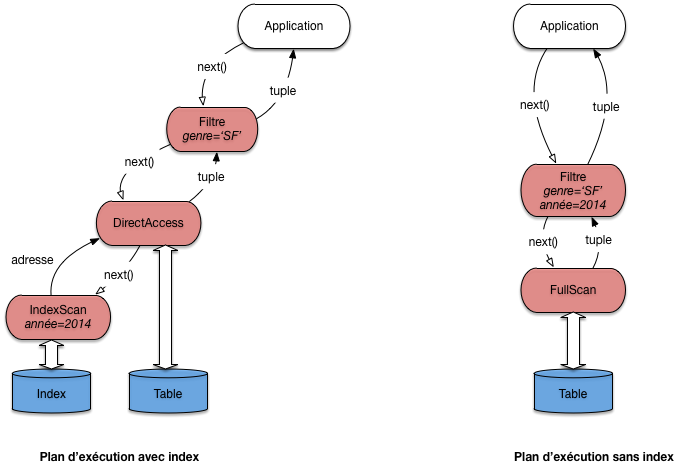
   
   Deux plans d'exécution pour une requête monotable
     
Le premier plan utilise l'index pour obtenir les adresses des films
parus en 2014 grâce à un opérateur ``IndexScan``.  Il est associé à
un opérateur ``DirectAccess`` qui récupère, une par une, les adresses
et obtient, par une lecture directe, le nuplet correspondant. Enfin,
chaque nuplet passe par l'opérateur de filtre qui ne conserve que ceux
dont le genre est 'SF'.

On voit sur ce premier exemple qu'un plan d'exécution est un programme
d'une forme très particulière. Il est constitué d'un graphe d'opérateurs 
connectés par des 'tuyaux' où circulent des nuplets. L'application, qui
communique avec la racine du graphe par l'interface de programmation,
joue le rôle d'un "aspirateur" qui tire vers le haut ce flux de données
fournissant le résultat de la requête.

.. note:: Pour une requête monotable, le graphe est linéaire. Quand la requête comprend
   des jointures, il prend la forme d'un arbre (binaire).

Examinons maintenant le second plan. Il consiste simplement à parcourir
séquentiellement la table (avec un opérateur ``FullScan``), suivi d'un
filtre qui  applique les deux critères de sélection.

Quel est le meilleur de ces deux plans? En principe, l'utilisation
de l'index donne de bien meilleurs résultats. Et en général,      
le choix d'utiliser le parcours séquentiel ou l'accès par index
peut sembler trivial: on regarde si un index est disponible,
et si oui on l'utilise comme chemin d'accès. Dans ce cas le plan
d'exécution est caractérisé par l'association de l'opérateur ``IndexScan``
qui récupère des adresses, et de l'opérateur ``DirectAccess`` qui récupère les nuplets
en fonction des adresses. 

En fait, ce choix est légèrement compliqué par les considérations suivantes:

    * Quelle est la taille de la table? Si elle tient en quelques blocs,
      un accès par l'index est probablement inutilement compliqué.
      
    * Le critère de recherche porte-t-il sur un ou sur plusieurs
      attributs? S'il y a plusieurs attributs, les critères
      sont-ils combinés par des **and** ou des **or**?

    * Quelle est la sélectivité de la recherche? On constate
      que quand une partie significative de la table
      est sélectionnée, il devient inutile, voire contre-performant,
      d'utiliser un index.

Le cas réellement trivial est celui -- fréquent -- d'une recherche avec un
critère d'égalité sur la clé primaire
(ou plus généralement sur un attribut indexé par un index unique). 
Dans ce cas l'utilisation
de l'index ne se discute pas. Exemple:

.. code-block:: sql

   select * from   Film where idFilm = 100

Dans beaucoup d'autres situations
les choses sont un peu plus subtiles. Le cas
le plus délicat est celui d'une recherche par intervalle sur un champ
indexé.

Voici un exemple simple de requête
dont l'optimisation n'est pas évidente à priori.
Il s'agit d'une recherche par intervalle (comme toute sélection
avec :math:`>` , ou une recherche par préfixe).

.. code-block:: sql

    select *
    from   Film
    where  idFilm between 100 and 1000

L'utilisation d'un index n'est pas toujours
appropriée dans ce cas, comme le montre le petit exemple
de la  :numref:`interBtree`. Dans cet exemple, le fichier 
a quatre blocs, et les enregistrements sont identifiés
(clé unique) par un numéro. On peut noter que
le fichier n'est pas ordonné sur la clé (il n'y a aucune raison
à priori pour que ce soit le cas).

.. _interBtree:
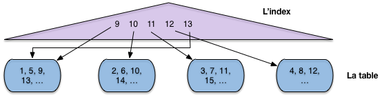
   
   Recherche par intervalle avec index
   
L'index en revanche s'appuie sur l'ordre des clés (il s'agit
ici typiquement d'un arbre B, voir chapitre :ref:`chap-arbreb`).
À chaque valeur de clé dans l'index est associé un 
pointeur (une adresse) qui désigne l'enregistrement dans le
fichier.

Maintenant supposons: 

    * que l'on effectue une recherche par intervalle
      pour ramener tous les enregistrements entre 9 et 13;
    * que la mémoire centrale disponible soit de trois blocs.

Si on choisit d'utiliser l'index, comme semble y inviter le fait
que le critère de recherche porte sur la clé primaire, on
va procéder en deux étapes.

    * **Étape 1**: on récupère dans l'index 
      toutes les valeurs de clé comprises entre 9 et 13 (opérateur ``IndexScan``).
    * **Étape 2**: pour chaque valeur obtenue dans l'étape 1,
      on prend le pointeur associé, on lit le bloc dans le fichier
      et on en extrait l'enregistrement (opérateur ``DirectAccess``).

Donc on va lire le bloc 1 pour l'enregistrement 9, puis le bloc 2 pour
l'enregistrement 10, puis le bloc 3 pour l'enregistrement 11. À ce moment-là
la mémoire (trois blocs) est pleine. Quand on lit le bloc 4 pour y prendre
l'enregistrement 12, on va supprimer du cache le bloc le plus
anciennement utilisé, à savoir le bloc 1. Pour finir,
on doit relire, *sur le disque*, le bloc 1 pour l'enregistrement 13.
Au total on a effectué 5 lectures, alors qu'un simple balayage du fichier
se serait contenté de 4, et aurait de plus bénéficié d'une lecture séquentielle.

Cette petite démonstration est basée sur une situation  caricaturale
et s'appuie sur des ordres de grandeurs
qui ne sont clairement pas représentatifs d'une vraie base de données.
Elle montre simplement que les accès au fichier, à partir
d'un index de type arbre B, sont aléatoires et peuvent conduire
à lire plusieurs fois le même bloc. Même sans cela, des recherches
par adresses  mènent à déclencher des opérations d'accès à
un bloc pour lire un unique enregistrement à chaque fois, ce qui
s'avère  pénalisant à terme par rapport à un simple parcours. 

La leçon, c'est que le SGBD ne peut pas aveuglément appliquer une stratégie
pré-déterminée pour exécuter une requête. Il doit examiner, parmi les
solutions possibles (au du moins celles qui semblent plausibles) celles
qui vont donner le meilleur résutat. C'est un module particulier (et très sensible),
*l'optimiseur*, qui se charge de cette estimation.

Voici quelques autres exemples, plus faciles
à traiter.

.. code-block:: sql

    select * from   Film
    where  idFilm = 20 
    and    titre = 'Vertigo'

Ici on utilise évidemment l'index pour accéder à l'unique
film (s'il existe) ayant l'identifiant 20.
Puis, une fois l'enregistrement en mémoire, on vérifie 
que son titre est bien *Vertigo*. C'est un plan similaire
à celui de la  :numref:`planEx-monotable` (gauche) qui sera utilisé.

Voici le cas
complémentaire:

.. code-block:: sql

    select * from   Film
    where  idFilm = 20 
    or     titre = 'Vertigo'

On peut utiliser l'index pour trouver le film 20,
mais il faudra de toutes manières faire un parcours séquentiel
pour rechercher *Vertigo* s'il n'y a pas d'index sur le titre. 
Autant donc s'épargner la recherche par index et trouver les deux films au cours du balayage.
Le plan sera donc plutôt celui de la  :numref:`planEx-monotable`, à droite.

Quiz
====

  - L’opérateur de parcours d’index (``IndexScan``) fournit, à chaque appel ``next()``

    .. eqt:: eval3-1

        A) :eqt:`I` Un nuplet
        #) :eqt:`I`  L’ensemble des nuplets du résultat
        #) :eqt:`C`  L’adresse d’un nuplet
        #) :eqt:`I` L’ensemble des adresses des nuplets du résultat

  - On suppose qu’il existe un index sur l’année, quelles sont parmi les requêtes suivantes celles dont le plan 
    d’exécution combine ``IndexScan``  et ``DirectAccess`` :

    .. eqt:: eval3-2

        A) :eqt:`I` ``select * from film``
        #) :eqt:`C`  ``select * from Film where année between 2001 and 2010``
        #) :eqt:`I`  ``select année from Film where titre like ‘A%’``

  - Parmi les requêtes suivantes, quelles sont celles qui peuvent s’évaluer avec un plan d’exécution comprenant seulement un 
    ``IndexScan`` :

   .. eqt:: eval3-3

        A) :eqt:`I` ``select titre from Film where année between 2001 and 2010`` 
        #) :eqt:`C`  ``select count(*) from Film where année between 2001 and 2010`` 
        #) :eqt:`I`  ``select  count(titre) from Film where année between 2001 and 2010`` 

  -  Dans le second plan d’exécution, celui basé sur un index, peut-on inverser les opérateurs d’accès direct et de filtre ?

   .. eqt:: eval3-4

        A) :eqt:`I` Oui
        #) :eqt:`C`  Non

  - Reprenez l’exemple du cours d’un accès avec un index pour un intervalle [9,13]. Supposons maintenant que le 
    fichier est trié sur la clé. Combien faudra-t-il lire de blocs dans le pire des cas, en supposant qu’un 
    bloc contient 10 nuplets ?

   .. eqt:: eval3-5

        A) :eqt:`I` 1
        #) :eqt:`C` 2
        #) :eqt:`I`  Tous

  - Si le fichier est trié sur la clé de l’index, est-il toujours préférable de passer par l’index pour 
    une recherche par intervalle ?

   .. eqt:: eval3-6
   
        A) :eqt:`C` Oui
        #) :eqt:`I`  Non

******************
S3: Le tri externe
******************

.. admonition::  Supports complémentaires:

    * `Diapositives: le tri-fusion <http://sys.bdpedia.fr/files/sltrifusion.pdf>`_
    * `Algorithme de tri  <https://mediaserver.lecnam.net/permalink/v125f35a42431bmd2zas/>`_    

*Le tri* est une autre opération
fondamentale pour l'évaluation des requêtes. On a besoin du
tri par exemple lorsqu'on fait une projection ou une union et qu'on
désire éliminer les enregistrements en double (clauses ``distinct``,
``order by`` de SQL). 
On verra également qu'un
algorithme de jointure courant consiste à trier au préalable
sur l'attribut de jointure  les relations à joindre. 

Le tri d'une relation sur un ou plusieurs attributs utilise
l'algorithme de tri-fusion (*sort-merge*) en mémoire externe. Il est du type 
"diviser pour régner", avec deux phases. Dans la première phase
on décompose le problème récursivement en sous-problèmes, et ce  jusqu'à ce que
chaque sous-problème puisse être résolu simplement et efficacement. La deuxième phase
consiste à agréger récursivement les solutions.

Dans le cas l'algorithme de tri-fusion, les deux phases se résument ainsi:

    * Partitionnement de la table en *fragments* tels que chaque fragment
      tienne en mémoire centrale. On
      trie alors chaque fragment (en mémoire),  en général avec l'algorithme de *Quicksort*.
    * Fusion des fragments triés.

Regardons en détail chacune des phases.

Phase de tri
============

Supposons que nous disposons pour faire le tri de :math:`M`  blocs en
mémoire. La phase de tri commence par prendre un fragment constitué
des :math:`M`  premiers blocs du fichier
et les charge en mémoire. On  trie ces blocs avec *Quicksort*
et on écrit le fragment trié sur le disque dans une zone temporaire
(:numref:`phasetri`). On recommence
avec les :math:`M`  blocs suivants du fichier, jusqu'à
ce que tout le fichier ait été lu par fragments de :math:`M` blocs,

.. _phasetri:
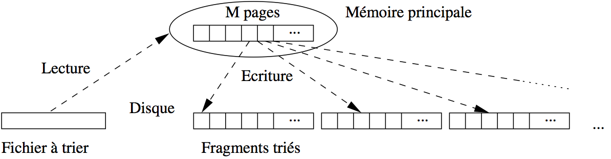
   
   Algorithme de tri-fusion: phase de tri

À l'issue de cette phase on a :math:`\lceil B / M \rceil` fragments triès, 
où :math:`B` est le nombre de blocs
du fichier.

.. admonition:: Exemple

    Si le fichier occupe 100 000 blocs, et la mémoire disponible
    pour le tri est de 1 000 blocs, cette phase découpe le fichier en 100 fragments de
    1 000 blocs chacun. Ces 100 fragments sont lus un par un, triés, et écrits dans
    la zone temporaire.

Phase de fusion
===============

La phase de fusion consiste à  fusionner  les
fragments.  Si on fusionne *n* fragments de taille 
*M*, on obtient en effet un nouveau fragment trié de taille :math:`n \times M`. 
En général, une étape de fusion suffit pour obtenir l'ensemble du fichier trié,
mais si ce dernier est très gros - 
ou si la mémoire disponible est insuffisante - il est parfois nécessaire
d'effectuer plusieurs étapes de fusion.

Commençons par regarder comment on fusionne en mémoire centrale
deux listes *triées* :math:`A` et :math:`B`. On a besoin de trois zones en *cache*. Dans les
deux premières, les deux listes à trier sont stockées. La troisième
zone de cache sert pour le résultat, c'est-à-dire la liste résultante triée.

L'algorithme employé (dit *fusion* ou "*merge*")
est une technique très efficace qui consiste à parcourir en parallèle et
séquentiellement les listes, en une seule fois. Le parcours unique est permis par
le tri des listes sur un même critère.

La :numref:`fusion` montre comment on fusionne :math:`A` et :math:`B`. On maintient deux curseurs, 
positionnés au départ au début de chaque liste.
L'algorithme compare les valeurs contenues dans les cellules pointées
par les deux curseurs. On compare ces deux valeurs, puis:

   - (choix 1) si elles sont égales, on déplace les deux valeurs dans la zone
     de résultat; *on avance les deux curseurs d'un cran*
   - (choix 2) sinon, on prend le curseur pointant sur la cellule dont la valeur est la
     plus petite, on déplace cette dernière dans la zone de résultat
     et on avance ce même curseur d'un cran. 

.. _fusion:
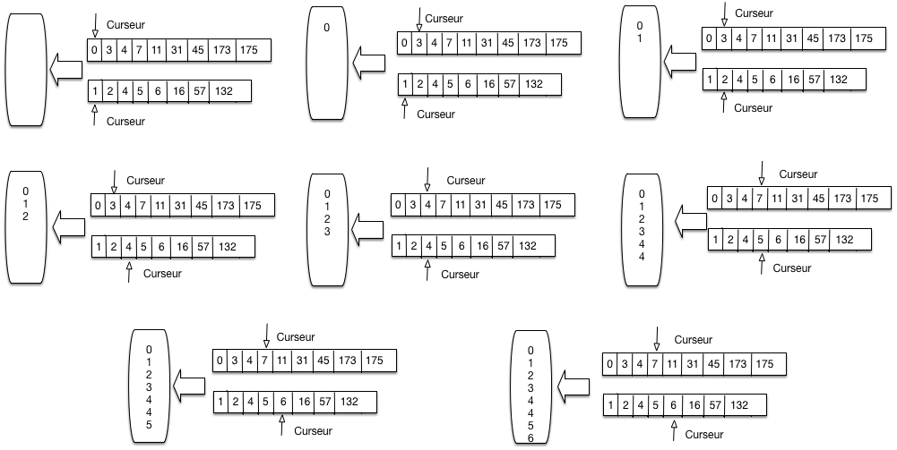
   
      Parcours linéaire pour la fusion de listes triées

La  :numref:`fusion` se lit de gauche à droite, de haut en bas.  
On applique tout d'abord deux fois le choix 2, avançant sur
la liste A puis la liste B. On avance encore sur la liste B puis la liste A. 
On se trouve alors face à la situation 2, et on copie les deux valeurs 4 
dans la zone de résultat.  

Et ainsi de suite.  Il est clair qu'*un seul parcours suffit*. Il devrait être clair également,
par construction que la zone de résultat contient une liste *triée* contenant toutes
les valeurs venant soit de A soit de B.
.

.. code-block:: bash

   // Fusion de deux listes l1 et l2
   function fusion
   {
     # $l1 désigne la première liste
     # $l2 désigne la seconde liste
     $resultat = [];
     # Début de la fusion des listes
     while ($l1 != null and $l2 != null) do
       if ($l1.val == $l2.val) then
         # On a trouvé un doublon 
         $resultat += $l1.val;
	     $resultat += $l2.val;
         # Avançons sur les deux listes
         $l1 = $l1.next; $l2 = $l2.next;    
       else if ($l1.val < $l2.val) then
         # Avançons sur l1
 	     $resultat += $l1.val;
         $l1 = $l1.next;
       else 
          # Avançons sur l2
 	     $resultat += $l2.val;
         $l2 = $l2.next;       
       fi
     done
   }

Remarquons que:

     * L'algorithme *fusion* se généralise (assez facilement) à plusieurs listes.
     * Si on fusionne :math:`n` listes de taille :math:`M`, la liste
       résultante a une taille de :math:`n \times M`.
       
La première étape de la phase de fusion de la relation consiste à fusionner les
:math:`\lceil B / M \rceil` obtenus à l'issue de la phase de tri. 
On prend pour cela :math:`M-1` fragments à la fois, et on leur associe à chacun un 
bloc en mémoire, le
bloc restant étant consacré au résultat.  On commence par lire le premier
bloc des :math:`M-1`  premiers fragments dans les :math:`M-1` premiers blocs,
et on applique
l'algorithme de fusion sur les listes triées, comme expliqué ci-dessus. 
Les enregistrements triés sont stockés dans un nouveau fragment sur disque.

On continue avec les :math:`M-1`   blocs suivants de chaque fragment, jusqu'à
ce que les :math:`M-1`   fragments initiaux aient été entièrement lues et
triés. On a alors
sur disque une nouvelle partition de taille :math:`M \times (M-1)`. On
répète le processus avec les :math:`M-1`  fragments suivants, et ainsi de suite.

À la fin de cette première étape,  on obtient :math:`\lceil \frac{B}{M \times (M-1)}\rceil` 
fragments triés, chacune (sauf le dernier qui est plus petit)
ayant pour taille :math:`M \times (M-1)`  blocs. 
La  :numref:`trifusion` résume la phase de fusion sous la forme
d'un arbre, chaque nœud (agrandi à
droite) correspondant à une fusion de :math:`M-1`  partitions.

.. _trifusion:
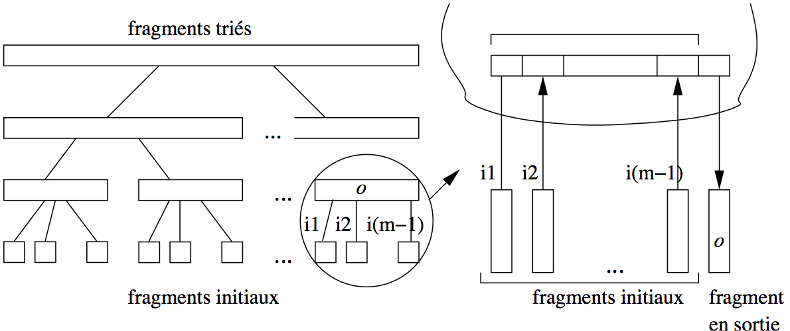
   
   Algorithme de tri-fusion: la phase de fusion
   

Un exemple est donné dans la   :numref:`trifusion`
sur un ensemble de films qu'on trie sur le nom du film.  Il
y a trois phases de fusion, à partir de 6 fragments initiaux
que l'on regroupe 2 à 2.

.. _tri-fusion:
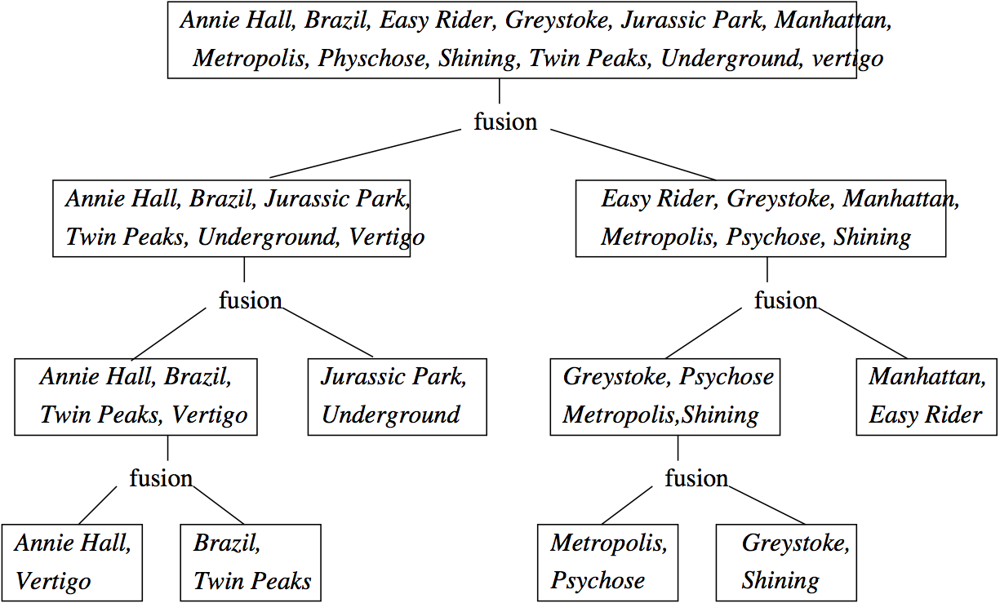
   
   Algorithme de tri-fusion: un exemple

Coût du tri-fusion
==================

La phase de tri coûte :math:`B`  écritures pour créer les
partitions triées. À chaque étape de la phase de fusion, chaque fragment
est lu une fois et les nouveaux fragments  créés sont :math:`M-1`  fois
plus grands mais :math:`M-1`  fois moins nombreux. Par conséquent à chaque
étape (pour chaque niveau de l'arbre de fusion), il y a :math:`2\times B` 
entrées/sorties. Le nombre d'étapes, c'est-à-dire le nombre de niveaux
dans l'arbre est :math:`O(\log_{M-1} B)`. Le coût de la phase de
fusion est :math:`O(B \times \log_{M-1} B)`. Il prédomine celui de la phase de tri. 

En pratique, un niveau de fusion est en général suffisant.
Idéalement, le fichier à trier tient complètement en mémoire
et la phase de tri suffit pour obtenir un seul fragment
trié, sans avoir à effectuer de fusion par la suite.
Si possible, on peut donc chercher à allouer un nombre
de bloc suffisant à l'espace de tri pour que tout
le fichier puisse être traité en une seule passe.

Il faut bien réaliser que les performances ne s'améliorent
pas de manière continue avec l'allocation de mémoire supplémentaire.
En fait il existe des "seuils" qui vont entraîner
un étape de fusion en plus ou en moins, avec des
différences de performance notables, comme le montre
l'exemple suivant.

.. admonition:: Exemple

    Prenons l'exemple du tri d'un fichier de 75 000 blocs
    de 4 096 octets, soit 307 Mo. Voici quelques calculs,
    pour des tailles mémoires différentes.

     * Avec une mémoire :math:`M > 307 \text{Mo}`, tout le fichier
       peut être chargé et trié en mémoire. Une seule lecture
       suffit.
     * Avec une mémoire :math:`M = 2 \text{Mo}`, soit 500 blocs.
      
        * on divise le fichier en :math:`\frac{307}{2} = 154` 
          fragments. Chaque fragment est trié en mémoire et stocké
          sur le disque.

          On a lu et écrit une fois le fichier en entier, soit 614 Mo.
        * On associe chaque fragment à une bloc en mémoire, et on
          effectue la fusion (noter qu'il reste :math:`500 - 154` 
          blocs disponibles). 
        
          On a lu encore une fois le fichier, pour un coût
          total de :math:`614 + 307 = 921`  Mo. 
     * Avec une mémoire :math:`M = 1 \text{Mo}`, soit 250 blocs.

       * on divise le fichier en :math:`307` 
         fragments. Chaque fragment est trié en mémoire et stocké
         sur le disque.

         On a lu et écrit une fois le fichier en entier, soit 714 Mo.
         
       * On associe les 249 premiers fragments  à un bloc en mémoire, et on
         effectue la fusion (on garde la dernière bloc pour la sortie).
         On obtient un nouveau fragment :math:`F_1` de taille 249  Mo.

         On prend les :math:`307 - 249 = 58`  fragments qui restent
         et on les fusionne: on obtient :math:`F_2` , de taille 58 Mo.

         On a lu et écrit encore une fois le fichier, pour un coût
         total de :math:`614 \times 2 = 1228`  Mo. 

      * Finalement on prend les deux derniers fragments, :math:`F_1` 
        et :math:`F_2` , et on les fusionne. Cela reprsente une lecture
        de plus, soit :math:`1 228 + 307 = 1 535`  Mo.

Il est remarquable qu'avec seulement 2 Mo, on arrive 
à trier en une seule étape de fusion un fichier qui est 150 fois
plus gros. Il faut faire un effort considérable 
d'allocation de mémoire (passer de 2 Mo à 307) pour
arriver à éliminer cette étape de fusion. Noter qu'avec 300 Mo,
on garde le même nombre de niveaux de fusion qu'avec 2 Mo
(quelques techniques subtiles, non présentées ici, permettent quand même
d'obtenir de meilleures performances dans ce cas).

En revanche, avec une mémoire de 1Mo, on doit effectuer
une étape de fusion en plus, ce qui représente plus
de 700 E/S supplémentaires. 

En conclusion: on doit pouvoir effectuer un tri avec
une seule phase de fusion, à condition de connaître
la taille des tables qui peuvent être à trier, et d'allouer
une mémoire suffisante au tri. 

L'opérateur de tri-fusion
=========================

Comme implanter le tri-fusion sous forme d'itérateur? Réponse: 
*l'ensemble du tri est effectué dans la fonction open(), le next() ne fait
que lire un par un les nuplets du fichier trié stocké dans la zone temporaire*.
Cela s'explique par le fait qu'il est impossible de fournir un résultat tant
que l'ensemble du tri n'a pas été effectué. C'est seulement alors que l'on peut
savoir quel est le plus petit élément, et le fournir comme réponse au premier appel *next()*.

La conséquence essentielle est que le tri est un opérateur *bloquant*. Quand on exécute
une requête contenant un tri, rien ne se passe tant que le résultat n'a pas été complètement
trié. Entre la requête

.. code-block:: sql

    select * from Film
    
et la requête

.. code-block:: sql

    select * from Film order by titre
    
La différence est donc considérable. Quelle que soit la taille de la table, l'exécution
de la première donne un premier nuplet instantanément: il suffit que le plan accède
au premier enregistrement du fichier.  Dans le second cas, il faudra attendre que
toute la table ait été lue et triée.

Quiz
====

  - Avec une mémoire de :math:`M` blocs, quelle est la taille des fragments ?

    .. eqt:: defSort1

       A) :eqt:`I` 1 
       #) :eqt:`C` :math:`M`
       #) :eqt:`I` :math:`M/2`

  - Avec une mémoire de :math:`M+1` blocs, je peux fusionner :math:`M` fragments. Quelle est la taille maximale de fichier obtenu 
    par une étape de fusion ?

    .. eqt:: defSort2

         A) :eqt:`I` *2M*
         #) :eqt:`C` :math:`M^2`
         #) :eqt:`I` :math:`M^M`

    On en déduit la taille maximale d’un fichier triable avec une fusion.

  - Je peux fusionner les fragments issus d’une fusion de fragments. Avec deux 
    étapes de fusion, la taille maximale du fichier trié obtenu est de :

    .. eqt:: defSort3

         A) :eqt:`I` *3M*
         #) :eqt:`C` :math:`M^3`
         #) :eqt:`I` :math:`(2M)^2`

  - Quelle est la formule permettant d’obtenir le nombre de fusions nécessaires pour trier un fichier de taille *F*:

    .. eqt:: defSort4

         A) :eqt:`I` *F/M*
         #) :eqt:`I` :math:`F+M`
         #) :eqt:`C` :math:`\log_M(F)`

***************************
S4: Algorithmes de jointure
***************************

.. admonition::  Supports complémentaires:

    * `Diapositives: algorithmes de jointure <http://sys.bdpedia.fr/files/slalgojoin.pdf>`_
    * `Vidéo algorithmes de jointure (partie 1)  <https://mediaserver.lecnam.net/permalink/v125f35a424a4rd7jddw/>`_    
    * `Vidéo algorithmes de jointure (partie 2)  <https://mediaserver.lecnam.net/permalink/v125f35a4250dhtk787f/>`_    
    
Passons maintenant aux *algorithmes de jointure*.  Avec les opérateurs
présentés dans cette section, nous complétons notre catalogue d'opérateurs
et nous saurons exécuter toutes les requêtes SQL dites *conjonctives*,
c'est-à-dire ne comprenant ni négation (``not exists``) ni union. Cela couvre
*beaucoup* de requêtes et montre que l'implantation d'un moteur d'exécution  de
requêtes SQL n'est finalement pas si compliqué.

.. code-block:: sql

    select a1, a2, .., an
    from T1, T2, ..., Tm
    where T1.x = T2.y and ... 
    order by ...
    
La jointure est une des opérations
les plus courantes et les plus coûteuses, et savoir
l'évaluer de manière efficace est une condition indispensable
pour obtenir un système performant. 
On peut classer les algorithmes de jointure en deux catégories, 
suivant l’absence ou la présence d’index sur les attributs de jointure. 
En l'absence d'index, les trois algorithmes les plus répandus sont les suivants:

   * L'algorithme le plus simple est la *jointure
     par boucles imbriquées*. Il est malheureusement
     très coûteux dès que les tables à joindre sont
     un tant soit peu volumineuses.
   * L'algorithme de *jointure par tri-fusion* est basé,
     comme son nom l'indique, sur un tri préalable
     des deux tables. C'est le plus ancien et le plus répandu 
     des concurrents de l'algorithme par boucles imbriquées,
     auquel il se compare avantageusement dès que
     la taille des tables dépasse celle de la mémoire disponible.
   * Enfin la *jointure par hachage* est une technique qui donne de très bons résultats quand 
     une des tables au moins tient en mémoire.

Quand un index est disponible (ce qui est le cas le plus courant, notamment
quand la jointure associe la clé primaire d'une table à la clé étrangère d'une autre),
on utilise une variante de
l'algorithme par boucles imbriquées avec traversée d'index,
dite *jointure par boucles indexée*.
   
.. note:: si les deux tables sont indexées, on utilise parfois
   une variante du tri-fusion sur les index, mais cette technique
   pose quelques problèmes et nous ne l'évoquerons que brièvement.

On note dans ce qui suit :math:`R` et :math:`S`
les relations à joindre et :math:`T`  la relation
résultat. Le nombre de blocs est noté respectivement par :math:`B_R` 
et :math:`B_S` . Le
nombre d'enregistrements de chaque relation est respectivement :math:`N_R`  et
:math:`N_S`.
 
Nous commençons par l'algorithme le plus efficace et le plus courant: celui
utilisant un index. 

Jointure avec un index
======================
  
La jointure entre deux tables comporte le plus souvent une condition
de jointure qui associe la clé primaire d'une table à la clé étrangère de
l'autre. Voici quelques exemples pour s'en convaincre.

 - Les films et leur metteur en scène
 
   .. code-block:: sql
   
      select * from Film as f, Artiste as a 
      where f.id_realisateur = a.id
      
 - Les artistes et leurs rôles      
 
   .. code-block:: sql
   
      select * from Artiste as a, Role as r
      where a.id = r.id_acteur
      
 - Les employés et leur département
   
   .. code-block:: sql
   
      select * from emp e, dept d
      where e.dnum = d.num
      
Cette forme de jointure est courante car elle est "naturelle": elle consiste
à reconstruire l'information dispersée entre plusieurs tables par le processus
de normalisation du schéma. Le point important (pour les performances) est
que la condition de jointure porte sur au moins un attribut indexé (la clé
primaire) et éventuellement sur deux si la clé étrangère est, elle aussi,
indexée.

Cette situation permet l'exécution d'un algorithme à la fois très simple
et assez efficace (on suppose pour l'instant que seule la clé primaire
est indexée):      
    
 - on parcourt séquentiellement la table contenant la clé étrangère;
 - pour chaque nuplet, on utilise la valeur de la clé étrangère pour
   accéder à l'index sur la clé primaire
   de la second table: on récupère l'adresse *adr* d'un nuplet;
 - il reste à effectuer un accès direct, avec l'adresse *adr*, pour
   obtenir le second nuplet et constituer la paire. 
 
Prenons comme exemple la première jointure SQL donnée ci-dessus. On va parcourir
la table Film qui contient la clé étrangère ``id_réalisateur``. Pour
chaque nuplet ``film`` obtenu durant ce parcours, on prend la valeur
de ``id_réalisateur`` et on recherche, avec l'index, l'adresse
de l'artiste correspondant. Il reste à effectuer un accès direct à la table Artiste.

Nous avons un nouvel opérateur que nous appellerons ``IndexedJoin``. Il
consomme des données fournis par deux autres opérateurs que nous avons déjà définis: 
un parcours séquentiel ``FullScan``, un parcours d'index ``IndexScan``.
Il est complété par un troisième, lui aussi déjà étudié: ``DirectAccess``. 
La forme du programme qui effectue ce type de jointure est illustrée
par la  :numref:`planEx-indexedjoin`. 
Elle peut paraître un peu complexe,
mais elle vaut la peine d'être étudiée soigneusement. Le motif est récurrent et doit
pouvoir être repéré quand on étudie un plan d'exécution.

.. _planEx-indexedjoin:
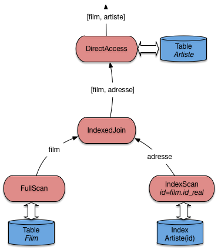
   
   Algorithme de jointure avec index
   
L'opérateur ``IndexedJoin`` lui-même fait peu de choses puisqu'il s'appuie
essentiellement sur d'autres composants qui font déjà une bonne partie du travail.
Implanter un moteur d'exécution, tâche qui peut sembler extrêmement complexe
à  priori, s'avère en fait relativement simple avec cette approche très générique
et décomposant les opérations nécessaires en briques élémentaires. 

Voici le pseudo-code de la fonction ``next()`` de l'opérateur de jointure. 
Il faudrait, dans une implantation réelle, ajouter quelques contrôles,
mais l'essentiel est là, et reste relativement simple.

.. code-block:: bash

    function nextIndexJoin
    {
      # $tScan est l'opérateur de parcours séquentiel de la première table      
      # On récupère un nuplet 
      $nuplet = $tScan.next();

      # On crée un opérateur de parcours d'index
      iScan = new IndexScan ();
      # On exécute le parcours d'index avec la clé étrangère
      $iScan.open ($nuplet.foreignKey);
      # On récupère l'adresse 
      addr = $iScan.next();
 
      # Et on renvoie la paire avec le nuplet et l'adresse      
      return [$nuplet, $addr];
     }

Cet algorithme peut être considéré comme le meilleur possible pour une jointure. 

  - Il s'appuie essentiellement sur un parcours d'index qui, en pratique,
    va s'effectuer en mémoire RAM car un arbre-B est compact, très sollicité,
    et résidera dans le cache la plupart du temps. 
  - Il permet un pipelinage complet: quelle que soit la taille des données,
    une application communiquant avec ce plan d'exécution recevra tout
    de suite la première paire-résultat, et obtiendra les suivantes
    avec très peu de latence à chaque appel *next()*.
    
En contrepartie, l'algorithme nécessite des accès directs (aléatoires)
pour obtenir les nuplets de la seconde table. C'est loin d'être très efficace,
pour des raisons déjà soulignées, et explique que 
la jointure reste une opération coûteuse.

Pour conclure sur cet algorithme, notez qu'il est présenté ici comme
s'appuyant sur un parcours séquentiel, mais qu'il fonctionne tout
aussi bien si la source de données (à gauche) est n'importe quel autre opérateur.
Il est donc très facile à intégrer dans les plans d'exécution très complexes
comprenant plusieurs jointures, sélection, projections, etc.

Jointure avec deux index
========================

Peut-on faire mieux si les *deux* tables sont indexées?   
Lorsque :math:`R` et :math:`S`   ont un index sur
l'attribut de jointure, on peut tirer parti du fait
que les feuilles de ceux-ci sont triées sur
cet attribut.  En fusionnant les feuilles des index :math:`B_R`
et :math:`B_S`  de la même manière que pendant la phase de fusion de l'algorithme de
jointure par tri-fusion, on obtient une liste de couples d'adresses d'enregistrements de :math:`R` et 
:math:`S`  à joindre. Cette première phase est très efficace, car les
deux index sont très probablement en mémoire et l'algorithme de fusion 
est lui-même simple et performant.

La deuxième phase consiste  à lire les enregistrements par deux accès directs, 
l'un sur  :math:`R`,  l'autre sur  :math:`S`. C'est ici que les choses
se compliquent, car la multiplication des accès aléatoires devient très pénalisante.
Comme déjà discuté, si une partie significative d'une table est concernée, il
est préférable d'efectuer un parcours séquentiel qu'une succession d'accès directs.
Pour cette raison, beaucoup
de SGBD (dont Oracle), en
présence d'index sur l'attribut de jointure dans les deux relations,
préfèrent quand même appliquer l'algorithme ``IndexedJoin``. L'amélioration
permise par cette situation reste le choix de la table à parcourir séquentiellement:
pour des raisons évidentes on prend la plus petite.

Jointure par boucles imbriquées
===============================

Nous abordons maintenant le cas des jointures où aucun index n'est disponible.
Disons tout de suite que les performances sont alors nettement moins bonnes, et
devraient amener à considérer la création d'un index approprié pour des
requêtes fréquemment utilisées.

L'algorithme direct et naïf, que nous appellerons ``NestedLoop``, 
s'adapte à tous les prédicats de jointure. 
Il consiste à énumérer tous les enregistrements dans le produit cartésien de
:math:`R` et :math:`S`  (en d'autres termes, toutes les paires possibles)
et garde ceux qui satisfont le prédicat  de jointure.  La fonction de base
est la jointure de deux listes en mémoire, ``L1`` et ``L2``,
et se  décrit simplement comme suit:

.. code-block:: bash

    function JoinList
    {
      # $L1 est la liste dite "extérieure"
      # $L2 est la liste dite "intérieure"
      # $condition est la condition de jointure
      resultat = [];
    
      for nuplet1 in $L1
      do
       for nuplet2 in $L2
       do
         if (condition ($nuplet1, $nuplet2) = true) the
           $resultats[] = ($nuplet1, $nuplet2);
         fi
       done
     done
   }
   
Le coût de cette fonction se mesure au nombre de fois où on effectue le test
de la condition de jointure. Il est facile de voir que chaque nuplet de ``L1``
est comparé à chaque nuplet de ``L2``, d'où un coût de :math:`|L1| \times |L2|`. 

Maintenant, ce qui nous intéresse dans un contexte de base de données, c'est aussi 
(surtout) le nombre de lectures de blocs nécessaires. Dès lors que la jointure implique
des accès disques, ces entrées/sorties (E/S) constituent le facteur 
prédominant. La méthode de base, illustrée par la  :numref:`nestedloop`,
consiste à charger toutes les paires de blocs en mémoire, et à appliquer
la fonction ``JoinList`` sur chaque paire.

.. _nestedloop:
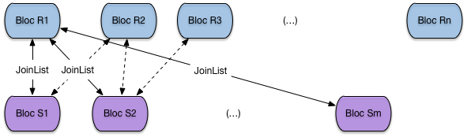
   
   Boucle imbriquée sur les blocs

Le pseudo-code suivant montre la jointure par boucle imbriquée, 
constituant toutes les paires de blocs par un unique parcours séquentiel
sur la première table, et des parcours séquentiels répétés sur la seconde.

.. code-block:: bash

    function NestedLoopJoin
    {
      # $R est la tablee dite "extérieure"
      # $S est la table dite "intérieure"
      # $condition est la condition de jointure
      resultat = [];
    
      for blocR in $R
      do
       for blocS in $S
       do
         JoinList ($blocR, $blocS)
       done
     done
   }
 
Le principale mérite (le seul) de cet algorithme est de demander
très peu de mémoire: deux blocs suffisent. En revanche, le nombre de lectures
et très important:

  - il faut lire toute la table *R*,
  - il faut lire autant de fois la table *S* qu'il y a de blocs dans *R*.
  
Le nombre de lectures est donc :math:`B_R + B_R \times B_S`.  Cette petite
formule montre au passage qu'il est préférable de prendre comme table
extérieure la plus petite des deux.

Cela étant, on peut faire beaucoup mieux en utilisant plus de mémoire.
Soit :math:`R` la table la plus petite. Si le nombre de blocs
:math:`M`  est
au moins égal à :math:`B_R + 1`, la table  :math:`R`  tient en mémoire
centrale. On peut alors lire :math:`S` *une seule fois*, bloc par bloc,
en effectuant à chaque fois la jointure entre le bloc et l'ensemble 
des blocs de :math:`R`  chargés en RAM (:numref:`nestedloop-improved`).
 
 
.. _nestedloop-improved:
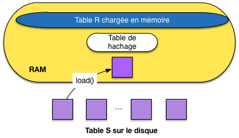
   
   Boucle imbriquée avec chargement complet d'une table en RAM
   
Avec cette solution (très fréquemment applicable en ces temps où la mémoire
RAM est devenue très grosse), le coût est de :math:`B_R + B_S`:
une seule lecture des deux tables suffit. D'un coût
quadratique dans les tailles des relations, lorsqu'on n'a que 3
blocs, on est passé à un coût linéaire. Cet algorithme en devient très efficace
et simple à implanter. 

S'il s'agit d'une équi-jointure, une variante encore améliorée
de cet algorithme consiste  à hacher :math:`R` 
en mémoire à l'aide d'une fonction de hachage :math:`h` .
Alors pour chaque 
enregistrement de :math:`S`, on cherche par :math:`h(s)`  les 
enregistrements  de :math:`R`  joignables. Le
coût en E/S est inchangé, mais le coût CPU est linéaire
dans le nombre d'enregistrement  des tables :math:`N_R + N_S`  (alors qu'avec la
procédure *JoinList* c'est une fonction quadratique du nombre 
d'enregistrements).

 
.. _nestedloop-fragments:
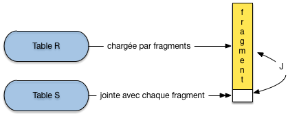
   
   Boucle imbriquée avec chargement par fragments d'une table en RAM

Si :math:`R`  ne tient pas en mémoire
car :math:`B_R > M -1`, il reste la version la plus générale
de la jointure par boucles imbriquées (:numref:`nestedloop-fragments`): 
on  découpe :math:`R` en fragments 
de taille :math:`M-1` blocs et on utilise la variante ci-dessus pour 
chaque groupe. :math:`R`  est lue
une seule fois, groupe par groupe, :math:`S` est lue
:math:`\lceil \frac{B_R}{M-1} \rceil` fois.
On obtient un coût final de:

.. math::

      B_R + \lceil \frac{B_R}{M-1} \rceil \times B_S

.. admonition:: Exemple

    On prend l'exemple d'une jointure entre Film et Artiste  en
    supposant, pour les besoins de la cause, qu'il n'y
    a pas d'index. La table Film occupe 1000 blocs,
    et la table Artiste 10 000 blocs. On suppose
    que la mémoire disponible a pour taille :math:`M=251`  blocs.

      * En prenant la table Artiste comme table extérieure,
        on obtient le coût suivant: 
        
        .. math:: 
           
            10 000 + \lceil \frac{10000}{250}  \rceil \times 1000 = 50 000

      * Et en prenant la table Film comme table extérieure: 
 
        .. math:: 
           
            1 000 + \lceil \frac{1000}{250} \rceil \times 1000 = 41 000

    Conclusion: il faut prendre la table la plus petite comme
    table extérieure. Cela suppose bien entendu que l'optimiseur
    dispose des statistiques suffisantes.

En résumé, cette technique est simple, et relativement efficace
quand une des deux relations peut être découpée
en un nombre limité de groupes (autrement dit,
quand sa taille par rapport à la mémoire disponible reste limitée).
Elle tend vite cependant à être très coûteuse en E/S,
et on lui préfère donc en général la jointure
par tri-fusion, ou la jointure par hachage, présentées
dans ce qui suit.

Jointure par tri-fusion
=======================

L'algorithme de jointure par tri-fusion que nous présentons ici 
s'applique à l'équijointure (jointure avec égalité).
C'est un exemple de technique à deux phases:
la première  consiste à trier les deux tables sur l'attribut de
jointure (si elles ne le sont pas déjà). 
Ce tri facilite l'identification des
paires d'enregistrement 
partageant  la même valeur pour l'attribut de jointure. 

À l'issue du tri on dispose
de deux fichiers temporaires stockés sur disque

.. note:: En fait on évite d'écrire le résultat de la dernière
   étape de fusion du tri, en prenant "à la volée"
   les enregistrements produits par l'opérateur de tri. Il s'agit
   d'un exemple de petites astuces qui peuvent avoir des conséquences 
   importantes, mais dont nous omettons en général la description
   pour des raisons  de clarté.
   
On utilise l'algorithme de tri externe vu précédemment pour cette
première étape. La deuxième phase, dite de fusion, consiste à lire bloc
par bloc chacun des deux fichiers temporaires et à parcourir
séquentiellement en parallèle ces deux fichiers pour trouver
les enregistrements à joindre. Comme les fichiers sont triés, sauf
cas exceptionnel, chaque bloc  n'est lu qu'une fois.

Prenons l'équijointure  de :math:`R` et :math:`S` sur les attributs
a et b.

.. code-block:: sql

   select * from R, S where R.a = S.b

On va trier :math:`R` et :math:`S` et on parcourt ensuite les tables
triées en parallèle.    
Regardons plus en détail la fusion. C'est une variante très proche 
de l'agorithme de fusion de liste.   
On commence avec les premiers enregistrements :math:`r_1` 
et :math:`s_1`  de chaque 
table. 

    * Si :math:`r_1.a = s_1.b` , on joint les deux enregistrements,  on passe au
      enregistrements suivants, jusqu'à ce que :math:`r_i.a \not= s_i.b`.
    * Si :math:`r_1.a < s_1.b`, on avance sur la liste de :math:`R`. 
    * Si :math:`r_1.a > s_1.b`, on avance sur la liste de :math:`S`. 

Donc on balaie une table tant que l'attribut de jointure a une valeur
inférieure à la valeur courante de l'attribut de jointure dans l'autre
table. Quand il y a égalité, on fait la jointure. Ceci peut impliquer
la jointure entre plusieurs enregistrements de :math:`R`  en séquence et plusieurs
enregistrements de :math:`S`  en séquence. Ensuite on recommence.

L'opérateur de jointure peut s'appuyer sur l'opérateur de tri, déjà
étudié. Il suffit donc d'implanter la jointure de deux listes triées
dans un opérateur ``Merge``. Voici la fonction ``next()`` de cet opérateur,
avec deux opérateurs de tris opérant respectivement sur la première 
et la seconde table (plus généralement, ces opérateurs de tri peuvent
opérer sur n'importe quel sous-plan d'exécution).

.. code-block:: bash

    function nextMerge
    {
      # $triR est l'opérateur de tri sur la première table
      # $triS est l'opérateur de tri sur la seconde table
      # a et b désignent les attributs de jointure
      
      # Récupération de nuplets fournis par les opérateurs
      $nupletR = $triR.next();
      $nupletS = $triS.next();
          
      # Tant que les deux nuplets de joignent pas sur a et b, on avance
      # sur une des deux listes 
     while ($nupletR.a != $nupletS.b) do
       if ($nupletR.a < $nupletS.b) then
         $nupletR = $triR.next();
        else
         $nupletS = $triR.next();
        fi
     done
     
     return [$nupletR, $nupletS];
   }

Le plan d'exécution typique d'une jointure
par tri-fusion avec cet opérateur 
est illustré par la :numref:`planEx-trifusion`.

.. _planEx-trifusion:
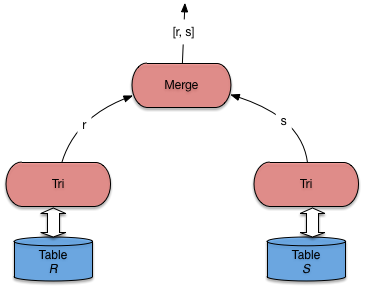
   
   Plan d'exécution type pour la jointure par tri-fusion
   
             
La jointure  :math:`s`  par tri-fusion
est illustrée dans la  :numref:`sortmerge`.

.. _sortmerge:
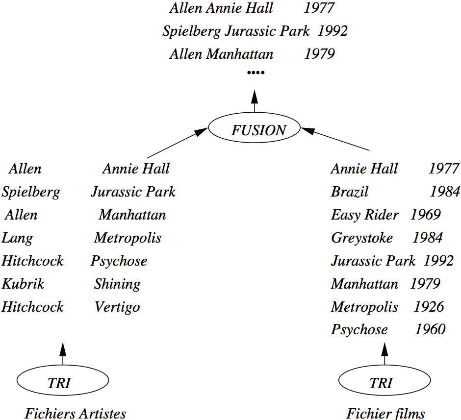
   
   Exemple de jointure par tri-fusion

Le coût de la jointure par tri-fusion est important, et 
impose une latence due à la phase de tri initiale. Une fois la phase
de fusion débutée, le débit est en revanche très rapide. La performance
dépend donc essentiellement du tri, et donc de la mémoire disponible. C'est
l'algorithme privilégié par les SGBD pour la jointure sans index de très
grosses tables (situation qu'il vaut mieux éviter quand c'est possible).

Jointure par hachage
====================

Comme tous les algorithmes à base de hachage, cet algorithme ne
peut s'appliquer qu'à une équi-jointure.
Comme l'algorithme de tri-fusion, il comprend deux phases:
une phase de partitionnement  des deux relations 
en :math:`k`  fragments chacune, *avec la même fonction de hachage*,
et une phase de jointure proprement dite. 

La première phase a pour but de réduire le coût de la jointure
proprement dite de la deuxième phase. Au lieu de comparer tous les
enregistrements de :math:`R` et :math:`S`, on ne
comparera les enregistrements de chaque fragment :math:`F_R^i` 
de :math:`R`  qu'aux
enregistrements du fragment :math:`F_S^i`  *associée* de :math:`S`.
Notez bien qu'il s'agit du même exposant :math:`i`: les fragements
sont associés par paire, ce qui implique que l'on a la garantie
qu'aucun nuplet de   :math:`F_R^i` ne joint avec un nuplet
de  :math:`F_S^j`, pour  :math:`i \not= j`.   

Le partitionnement de :math:`R`  se fait par hachage. On suppose toujours
que ``a`` et ``b`` sont les attributs de jointure respectifs et on
note :math:`h`  la
fonction de hachage qui s'applique à la valeur de ``a`` 
ou ``b`` et renvoie un entier compris entre 1 et :math:`k`. 

Un enregistrement  :math:`r` de :math:`R` est donc 
placé dans le fragment  :math:`F_R^{h(r.a)}`;
un enregistrement  :math:`s` de :math:`S` est donc 
placé dans le fragment  :math:`F_S^{h(s.b)}`. On obtient 
exactement le même nombre de fragments pour :math:`R` et :math:`S`,
placés sur le disque si nécessaire, comme le montre la figure :ref:`hashjoin`.

.. _hashjoin:
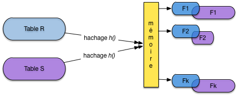
   
   Première phase de la jointure par hachage: le partitionnement

.. important:: Comment est choisi :math:`k`, le nombre de fragments? 
   *Le critère que, pour la plus petite des deux tables, chaque fragment
   doit tenir dans la mémoire disponible*. Si, par exemple, :math:`R`
   est la plus petite des deux tables et occupe 100 blocs, alors
   que 20 blocs de RAM sont disponibles, il faudra au moins
   :math:`k=5` fragments. Pourquoi? Lire la suite.

On peut alors passer à la seconde phase, dite de jointure. 
La remarque fondamentale ici est la suivante: si deux nuplets  :math:`r`  et  :math:`s`
doivent être joints, alors on a  :math:`h(r.a) = h(s.b)=u` 
et on les trouvera, respectivement, dans  :math:`F_R^u`
et :math:`F_S^u`. *En d'autres termes, il suffit d'effectuer
la jointure sur les paires de fragments correspondant à la même valeur
de la fonction de hachage.*
   
.. note:: Le paragraphe qui précède est vraiment le cœur de l'algorithme
   de hachage et justifie tout sont fonctionnement. Lisez-le et relisez-le
   jusqu'à être convaincus que vous le comprennez.
   
La deuxième phase consiste alors pour :math:`i = 1, ..., k`, 
à lire le fragment  :math:`F_R^i` de 
:math:`R` en mémoire et à effectuer la jointure avec le
fragment :math:`F_S^i` de :math:`S`. La technique de jointure à appliquer
au fragment est exactement celle par boucle imbriquées, décrite ci-dessus,
quand l'une
des deux tables tient en RAM: . Le point important
(et qui explique le choix du nombre de fragments) 
est qu'au moins l'un des deux fragments à joindre doit résider en mémoire;
l'autre, lu séquentiellement, peut avoir une taille quelconque.

La  :numref:`hashjoin2` montre le calcul de la jointure pour deux fragments.
Celui de la première table est entièrement en mémoire, celui de la seconde
est lu séquentiellement et placé au fur et à mesure de la lecture
dans le reste de la mémoire disponible, pour être joint avec le fragment résidant.

.. _hashjoin2:
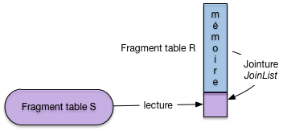
   
   Première phase de la jointure par hachage: la jointure

Le coût de la première phase de partitionnement de cet algorithme est
:math:`2 \times (B_R + B_S)`.  Chaque relation est lue entièrement et hachée  dans
les fragments qui sont écrits sur disque bloc par bloc. 

Le coût de la deuxième phase est de :math:`B_R + B_S`. En effet les
relations partitionnées sont lues une fois chacune, fragment par fragment.
Le coût total de cet algorithme est donc  :math:`3 \times (B_R + B_S)`.
Noter que cet algorithme est très gourmand en mémoire.  Il 
est  bien adapté aux jointures déséquilibrées pour lesquelles une
des tables est petite par rapport à lamémoire RAM disponible. Dans le meilleur des cas où un seul
fragment est nécessaire (la table tient entièrement en mémoire) on
retrouve tout simplement la jointure par boucles imbriquées décrite
précédemment. La jointure par hachage peut être vue comme une généralisation
de cet algorithme simple.

Comment implanter cet algorithme de jointure sous forme d'itérateur? Et bien,
comme pour le tri, toute la phase de hachage s'effectue dans le ``open()``
et cet opérateur est donc *bloquant*: la phase de hachage correspond
à une latence perçue par l'utilisateur qui attend sans que rien (en 
apparence) ne se passe. La phase de jointure peut, elle, être très rapide,
et surtout fournit régulièrement des nuplets à l'application cliente.

Concluons cette section avec deux remarques:

    * Excepté les algorithmes basés sur une
      boucle imbriquée avec ou sans index, les algorithmes montrés ont été
      conçus pour le prédicat d'égalité.  Naturellement, indépendamment de
      l'algorithme, le nombre des enregistrements du résultat est vraisemblablement
      beaucoup plus important pour de telles jointures que dans le cas d'égalité.
    * Cette section a montré que l'éventail des algorithmes de
      jointure est très large et que le choix d'une méthode efficace n'est
      pas simple. Il dépend notamment de la taille des relations, des
      méthodes d'accès disponibles et de la taille disponible en mémoire
      centrale. Ce choix est cependant fondamental parce qu'il a un impact
      considérable sur les performances. La différence entre deux
      algorithmes peut dans certains cas atteindre plusieurs ordres de grandeur.

La tendance est à l'utilisation de plus en plus fréquente de la joiunture
par hachage qui remplace l'algorithme de tri-fusion qui était privilégié
dans les premiers temps des SGBD relationnels. La taille atteinte par
les mémoires RAM est sans doute le principal facteur explicatif de ce phénomène.

Quiz
====

  - Pourquoi la clé primaire d’une table doit-elle être indexée (plusieurs réponses possibles) :

    .. eqt:: defO1

         A) :eqt:`I` Parce que la plupart des requêtes SQL portent sur la valeur de la clé primaire.
         #) :eqt:`C` Pour vérifier rapidement la contrainte d’unicité lors d’une insertion.
         #) :eqt:`C` Pour vérifier rapidement la contrainte d’intégrité référentielle lors de l’insertion d’un clé étrangère.
         #) :eqt:`I` Pour vérifier rapidement la contrainte d’intégrité référentielle lors de la destruction d’une clé primaire.
         
  -  Considérons les tables des employés et des départements suivantes. Les clés primaires sont indexées.

    .. csv-table:: 
       :header: "Enum", "Nom", "Dnum"
       :widths: 10, 10, 10
             
       E1,  Benjamin,    D1
       E2,  Philippe,    D2
       E3,  Serge,  D1

|

    .. csv-table:: 
       :header: "Dnum", "Dnom"
       :widths: 10, 10

        D1,  INRIA
        D2, CNAM

    Pour une jointure avec index, combien de parcours d’index doit-on effectuer ?

    .. eqt:: defO2

         A) :eqt:`I` 1
         #) :eqt:`I` 2
         #) :eqt:`C` 3

  - Supposons que l’attribut ``Dnum``  dans la table ``Employé`` soit indexé. Combien de parcours d’index devrait-on 
    effectuer en prenant la table ``Dept`` comme table directrice (à gauche).

    .. eqt:: defO3

         A) :eqt:`I` 1
         #) :eqt:`C` 2
         #) :eqt:`I` 3

  - Dans la requête suivante, peut-on appliquer la jointure par boucles imbriquées indexées, 
    *f()* et *g()* étant des fonctions quelconques ?

    .. code-block:: sql
      
         select * from Emp, Dept where f(E.dnum) = g(Dept.dnum)

    .. eqt:: defO4

         A) :eqt:`I` Oui
         #) :eqt:`C` Non

  - Soit la jointure entre deux tables T(ABCD) et S(MNO) dans la requête suivante :

    .. code-block:: sql
    
          select * from T, S where T.A=S.M

    À quels attributs faut-il appliquer la fonction de hachage pour la jointure ?

    .. eqt:: defO5

         A) :eqt:`I` Aux clés primaires.
         #) :eqt:`C`  Aux attributs A de T et M de S.
         #) :eqt:`I` À l’attribut A de T, et à la clé primaire de S.
         #) :eqt:`I` À la clé primaire de T, à l’attribut M de S.

  - Pourquoi 2 nuplets à joindre sont-ils forcément dans des fragments associés ?

    .. eqt:: defO6

         A) :eqt:`I` Parce que les fragments sont de taille proportionnelle à la table, ce qui garantit l’alignement des nuplets à joindre.
         #) :eqt:`C`  Parce que les valeurs des attributs de jointure étant les mêmes, le résultat de la fonction de hachage est le même.

  - Peut-on appliquer la jointure par hachage à la requête suivante :

    .. code-block:: sql
    
          select * from T, S where T.A <= S.M

   .. eqt:: defO7

         A) :eqt:`I` Oui
         #) :eqt:`C`  Non

*********
Exercices
*********

.. _ex-iter1:
.. admonition:: Exercice `ex-iter1`_: définition d'itérateurs

    - Définir sous forme de pseudo-code (``open()``  et ``next()``)  un itérateur ``min`` qui renvoie le nuplet 
      de sa source ayant la valeur minimale pour un attribut ``att_min``.
    - Définir un itérateur ``distinct`` qui élimine les doublons de sa source.

  .. ifconfig:: opalgo in ('public')

      .. admonition:: Correction
      
          
          - L'itérateur ``Min`` prend comme source
            de données un autre itérateur ``$source``. 
            Voici la spécification en pseudo-code.
            
            .. code-block:: bash

                #  Initialisation de l'itérateur
                function open
                {
                  $source.open(); # On exécute le open() sur la source
                  $courant = $source.next(); # On récupére le premier nuplet
                  $valeur_min =  $courant['att_min'] # Initialisation de la valeur min
                }

                # Le next parcourt tous les enregistrements et conserve le min 
                # (on aurait pu le faire dans l'open)
                function next
                {
                  $nouveau = $source.next();
                  if ($nouveau == NULL) then # On a parcouru toute la source
                     return $valeur_min;
                  fi
                
                  if ($nouveau['att_min'] < $valeur_min) then
                        # On a trouvé une valeur plus petite
                        $valeur_min = $nouveau['att_min']; 
                  fi
                }
        
         - Voici la spécification presque complète du ``distinct`` en pseudo-code. Quelques
           améliorations à apporter, et notamment la gestion de la fin et de la
           fermeture. Important: ne fonctionne que si la source est triée.
            
           .. code-block:: bash
            
                function open
                {
                  $source.open();
                  $courant = $source.next(); # Premier nuplet
                }

                function next
                {
                   #  On prend le nuplet suivant de la source
                  $suivant = $source.next()
                  # On continue le parcours de la source jusqu'à trouver un nuplet différent
                  while ($suivant == $courant) do
                    $suivant = $source.next()
                  done
                  
                  # Ici, on a trouvé un nuplet $suivant qui est différent de $courant
                  $retour = $courant # Le nuplet à renvoyer
                  $courant = $suivant # Le nouveau nuplet courant
                  return $retour
                 }

           On peut aussi obtenir l'élimination des doublons avec la hachage. 

.. _ex-iter2:
.. admonition:: Exercice `ex-iter2`_: plans d'exécution 

    Donner des plans d'exécution pour les requêtes suivantes:
    
    - Avec clause ``order by``

      .. code-block:: sql

            select titre from Film order by annee

    - Recherche d'un élément minimal

      .. code-block:: sql

            select min(annee) from Film

    - Elimination des doublons

      .. code-block:: sql

            select distinct genre from Film

  .. ifconfig:: opalgo in ('public')

      .. admonition:: Correction
      
          - Un itérateur de parcours séquentiel, suivi d'un itérateur
            de tri, suivi d'un itérateur pour la projection.
          - Un itérateur de parcours séquentiel, suivi de notre itérateur
            ``Min``, suivi d'un itérateur pour la projection. Autre possibilité:
            on trie, et on ne garde que le premier.
          - Un itérateur de parcours séquentiel, suivi d'un itérateur
            de tri, suivi de notre itérateur ``distinct``.

.. _ex-opalgo1:
.. admonition:: Exercice `ex-opalgo1`_: comprendre le tri externe

    Soit un fichier de 10 000 blocs et une mémoire cache 
    de 3 blocs. On trie ce fichier avec l'algorithme de tri-fusion.

     - Combien de fragments sont produits pendant la première passe?
     - Combien d'étapes de fusion faut-il pour trier complètement le fichier?
     - Quel est le coût total en entrées/sorties?
     - Combien faut-il de blocs en mémoire faut-il pour trier le fichier 
       en une fusion    seulement.
     - Répondre aux mêmes questions en prenant un fichier de 20 000 
       blocs et 5 blocs de mémoire *cache*.

  .. ifconfig:: opalgo in ('public')

      .. admonition:: Correction
      
         Pour un fichier de 10\,000 blocs et 3 blocs de buffer.
         
           - il faut lire :math:`\lceil \frac{10000}{3} \rceil = 3 334` 
             fois 3 blocs, que l'on trie à chaque fois.
           - ensuite on associe 2 fragments pour en produire un troisième,
             deux fois plus gros. La taille des fragments est de 3, puis
             de 6 après la seconde passe, puis de 12 après la troisième,
             plus généralement de :math:`3 \times 2^(n-1)` après l'étape *n*.
          
             On cherche *n* tel que :math:`3 \times 2^{n-1} \geq 10\,000`.
             On trouve :math:`n = \lceil \log (\frac{10000}{3}) \rceil + 1 = 13`.
           - Nombre d'entrées/sorties: :math:`2 \times 10\,000 \times n`
           - On veut que :math:`m \times (m - 1)    \geq 10\,000`,
             donc :math:`m = \sqrt{10\,000} = 100`.
             

.. _ex-join1:
.. admonition:: Exercice `ex-join1`_: coût des jointures par boucles imbriquées

    Soit deux relations *R* et *S*, de tailles respectives *|R|* et *|S|*
    (en nombre de blocs). On dispose d'une mémoire *mem* de taille *M*,
    dont les blocs sont dénotés :math:`mem[1], mem[2], \ldots, mem[M]`.

      - Donnez la formule exprimant le coût d'une jointure
        :math:`R \Join S`, en nombre d'entrées/sorties, pour l'algorithme suivant:

        .. code-block:: bash
        
            $posR = 1   # On se place au début de R
            while [$posR <= |R|] do  
                Lire  R[$posR] dans $mem[1] # On lit les blocs 1 par 1
                $posS = 1  # On se place au début de S
                while ($posS <= |S|)  do 
                   Lire  S[$posS] dans $mem[2] # On lit les blocs 1 par 1
                   # JoinList est l'algorithme donné en cours
                   JoinList (mem[1], mem[2]) 
                  $posS = $posS + 1 # Bloc suivant de S
                done
               $posR = $posR + 1 # Bloc suivant de R
             done

      - Même question avec l'algorithme suivant

        .. code-block:: bash
        
            $posR = 1   # On se place au début de R
            while [$posR <= |R|] do  
               Lire  R[p$osR..($posR+M-1)] dans $mem[1..M-1] # On lit M-1 blocs de R
               $posS = 1
               while ($posS <= |S|) do
                   Lire  S[$posS] dans $mem[M] # On lit les blocs 1 par 1
                   # JoinList est l'algorithme donné en cours
                  JoinList (mem[1..M-1], mem[M]) 
                  $posS = $posS + 1 # Bloc suivant de S
              done
              $posR = $posR + M - 1 # On lit les M - 1 blocs suivants de R
             done

      - Quelle table faut-il prendre pour la boucle extérieure? La plus petite
        ou la plus grande\,?

  .. ifconfig:: opalgo in ('public')

      .. admonition:: Correction

           - Le premier algorithme est une jointure
             par boucle imbriquée qui exploite très mal la mémoire
             puisque seuls les deux premiers blocs de *m*
             sont utilisés. Le coût est de :math:`|R| + |R| \times |S|`.
           - le second est en fait celui illustré
             par la :numref:`nestedloop-improved`. La mémoire
             *m* est utilisée pour réduire le nombre d'itérations sur *R*,
             avec un coût de :math:`|R| + \lceil \frac{|R|}{M-1} \rceil  \times |S|`.
           - Au vu des formules de coût il faut prendre la petite table 
             comme table directrice. Si cette table tient en mémoire (fréquent),
             le coût  se réduite à :math:`|R| + |S|`, soit une unique lecture 
             séquentielle de chaque table.

.. _ex-joincost:
.. admonition:: Exercice `ex-joincost`_:  coût des jointures

    On suppose que  :math:`|R| = 10\,000` blocs, :math:`|S|=1\,000` 
    et *M=51*. On a  10 enregistrements par bloc, ``b`` est la clé 
    primaire de *S* et on suppose que pour chaque valeur de ``R.a`` 
    on trouve en moyenne 5 enregistrements dans *R*. On veut 
    calculer :math:`\pi_{R.c} (R \Join_{a=b} S)`.

      - Donnez le nombre d'entrée-sorties *dans le pire des cas* pour les
        algorithmes par boucles imbriquées de l'exercice `ex-join1`_.
      - Même question en supposant (a) qu'on a un index sur *R.a*,
        (b) qu'on a un index sur *S.b*, (c) qu'on a deux index,
        sachant que dans tous les cas  l'index a 3 niveaux.
      - Même question pour une jointure par hachage.
      - Même question avec un algorithme de tri-fusion.

  .. ifconfig:: opalgo in ('public')

      .. admonition:: Correction
      
            - Premier algorithme: 10 001 000 blocs. Second algorithme 
              on lit *S* (il faut mettre la table la plus petite à l'extérieur
              de la boucle) en 20 fragments, et pour chacun on
              lit *R*: :math:`1\,000 + (20 \times 10\,000) = 201\,000`.
            - Avec un index sur *R.a*: on parcourt *S* (1 000 
              blocs). *S* contient 10 000 enregistrements
              donc *au pire* if faut 30 000 accès  pour parcourir
              l'index de hauteur 3. Pour chaque valeur de *S.b*
              on trouve en moyenne 5 enregistrement dans *R*,
              donc 50 000 lectures directes dans *R*.
              Soit 81 000 lectures.
              
              Avec un index sur *S*: on parcourt *R* (10 000 blocs).
              Au pire il faut 100 000 accès par l'index: 300 000 blocs + 
              100 000 accès directs. Soit 500 000 lectures.      
              
              Avec deux index: il faut se ramener au
              cas d'un index sur *R*.
              
              Ces coûts sont théoriques. En pratique, les index 
              sont le plus souvent déjà en mémoire, ainsi qu'une bonne 
              partie des blocs de données. Cela réduit considérablement
              le nombre de lectures physiques (retirer le facteur lié
              au parcours d'index dans les analyses ci-dessus).

            - Par hachage: le mieux est de hacher la table *S* 
              sur *S.b* en 20  fragments de  50 blocs chacun. On hache ensuite 
              *R*  sur *R.a*, *avec la même fonction de hachage*
              en 20 fragments d'environ 500 blocs chacun.
              
              Ensuite on applique la jointure par boucles imbriquées   sur chaque paire de fragments:
              on lit le fragment de *S* dans 50 blocs,
              on fait défiler le fragment correspondant de *R* dans le bloc restant. 
             
              Coût: pour le hachage on lit et on écrit une fois *S* et *R* 
              (22 000 E/S).  Pour la jointure il suffit de lire une fois
              *R* et *S*, soit 33 000 blocs lus ou écrits en tout. 
            - Avec un algo. de tri-fusion. On commence par trier 
              chaque table:
             
               - la table :math:`R` se décompose en 197 (10 000/51) 
                 fragments triés
                 de 51 blocs chacun (sauf le dernier qui fait 4 blocs)\,; 
                 on les fusionne en 4 gros fragments: les 3 premiers
                 font :math:`51 \times 50 =  2\,550` blocs, le dernier fait 
                 2 350 blocs. Une dernière fusion et le fichier est trié. 
                 Coût : 60 000 blocs.
                 
                 La table :math:`S` se trie en une seule phase de fusion: coût 
                 4 000 blocs.
                 
                 Il reste à fusionner les deux tables triées, pour un coût final
                 de 11 000 blocs lus. Donc le coût total est de 75 000 blocs.
                 
                 Remarque: en pratique certaines astuces permettent d'améliorer
                 la performance du tri (notez par exemple que la mémoire
                 est très mal utilisée dans la seconde phase de fusion de
                 la table :math:`R`), ce qui rapproche le coût de celui du hachage.
